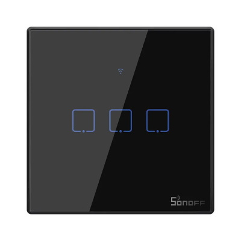
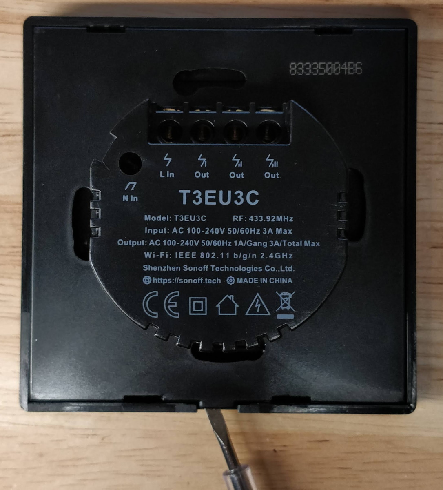
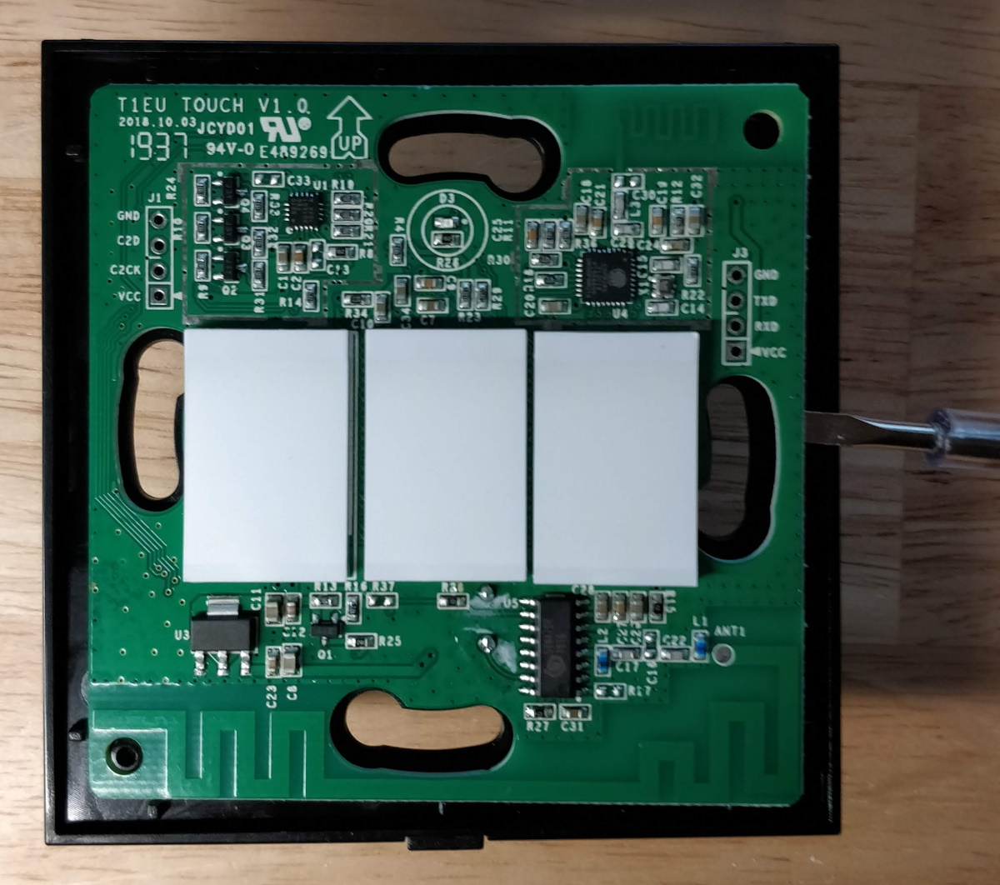
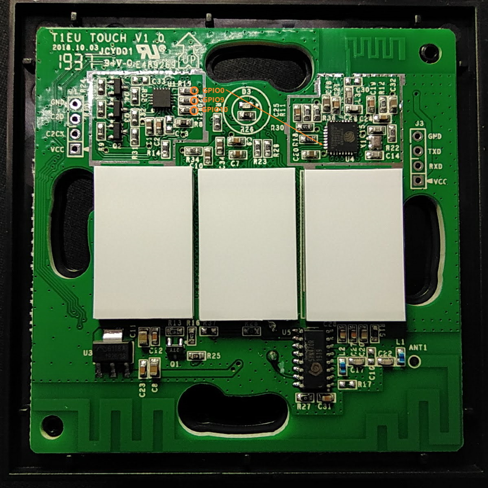
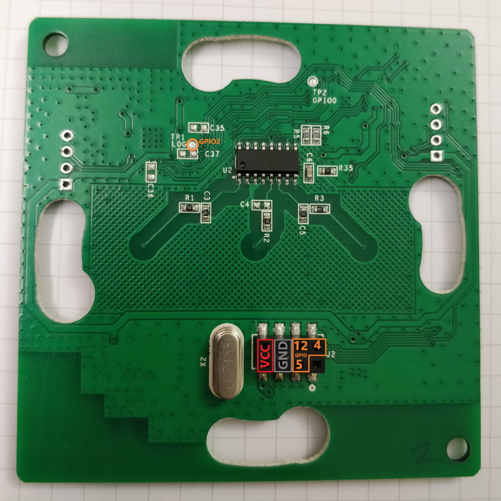
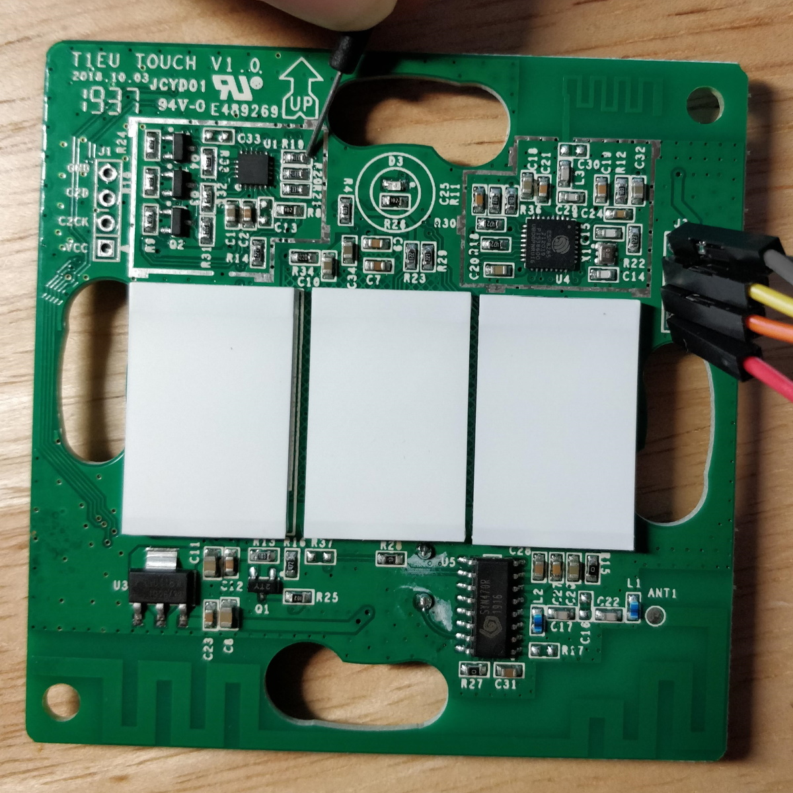
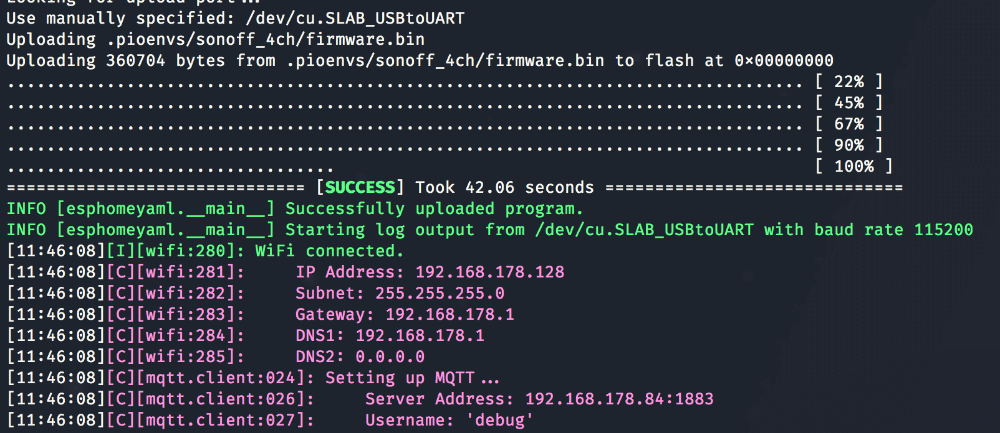

Using With Sonoff T3 EU 3 Gang
=====================================

.. seo::
    :description: Instructions for putting Sonoff T3 EU 3C devices into flash mode and installing ESPHome on them.
    :image: sonoff_t3_eu_3g_v1.0.jpg

ESPHome can also be used with Sonoff T3 EU 1/2/3 Gang wireless switches. These devices are
basically just an ESP8266 chip with up to 3 relays to control power output and three backlit capacitive touch buttons to control the relays.

    Sonoff T3 EU 3 Gang WiFi switch.

This guide will step you through setting up your Sonoff T3 EU 3 Gang and flashing the first ESPHome firmware
with the serial interface. This should also work for the T1 EU 3 Gang and T2 EU 3 Gang with PCB version ``T1EU TOUCH V1.0`` from 2018.
After that, you will be able to upload all future firmware updates with the remote
Over-The-Air update process.

.. note::

    If you've previously installed Sonoff-Tasmota on your Sonoff T3 EU 3 Gang, you're in luck 😀
    ESPHome can generate a firmware binary which you can then upload via the
    Tasmota web interface. To see how to create this binary, skip to :ref:`sonoff_t3_eu_3g_v1.0-creating_firmware`.

Since firmware version 1.6.0, iTead (the creator of this device) has removed the ability to upload
a custom firmware through their own upload process. Unfortunately, that means that the only way to
flash the initial ESPHome firmware is by physically opening the device up and using the UART
interface.

.. warning::

    Opening up this device can be very dangerous if not done correctly. While the device is open,
    you will be a single touch away from being electrocuted if the device is plugged in.

    So, during this *entire* guide **never ever** plug the device in. Also, you should only do this
    if you know what you're doing. If you, at any step, feel something is wrong or are uncomfortable
    with continuing, it's best to just stop for your own safety.

    It's your own responsibility to make sure everything you do during this setup process is safe.

For this guide you will need:

- Sonoff T3 EU 3 Gang 😉
- A USB to UART Bridge for flashing the device. These can be bought on Amazon for less than 5 dollars.
  Note that the bridge *must* be 3.3V compatible. Otherwise you will destroy your Sonoff.
- Jumper wires to connect the UART bridge to the header pins and to connect GPIO0 to the Ground.
- Computer running ESPHome or the Home Assistant ESPHome add-on.
- Screwdriver to open up the Sonoff T3 EU 3 Gang.

Have everything? Great! Then you can start.

Step 1: Opening up the Sonoff T3 EU 3 Gang
------------------------------------------

The first step is to open up the Sonoff T3 EU 3 Gang. Note that you do not have to run the original firmware
supplied with the Sonoff T3 EU 3 Gang before doing this step.

.. warning::

    Just to repeat this: Make **absolutely sure** the device is not connected to any appliance or
    plugged in before doing this step.

While the device is not plugged in, turn the device face down and put a narrow flat screwdriver into the slot at the bottom.
With careful twisting motion detach the faceplate.

    Careful twisting motion.

After that, use the same screwdriver to carefully lift the top PCB off of the switch.
This PCB contains the ESP chip and what's left inside the switch body are relays.

    "TOUCH BOARD" with touchpads holds the ESP chip.

Step 2: Connecting UART
-----------------------

Now we need our computer to somehow establish a data connection to the board. For this we will
have to connect the four wires on the UART to USB bridge to the UART pins of the Sonoff T3 v1.0.

Fortunately for us, these pins on the ESP controller have dedicated solder pads on the PCB (``J3``). You can identify
these by the ``VCC33``, ``RX``, ``TX`` and ``GND`` markings on the silk-screen.

Now go ahead and connect these pins to your UART to USB bridge as seen in below image. Make sure
that you connect these correctly, especially the ``VCC33`` and ``GND`` parts as you can otherwise
destroy the chip.

``VCC33`` should be connected to the ``3V3`` (**not** 5V) pin of the UART bridge, ``GND`` to ``GND``
and the same with ``RX``/``TX``.

There's no need for soldering - for quick job like one time firmware flashing you can just hold pins in respective holes by hand
provided **you are not touching any live contacts**, only the wires.

    The Resistors ``R19``, ``R20`` and ``R21`` expose ``GPIO0``, ``GPIO9`` and ``GPIO10`` respectively.

    Backside also exposes ``GPIO2``.

.. note::

    If your upload fails with an ``error: espcomm_upload_mem failed`` message it's most likely due
    to the pins being swapped. In that case, just swap ``RX`` and ``TX`` and try again - you won't break
    anything if they're swapped.

.. _sonoff_t3_eu_3g_v1.0-creating_firmware:

Step 3: Creating Firmware
-------------------------

The Sonoff T3 EU 3 Gang is based on the ``ESP8266`` platform (technically it's the ``ESP8285``, but for our purposes
they're the same) and is a subtype of the ``esp01_1m`` board.
With this information, you can step through the ESPHome wizard (``esphome sonoff_t3_us_3gang_v1.0.yaml wizard``),
or alternatively, you can just take the below configuration file and modify it to your needs.

.. code-block:: yaml

    esphome:
      name: <NAME_OF_NODE>

    esp8266:
      board: esp8285

    wifi:
      ssid: !secret wifi_ssid
      password: !secret wifi_password

    api:

    logger:

    ota:

Now run ``esphome sonoff_t3_us_3gang_v1.0.yaml compile`` to validate the configuration and
pre-compile the firmware.

.. note::

    After this step, you will be able to find the compiled binary under
    ``<NAME_OF_NODE>/.pioenvs/<NAME_OF_NODE>/firmware.bin``. If you're having trouble with
    uploading, you can also try uploading this file directly with other tools.

Step 4: Uploading Firmware
--------------------------

In order to upload the firmware, you're first going to need to get the chip into a flash mode, otherwise
the device will start up without accepting any firmware flash attempts.
To put ESP8266 into flash mode you need to connect ``GPIO0`` to ``GND`` when the device is powering up.

This is a tricky process with T3 and the best is to hold the ground wire to the right side of the ``R19`` Resistor which is connected to ``GPIO0``.
Keep holding ``GND`` and ``GPIO0`` connected for 2-4 seconds. The T3 EU 3 Gang should now be in a flash mode and should not blink with any LED.
The touchpads may light up.

    Connect ``GND`` to ``R19`` right contact while powering the board.

Now you can finally run the upload command:

.. code-block:: bash

    esphome sonoff_t3_us_3gang_v1.0.yaml run

If successful, you should see something like this:

Hooray 🎉! You've now successfully uploaded the first ESPHome firmware to your Sonoff T3 EU 3 Gang. And in a moment,
you will be able to use all of ESPHome's great features with your Sonoff T3 EU 3 Gang. Now you can put your T3 back together and fire up.

.. note::

    While now your T3 will start up and connect to your WiFi network if you power it up from UART it will not behave normally,
    it may flash random LEDs, turn on and off touchpads' backlight and not react on touching touchpads. This will all be fixed once you re-assemble your T3
    and power it up from the mains power once safe to do so.

If above step does, however, not work, here are some steps that can help:

-  Sometimes the UART bridge cannot supply enough current to the chip to operate, in this
   case use a 3.3V supply you have lying around. A nice hack is to use the power supply of
   NodeMCU boards. Simply connect the NodeMCU's 3.3V to VCC and GND to GND. **Do not attempt
   to plug the device into a socket to overcome this problem while troubleshooting.**
-  In other cases the ``TX`` and ``RX`` pin are reversed. Simple disconnect the device, swap
   the two pins and put it into flash mode again.

Step 5: Adding the Button, Relay and LEDs
-----------------------------------------

Now we would like the T3 EU 3 Gang to actually do something, not just connect to WiFi and pretty much sit idle.

Below you will find a table of all usable GPIO pins of the Sonoff T3 EU 3 Gang and a configuration file that exposes all
of the basic functions.

======================================== =========================================
``GPIO0``                                Touchpad #1 (inverted)
---------------------------------------- -----------------------------------------
``GPIO9``                                Touchpad #2 (inverted)
---------------------------------------- -----------------------------------------
``GPIO10``                               Touchpad #3 (inverted)
---------------------------------------- -----------------------------------------
``GPIO12``                               Relay #1 and Touchpad #1 backlight
---------------------------------------- -----------------------------------------
``GPIO5``                                Relay #2 and Touchpad #2 backlight
---------------------------------------- -----------------------------------------
``GPIO4``                                Relay #3 and Touchpad #3 backlight
---------------------------------------- -----------------------------------------
``GPIO13``                               Blue LED (inverted)
---------------------------------------- -----------------------------------------
``GPIO1``                                ``RX`` pin (for external sensors)
---------------------------------------- -----------------------------------------
``GPIO3``                                ``TX`` pin (for external sensors)
======================================== =========================================

.. code-block:: yaml

    esphome:
      name: <NAME_OF_NODE>

    esp8266:
      board: esp01_1m

    wifi:
      ssid: !secret wifi_ssid
      password: !secret wifi_password

    api:

    logger:

    ota:

    binary_sensor:
      - platform: gpio
        pin:
          number: GPIO0
          mode:
            input: true
            pullup: true
          inverted: true
        name: "Sonoff T3 EU 3 Gang Touchpad 1"
      - platform: gpio
        pin:
          number: GPIO9
          mode:
            input: true
            pullup: true
          inverted: true
        name: "Sonoff T3 EU 3 Gang Touchpad 2"
      - platform: gpio
        pin:
          number: GPIO10
          mode:
            input: true
            pullup: true
          inverted: true
        name: "Sonoff T3 EU 3 Gang Touchpad 3"
      - platform: status
        name: "Sonoff T3 EU 3 Gang Status"

    switch:
      - platform: gpio
        name: "Sonoff T3 EU 3 Gang Relay 1"
        pin: GPIO12
      - platform: gpio
        name: "Sonoff T3 EU 3 Gang Relay 2"
        pin: GPIO5
      - platform: gpio
        name: "Sonoff T3 EU 3 Gang Relay 3"
        pin: GPIO4

    output:
      # Register the blue LED as a dimmable output ....
      - platform: esp8266_pwm
        id: blue_led
        pin: GPIO13
        inverted: true

    light:
      # ... and then make a light out of it.
      - platform: monochromatic
        name: "Sonoff T3 EU 3 Gang Blue LED"
        output: blue_led

Above example also showcases an important concept of ESPHome: IDs and linking. In order
to make all components in ESPHome as "plug and play" as possible, you can use IDs to define
them in one area, and simply pass that ID later on. For example, above you can see a PWM (dimmer)
output being created with the ID ``blue_led`` for the blue LED. Later on it is then transformed
into a :doc:`monochromatic light </components/light/monochromatic>`.
If you additionally want the buttons to control the relays, look at `the complete Sonoff T3 EU 3 Gang
with automation example <https://github.com/esphome/esphomedocs/blob/current/devices/sonoff_t3_eu_3gang_v1.0.yaml>`__.

Step 6: Finishing Up
--------------------

If you're sure everything is done with the T3 EU 3 Gang and have double checked there's nothing that could cause a short
in the case, you can put the T3 back together.

Now triple- or even quadruple-check the UART bridge is not connected to the T3 EU 3 Gang, then comes the time when you can
connect it.

Happy hacking!

See Also
--------

- :doc:`sonoff`
- :doc:`sonoff_4ch`
- :doc:`sonoff_s20`
- :ghedit:`Edit`
