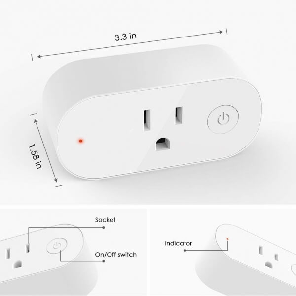

Using With Sonoff S20
=====================

.. seo::
    :description: Example ESPHome code to emulate stock firmware functionality while maintaining 100% local control.
    :image: teckin_sp20_us.jpg

ESPHome can be used with Teckin SP20 (US) smart sockets. These devices are basically just an ESP8266 chip with a relay to control the socket, a HLW8012 power
 monitoring chip, a small button on the front and two LEDs (blue and red).

    Teckin SP20 (US) Smart Socket.

Adding the Button, Relay and LEDs
---------------------------------

Below you will find a table of all usable GPIO pins of the SP20 and a configuration file that exposes all
to mimic the stock functionality.

======================================== ========================================
``GPIO13``                               Button
---------------------------------------- ----------------------------------------
``GPIO4``                                Relay
---------------------------------------- ----------------------------------------
``GPIO2``                                Blue LED (inverted)
---------------------------------------- ----------------------------------------
``GPIO0``                                Red LED (inverted)
---------------------------------------- ----------------------------------------
``GPIO12``                               HLW8012 SEL pin
---------------------------------------- ----------------------------------------
``GPIO5``                                HLW8012 CF pin
---------------------------------------- ----------------------------------------
``GPIO14``                               HLW8012 CF1 pin
======================================== ========================================

.. code-block:: yaml

    substitutions:
      device_name: '<NODE_NAME>'     # used internally
      friendly_name: '<Node Name>'   # displayed in Home Assistant

    esphome:
      name: ${device_name}
      platform: ESP8266
      board: esp01_1m

    wifi:
      ssid: '<WIFI_SSID>'
      password: '<WIFI_PASSWORD>'

    logger:

    api:

    ota:

    time:
      - platform: homeassistant
        id: homeassistant_time

    sensor:
      - platform: hlw8012
        sel_pin:
          number: GPIO12
          inverted: True
        cf_pin: GPIO5
        cf1_pin: GPIO14
        current:
          name: ${friendly_name} Current
        power:
          name: ${friendly_name} Power
          id: ${device_name}_power
          filters:
            - lambda: return (x / 2.2);
        voltage:
          name: ${friendly_name} Voltage
        current_resistor: 0.001  # default 0.001
        voltage_divider: 910     # default 2351
        change_mode_every: 3     # default 8
        update_interval: 3s      # default 60s

      - platform: total_daily_energy
        name: ${friendly_name} Total Daily Energy
        power_id: ${device_name}_power
        filters:
          - multiply: 0.001   # convert Wh to kWh
        unit_of_measurement: kWh

    status_led:
      pin:
        number: GPIO0   # Red LED
        inverted: True

    output:
      - platform: esp8266_pwm
        id: blue_led_output
        pin:
          number: GPIO2
          inverted: True

    light:
      - platform: monochromatic
        name: ${friendly_name} Blue LED
        output: blue_led_output
        id: blue_led
        default_transition_length: 1ms   # default 1s
        internal: True

    binary_sensor:
      - platform: gpio
        pin:
          number: GPIO13
        id: button
        name: ${friendly_name} Button
        on_press:
          - switch.toggle: relay_template
        internal: True

    switch:
      - platform: gpio
        pin: GPIO4
        id: relay

      # Tie the LED & relay operation together and report status based on relay state.
      - platform: template
        name: ${friendly_name}
        id: relay_template
        lambda: |-
          if (id(relay).state) {
            return true;
          } else {
            return false;
          }
        turn_on_action:
          - light.turn_on: blue_led
          - switch.turn_on: relay
        turn_off_action:
          - light.turn_off: blue_led
          - switch.turn_off: relay

Happy hacking!

See Also
--------

- :ghedit:`Edit`

.. disqus::
