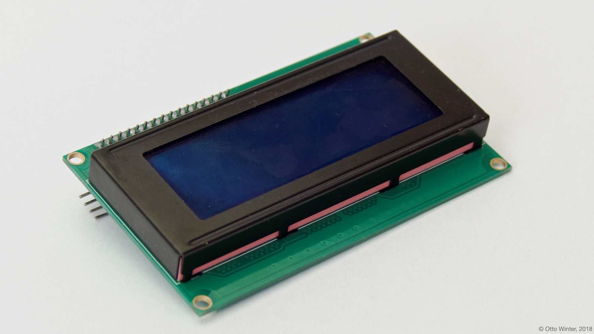

GPIO Character-Based LCD Display
================================

The ``lcd_gpio`` display platform allows you to use standard character-based LCD displays like `this one <https://www.adafruit.com/product/181>`__
with esphomelib. This integration is only for LCD displays that display individual characters on a screen (usually 16-20 columns
and 2-4 rows), and not for LCD displays that can control each pixel individually. Also, this is the GPIO version of the LCD
integration where each of the data pins of the LCD needs a dedicated GPIO pin on the ESP. These LCD displays are also
commonly sold with a PCF8574 chip which only need two lines to the ESP, for that see :doc:`lcd_pcf8574`.

    LCD Display.

.. figure:: images/lcd-hello_world.jpg
    :align: center
    :width: 60.0%

.. code:: yaml

    # Example configuration entry
    display:
      - platform: lcd_gpio
        dimensions: 18x4
        data_pins:
          - D0
          - D1
          - D2
          - D3
        enable_pin: D4
        rs_pin: D5
        lambda: |-
          it.print("Hello World!");

Configuration variables:
------------------------

- **dimensions** (**Required**, string): The dimensions of the display with ``ROWSxCOLUMNS``. If you're not
  sure, power the display up and just count them.
- **data_pins** (**Required**, list of :ref:`Pin Schemas <config-pin_schema>`): A list of the data pins you
  have hooked up to the LCD. The list can either be 8 items long (when you have connected all 8 data pins), or
  4 items long (if you're operating in 4-bit mode with either the first 4 data pins connected or the last 4 data
  pins connected).
- **enable_pin** (**Required**, :ref:`Pin Schema <config-pin_schema>`): The pin you have ``EN`` hooked up to.
- **rs_pin** (**Required**, :ref:`Pin Schema <config-pin_schema>`): The pin you have ``RS`` hooked up to.
- **rw_pin** (*Optional*, :ref:`Pin Schema <config-pin_schema>`): Optionally set the pin you have ``RW`` hooked up to.
  You can also just permanently connect that pin to GND.
- **lambda** (*Optional*, :ref:`lambda <config-lambda>`): The lambda to use for rendering the content on the display.
  See :ref:`display-lcd_lambda` for more information.
- **update_interval** (*Optional*, :ref:`config-time`): The interval to re-draw the screen. Defaults to ``1s``.
- **id** (*Optional*, :ref:`config-id`): Manually specify the ID used for code generation.

.. _display-lcd_lambda:

Rendering Lambda
----------------

The LCD displays has a similar API to the fully fledged ::ref:`display-engine`, but it's only a subset as LCD displays
don't have a concept of individual pixels. In the lambda you're passed a variable called ``it``
as with all other displays. In this case however, ``it`` is an :ref:`api-display-lcd_display` instance.

The most basic operation with LCD Displays is writing static text to the screen as in the configuration example
at the top of this page.

Each of the three methods (``print``, ``printf`` and ``strftime``) all optionally take a column and row arguments at the
beginning which can be used to print the text at a specific position. These arguments are set to ``0`` (column) and ``0`` (row)
by default which means the character at the top left.

.. code:: yaml

    display:
      - platform: lcd_gpio # or lcd_pcf8574
        # ...
        lambda: |-
          // Print 0 at the top left
          it.print("0");

          // Print 1 at the second row and second column.
          it.print(1, 1, "1");

          // Let's write a sensor value (let's assume it's 42.1)
          it.printf("%.1f", id(my_sensor).value);
          // Result: "42.1" (the dot will appear on the "2" segment)

          // Print a right-padded sensor value with 0 digits after the decimal
          it.printf("Sensor value: %8.0f", id(my_sensor).value);
          // Result: "Sensor value:       42"

          // Print the current time
          it.strftime("It is %H:%M on %d.%m.%Y");
          // Result for 10:06 on august 21st 2018 -> "It is 10:06 on 21.08.2018"

.. note::

    If you're not seeing anything on the display, make sure you try turning the contrast potentiometer around.

Please see :ref:`display-printf` for a quick introduction into the ``printf`` formatting rules and
:ref:`display-strftime` for an introduction into the ``strftime`` time formatting.

See Also
--------

- :doc:`index`
- :doc:`lcd_pcf8574`
- :doc:`API Reference </api/display/lcd_display>`
- `Arduino LiquidCrystal Library <https://www.arduino.cc/en/Reference/LiquidCrystal>`__
- `Edit this page on GitHub <https://github.com/OttoWinter/esphomedocs/blob/current/esphomeyaml/components/display/lcd_gpio.rst>`__

.. disqus::
