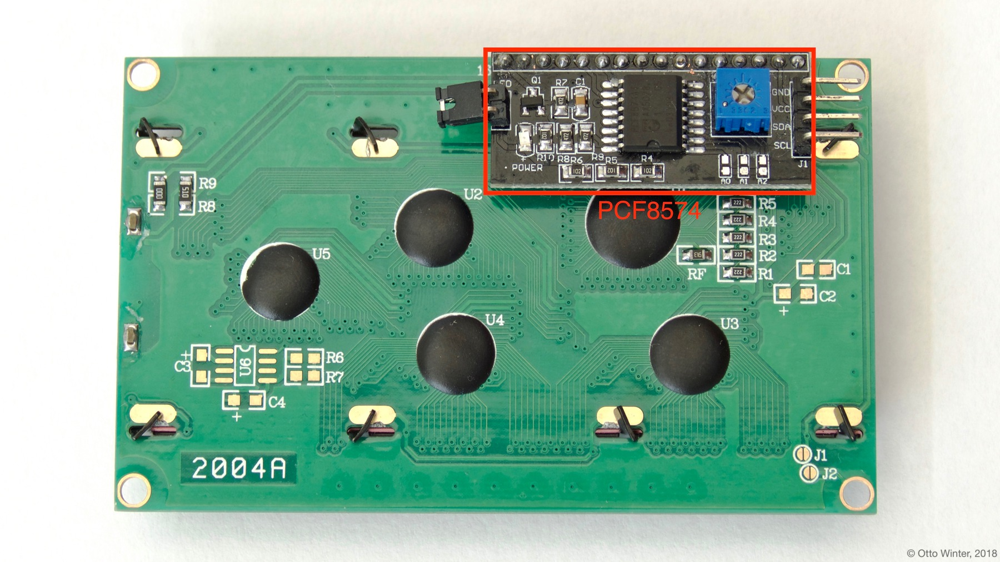

PCF8574 Character-Based LCD Display
===================================

.. seo::
    :description: Instructions for setting up the touch pad on the ESP32.
    :image: lcd.jpg

The ``lcd_pcf8574`` display platform allows you to use standard character-based LCD displays like `this one <https://docs.labs.mediatek.com/resource/linkit7697-arduino/en/tutorial/driving-1602-lcd-with-pcf8574-pcf8574a>`__
with esphomelib. This integration is only for LCD displays that display individual characters on a screen (usually 16-20 columns
and 2-4 rows), and not for LCD displays that can control each pixel individually.

This version of the LCD integration is for LCD displays with an PCF8574 connected to all the data pins. This has
the benefit that you only need to connect two data wires to the ESP instead of the 6 or 10 with the :doc:`lcd_gpio`.
As the communication with the :ref:`I²C Bus <i2c>`, you need to have an ``i2c:`` section in your configuration.

    The PCF8574 chip attached to the LCD Display.

.. figure:: images/lcd-hello_world.jpg
    :align: center
    :width: 60.0%

.. code:: yaml

    # Example configuration entry
    i2c:
      sda: D0
      scl: D1

    display:
      - platform: lcd_pcf8574
        dimensions: 18x4
        address: 0x3F
        lambda: |-
          it.print("Hello World!");

Configuration variables:
------------------------

- **dimensions** (**Required**, string): The dimensions of the display with ``ROWSxCOLUMNS``. If you're not
  sure, power the display up and just count them.
- **address** (*Optional*, int): The :ref:`I²C <i2c>` address of the PCF8574 chip, defaults to ``0x3F``.
- **lambda** (*Optional*, :ref:`lambda <config-lambda>`): The lambda to use for rendering the content on the display.
  See :ref:`display-lcd_lambda` for more information.
- **update_interval** (*Optional*, :ref:`config-time`): The interval to re-draw the screen. Defaults to ``1s``.
- **id** (*Optional*, :ref:`config-id`): Manually specify the ID used for code generation.

See Also
--------

- :doc:`index`
- :doc:`lcd_gpio`
- :doc:`/esphomeyaml/components/pcf8574`
- :doc:`API Reference </api/display/lcd_display>`
- `Arduino LiquidCrystal Library <https://www.arduino.cc/en/Reference/LiquidCrystal>`__
- `Edit this page on GitHub <https://github.com/OttoWinter/esphomedocs/blob/current/esphomeyaml/components/display/lcd_pcf8574.rst>`__

.. disqus::
