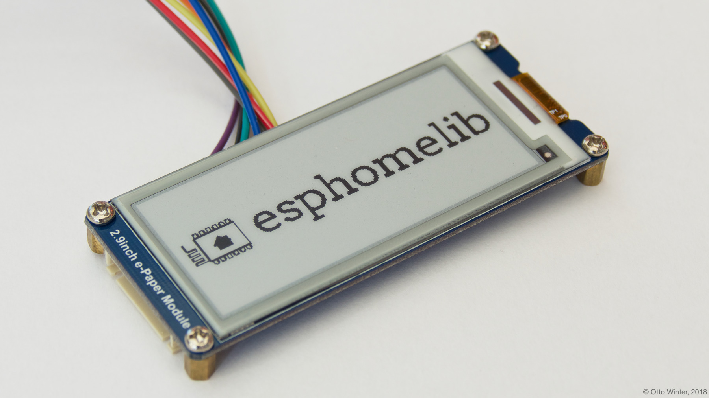
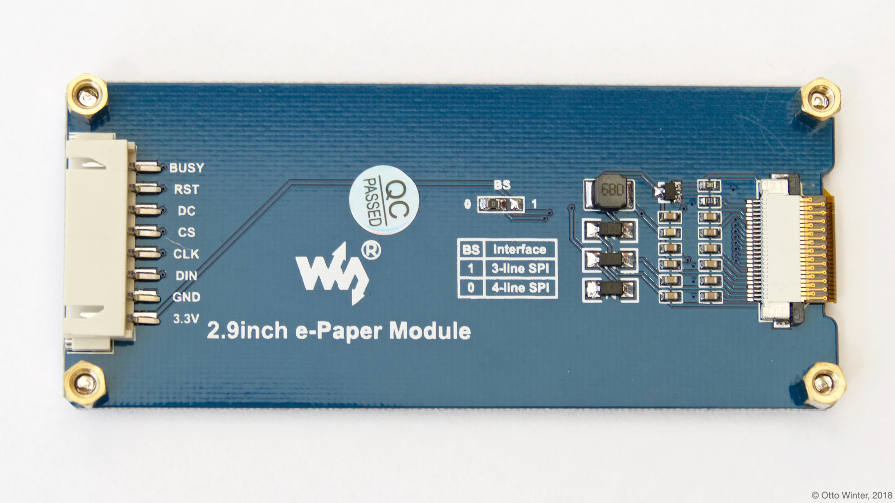

Waveshare E-Paper Display
=========================

.. seo::
    :description: Instructions for setting up Waveshare E-Paper displays in esphomelib.
    :image: waveshare_epaper.jpg

The ``waveshare_epaper`` display platform allows you to use
some E-Paper displays sold by `Waveshare <https://www.waveshare.com/product/modules/oleds-lcds/e-paper.htm>`__
with esphomelib. Similar modules sold by other vendors might also work but not have been tested yet. Currently only
single-color E-Ink displays are implemented and of those only a few modules.

    Waveshare E-Paper 2.9 Inch E-Paper Display.

The communication esphomelib has chosen to use for this integration is 4-wire :ref:`SPI <spi>`, as it's the most stable
and high-speed. So you need to make sure your board is set to the 4-wire SPI mode and have an ``spi:`` section in your
configuration.

.. table::
    :class: no-center

    ==================== ===================== =====================
    **E-Paper Pin**      **ESP Pin**           **esphomelib Option**
    -------------------- --------------------- ---------------------
    ``VCC``              ``3.3V``              N/A
    -------------------- --------------------- ---------------------
    ``GND``              ``GND``               N/A
    -------------------- --------------------- ---------------------
    ``CLK``              Any GPIO              ``spi.clk_pin``
    -------------------- --------------------- ---------------------
    ``DIN``              Any GPIO              ``spi.mosi_pin``
    -------------------- --------------------- ---------------------
    ``CS``               Any GPIO              ``cs_pin``
    -------------------- --------------------- ---------------------
    ``DC``               Any GPIO              ``dc_pin``
    -------------------- --------------------- ---------------------
    ``BUSY`` (Optional)  Any GPIO              ``busy_pin``
    -------------------- --------------------- ---------------------
    ``RESET`` (Optional) Any GPIO              ``reset_pin``
    ==================== ===================== =====================

.. code-block:: yaml

    # Example configuration entry
    spi:
      clk_pin: D0
      mosi_pin: D1

    display:
      - platform: waveshare_epaper
        cs_pin: D2
        dc_pin: D3
        busy_pin: D4
        reset_pin: D5
        model: 2.90in
        full_update_every: 30
        lambda: |-
          it.print(0, 0, id(font), "Hello World!");

Configuration variables:
------------------------

- **cs_pin** (**Required**, :ref:`Pin Schema <config-pin_schema>`): The CS pin.
- **dc_pin** (**Required**, :ref:`Pin Schema <config-pin_schema>`): The DC pin.
- **model** (**Required**): The model of the E-Paper display. Options are:

  - ``1.54in``
  - ``2.13in`` (not tested)
  - ``2.70in`` (not tested)
  - ``2.90in``
  - ``4.20in`` (not tested)
  - ``7.50in`` (not tested)

- **busy_pin** (*Optional*, :ref:`Pin Schema <config-pin_schema>`): The BUSY pin. Defaults to not connected.
- **reset_pin** (*Optional*, :ref:`Pin Schema <config-pin_schema>`): The RESET pin. Defaults to not connected.
  Make sure you pull this pin high (by connecting it to 3.3V with a resistor) if not connected to a GPIO pin.
- **rotation** (*Optional*): Set the rotation of the display. Everything you draw in ``lambda:`` will be rotated
  by this option. One of ``0°`` (default), ``90°``, ``180°``, ``270°``.
- **full_update_every** (*Optional*, int): E-Paper displays have two modes of switching to the next image: A partial
  update that only changes the pixels that have changed and a full update mode that first clears the entire display
  and then re-draws the image. The former is much quicker and nicer, but every so often a full update needs to happen
  because artifacts accumulate. On the ``1.54in``, ``2.13in`` and ``2.90in`` models you have the option to switch only
  do a full-redraw every x-th time using this option. Defaults to ``30`` on the described models and a full update for
  all other models.
- **lambda** (*Optional*, :ref:`lambda <config-lambda>`): The lambda to use for rendering the content on the display.
  See :ref:`display-engine` for more information.
- **update_interval** (*Optional*, :ref:`config-time`): The interval to re-draw the screen. Defaults to ``10s``.
- **spi_id** (*Optional*, :ref:`config-id`): Manually specify the ID of the :ref:`SPI Component <spi>` if you want
  to use multiple SPI buses.
- **id** (*Optional*, :ref:`config-id`): Manually specify the ID used for code generation.

See Also
--------

- :doc:`index`
- :doc:`API Reference </api/display/waveshare_epaper>`
- `Arduino Waveshare E-Paper library <https://github.com/soonuse/epd-library-arduino>`__ by `Yehui (@soonuse) <https://github.com/soonuse>`__
- `Edit this page on GitHub <https://github.com/OttoWinter/esphomedocs/blob/current/esphomeyaml/components/display/waveshare_epaper.rst>`__

.. disqus::
