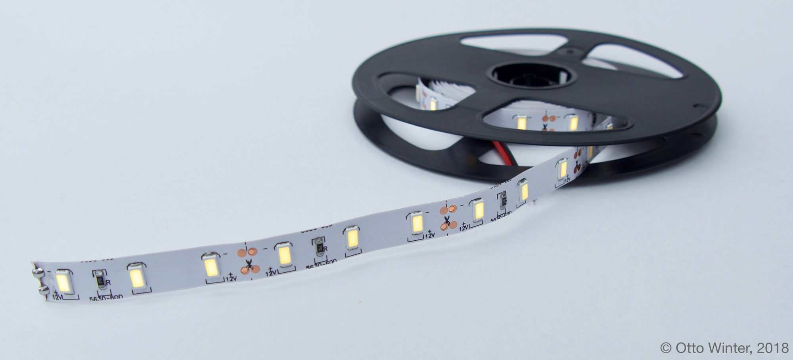

Monochromatic Light
===================

.. seo::
    :description: Instructions for setting up monochromatic (brightness-only) lights.
    :image: brightness-medium.svg

The ``monochromatic`` light platform creates a simple brightness-only light from an
:ref:`float output component <output>`.

    Example of a brightness-only LED strip that can be used with this component.

.. figure:: images/kitchen-lights.png
    :align: center
    :width: 40.0%

.. code:: yaml

    # Example configuration entry
    light:
      - platform: monochromatic
        name: "Kitchen Lights"
        output: output_component1

Configuration variables:
------------------------

- **name** (**Required**, string): The name of the light.
- **output** (**Required**, :ref:`config-id`): The id of the float :ref:`output` to use for this light.
- **gamma_correct** (*Optional*, float): The `gamma correction
  factor <https://en.wikipedia.org/wiki/Gamma_correction>`__ for the light. Defaults to ``2.8``.
- **default_transition_length** (*Optional*, :ref:`config-time`): The length of
  the transition if no transition parameter is provided by Home
  Assistant. Defaults to ``1s``.
- **effects** (*Optional*, list): A list of :ref:`light effects <light-effects>` to use for this light.
-  **id** (*Optional*, :ref:`config-id`): Manually specify the ID used for code generation.
- All other options from :ref:`MQTT Component <config-mqtt-component>`.

.. note::

    The ``monochromatic`` light platform only works with ``float``
    :ref:`outputs <output>` that can output any light intensity percentage like the
    :doc:`ESP32 LEDC </esphomeyaml/components/output/ledc>` or
    :doc:`ESP8266 PWM </esphomeyaml/components/output/esp8266_pwm>` components and does **not** work with output
    platforms like the :doc:`/esphomeyaml/components/output/gpio`.

See Also
--------

.. figure:: images/monochromatic-detail.jpg
    :align: center
    :width: 75.0%

- :doc:`/esphomeyaml/components/output/index`
- :doc:`/esphomeyaml/components/light/index`
- :doc:`/esphomeyaml/components/light/binary`
- :doc:`/esphomeyaml/components/power_supply`
- :doc:`/esphomeyaml/components/output/ledc`
- :doc:`/esphomeyaml/components/output/esp8266_pwm`
- :doc:`/esphomeyaml/components/output/pca9685`
- :doc:`/esphomeyaml/components/output/my9231`
- :doc:`API Reference </api/light/index>`
- `Edit this page on GitHub <https://github.com/OttoWinter/esphomedocs/blob/current/esphomeyaml/components/light/monochromatic.rst>`__

.. disqus::
