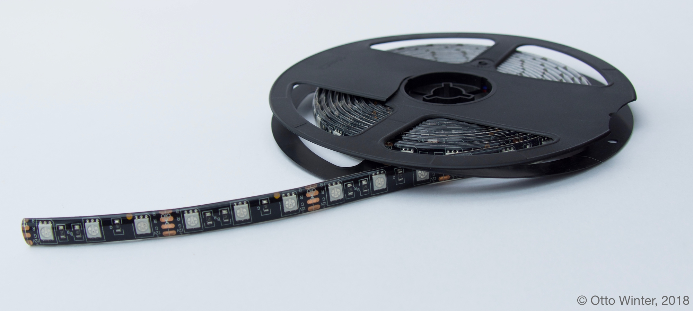
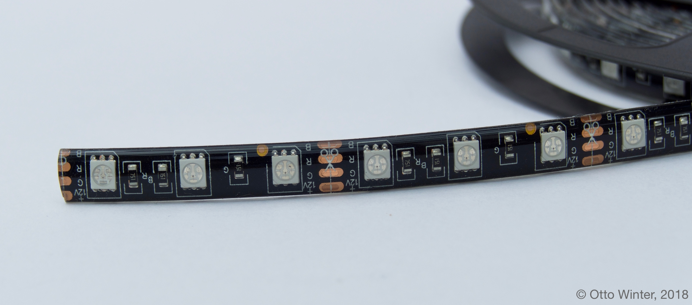

RGB Light
=========

.. seo::
    :description: Instructions for setting up RGB lights in esphomelib.
    :image: rgb.png

The ``rgb`` light platform creates an RGB light from 3 :ref:`float output components <output>`
(one for each color channel).

    Example of an RGB LED strip that can be used with this component.

.. figure:: images/rgb-ui.png
    :align: center
    :width: 40.0%

.. code:: yaml

    # Example configuration entry
    light:
      - platform: rgb
        name: "Living Room Lights"
        red: output_component1
        green: output_component2
        blue: output_component3

Configuration variables:
------------------------

- **name** (**Required**, string): The name of the light.
- **red** (**Required**, :ref:`config-id`): The id of the float :ref:`output` to use for the red channel.
- **green** (**Required**, :ref:`config-id`): The id of the float :ref:`output` to use for the green channel.
- **blue** (**Required**, :ref:`config-id`): The id of the float :ref:`output` to use for the blue channel.
- **gamma_correct** (*Optional*, float): The `gamma correction
  factor <https://en.wikipedia.org/wiki/Gamma_correction>`__ for the light. Defaults to ``2.8``.
- **default_transition_length** (*Optional*, :ref:`config-time`): The length of
  the transition if no transition parameter is provided by Home Assistant. Defaults to ``1s``.
- **effects** (*Optional*, list): A list of :ref:`light effects <light-effects>` to use for this light.
- **id** (*Optional*, :ref:`config-id`): Manually specify the ID used for code generation.
- All other options from :ref:`MQTT Component <config-mqtt-component>`.

.. note::

    The RGB light platform only works with ``float`` :ref:`outputs <output>` that
    can output any light intensity percentage like the :doc:`ESP32 LEDC </esphomeyaml/components/output/ledc>` or
    :doc:`ESP8266 PWM </esphomeyaml/components/output/esp8266_pwm>` components and does **not** work with output
    platforms like the :doc:`/esphomeyaml/components/output/gpio`.

See Also
--------

- :doc:`/esphomeyaml/components/output/index`
- :doc:`/esphomeyaml/components/light/index`
- :doc:`/esphomeyaml/components/light/rgbw`
- :doc:`/esphomeyaml/components/power_supply`
- :doc:`/esphomeyaml/components/output/ledc`
- :doc:`/esphomeyaml/components/output/esp8266_pwm`
- :doc:`/esphomeyaml/components/output/pca9685`
- :doc:`/esphomeyaml/components/output/my9231`
- :doc:`API Reference </api/light/index>`
- `Edit this page on GitHub <https://github.com/OttoWinter/esphomedocs/blob/current/esphomeyaml/components/light/rgb.rst>`__

.. disqus::
