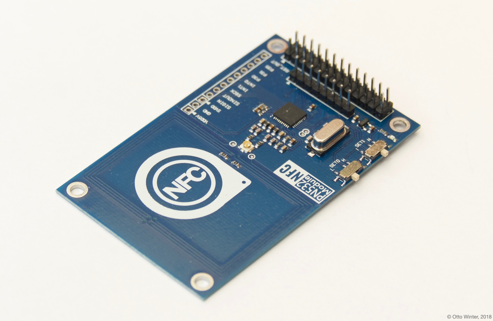
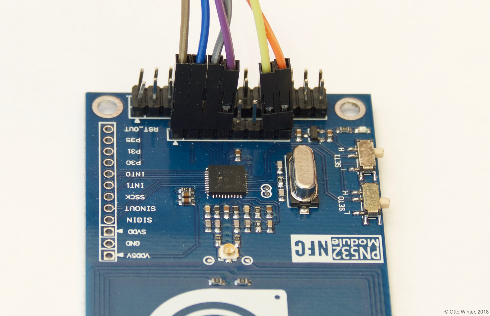

PN532 NFC/RFID Controller Hub
=============================

The ``pn532`` component allows you to use PN532 NFC/RFID controllers
(`datasheet <https://cdn-shop.adafruit.com/datasheets/pn532ds.pdf>`__, `adafruit <https://www.adafruit.com/product/364>`__)
with esphomelib. This component is a global hub that establishes the connection to the PN532 via :ref:`SPI <spi>` and
outputs its data. Using the :doc:`PN532 binary sensors </esphomeyaml/components/binary_sensor/pn532>` you can then
create individual binary sensors that track if an NFC/RFID tag is currently detected by the PN532.

See :ref:`pn532-setting_up_tags` for information on how to setup individual binary sensors for this component.

As the communication with the PN532 is done using SPI for this integration, you need to set the two switches on
the board to the SPI mode (usually by setting the first one to OFF and the second one to ON). Additionally, you need
to have an :ref:`spi bus <spi>` in your configuration with both the **miso_pin** and **mosi_pin** set.

.. code:: yaml

    # Example configuration entry
    spi:
      clk_pin: D0
      miso_pin: D1
      mosi_pin: D2

    pn532:
      cs_pin: D3
      update_interval: 1s

    binary_sensor:
      - platform: pn532
        uid: 74-10-37-94
        name: "PN532 NFC Tag"

Configuration variables:
------------------------

- **cs_pin** (**Required**, :ref:`Pin Schema <config-pin_schema>`): The pin on the ESP that the chip select line
  is connected to.
- **update_interval** (*Optional*, :ref:`config-time`): The duration of each scan on the PN532. This affects the
  duration that the individual binary sensors stay active when they're found.
  If a device is not found within this time window, it will be marked as not present. Defaults to 1s.
- **spi_id** (*Optional*, :ref:`config-id`): Manually specify the ID of the :ref:`SPI Component <spi>` if you want
  to use multiple SPI buses.
- **id** (*Optional*, :ref:`config-id`): Manually specify the ID for this component.

    Example for hooking up the PN532 via SPI. Notice the position of the two switches on the right.

See Also
--------

- :doc:`binary_sensor/pn532`
- :doc:`rdm6300`
- `PN532 Library <https://github.com/adafruit/Adafruit-PN532/blob/master/Adafruit_PN532.cpp>`__ by `Adafruit <https://www.adafruit.com/>`__
- :doc:`API Reference </api/binary_sensor/pn532>`
- `Edit this page on GitHub <https://github.com/OttoWinter/esphomedocs/blob/current/esphomeyaml/components/pn532.rst>`__

.. disqus::
