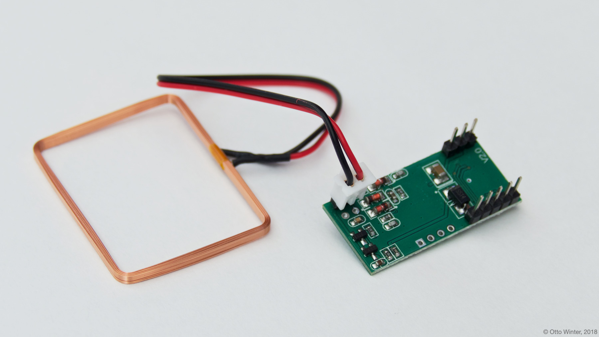

RDM6300 NFC/RFID Hub
====================

.. seo::
    :description: Instructions for setting up RDM6300 NFC/RFID tag readers in esphomelib.
    :image: rdm6300.jpg
    :keywords: RDM6300, NFC, RFID

The ``rdm6300`` component allows you to use RDM6300 NFC/RFID controllers
(`datasheet <https://elty.pl/upload/download/RFID/RDM630-Spec.pdf>`__, `iTead <https://www.itead.cc/rdm6300.html>`__)
with esphomelib. This component is a global hub that establishes the connection to the RDM6300 via :ref:`UART <uart>` and
translates the received data. Using the :doc:`RDM6300 binary sensors </esphomeyaml/components/binary_sensor/rdm6300>` you can then
create individual binary sensors that track if an NFC/RFID tag is currently detected by the RDM6300.

See :ref:`rdm6300-setting_up_tags` for information on how to setup individual binary sensors for this component.

As the communication with the RDM6300 is done using UART, you need
to have an :ref:`UART bus <uart>` in your configuration with the ``rx_pin`` connected to the data pin of the RDM6300 and
with the baud rate set to 9600

.. code:: yaml

    # Example configuration entry
    uart:
      rx_pin: D0
      baud_rate: 9600

    rdm6300:

    binary_sensor:
      - platform: rdm6300
        uid: 7616525
        name: "RDM6300 NFC Tag"

Configuration variables:
------------------------

- **uart_id** (*Optional*, :ref:`config-id`): Manually specify the ID of the :ref:`UART Component <uart>` if you want
  to use multiple UART buses.
- **id** (*Optional*, :ref:`config-id`): Manually specify the ID for this component.

See Also
--------

- :doc:`binary_sensor/rdm6300`
- :doc:`pn532`
- `RDM6300 Arduino Library <https://github.com/arliones/RDM6300-Arduino>`__ by `Arliones Hoeller Jr <https://github.com/arliones>`__
- :doc:`API Reference </api/binary_sensor/rdm6300>`
- `Edit this page on GitHub <https://github.com/OttoWinter/esphomedocs/blob/current/esphomeyaml/components/rdm6300.rst>`__

.. disqus::
