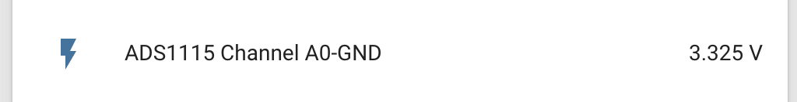

ADS1115 Sensor
==============

.. seo::
    :description: Instructions for setting up ADS1115 multiplexed analog voltage sensors.
    :image: ads1115.jpg
    :keywords: ADS1115

The ``ads1115`` sensor allows you to use your ADS1115 sigma-delta ADC
sensors (`datasheet <http://www.ti.com/lit/ds/symlink/ads1115.pdf>`__, `Adafruit`_) with esphomelib.
First, setup a :doc:`ADS1115 Hub </esphomeyaml/components/ads1115>` for your ADS1115 sensor and then use this
sensor platform to create individual sensors that will report the
voltage to Home Assistant.

.. figure:: images/ads1115-full.jpg
    :align: center
    :width: 50.0%

    ADS1115 16-Bit ADC.

.. _Adafruit: https://www.adafruit.com/product/1085

.. code-block:: yaml

    ads1115:
      - address: 0x48
    sensor:
      - platform: ads1115
        multiplexer: 'A0_GND'
        gain: 6.144
        name: "ADS1115 Channel A0-GND"

Configuration variables:
------------------------

-  **multiplexer** (**Required**): The multiplexer channel of this sensor. Effectively means between which pins you
   want to measure voltage.
-  **gain** (**Required**, float): The gain of this sensor.
-  **name** (**Required**, string): The name for this sensor.
-  **ads1115_id** (*Optional*, :ref:`config-id`): Manually specify the ID of the
   :doc:`ADS1115 Hub </esphomeyaml/components/ads1115>` you want to use this sensor.
-  **update_interval** (*Optional*, :ref:`config-time`): The interval
   to check the sensor. Defaults to ``60s``.
-  **id** (*Optional*, :ref:`config-id`): Manually specify the ID used for code generation.

Multiplexer And Gain
--------------------

The ADS1115 has a multiplexer that can be configured to measure voltage between several pin configurations. These are:

 - ``A0_A1`` (between Pin 0 and Pin 1)
 - ``A0_A3`` (between Pin 0 and Pin 3)
 - ``A1_A3`` (between Pin 1 and Pin 3)
 - ``A2_A3`` (between Pin 2 and Pin 3)
 - ``A0_GND`` (between Pin 0 and GND)
 - ``A1_GND`` (between Pin 1 and GND)
 - ``A2_GND`` (between Pin 2 and GND)
 - ``A3_GND`` (between Pin 3 and GND)

Additionally, the ADS1115 has a Programmable Gain Amplifier (PGA) that can help you measure voltages in different ranges, these are:

 - ``6.144`` (measures up to 6.144V)
 - ``4.096`` (measures up to 4.096V)
 - ``2.048`` (measures up to 2.048V)
 - ``1.024`` (measures up to 1.024V)
 - ``0.512`` (measures up to 0.512V)
 - ``0.256`` (measures up to 0.256V)

See Also
--------

- :ref:`sensor-filters`
- :doc:`adc`
- :doc:`max6675`
- :doc:`API Reference </api/sensor/ads1115>`
- `i2cdevlib <https://github.com/jrowberg/i2cdevlib>`__ by `Jeff Rowberg <https://github.com/jrowberg>`__
- `Edit this page on GitHub <https://github.com/OttoWinter/esphomedocs/blob/current/esphomeyaml/components/sensor/ads1115.rst>`__

.. disqus::
