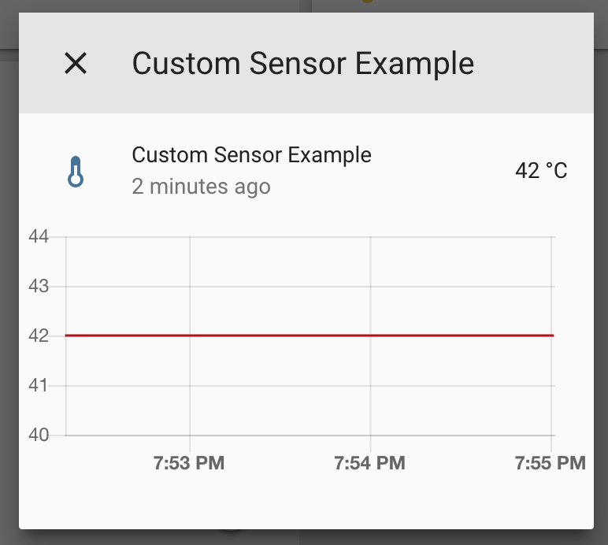

Custom Sensor Component
=======================

.. seo::
    :description: Instructions for setting up Custom C++ sensors with esphomelib.
    :image: language-cpp.svg
    :keywords: C++, Custom

.. warning::

    While I do try to keep the esphomeyaml configuration options as stable as possible
    and back-port them, the esphomelib API is less stable. If something in the APIs needs
    to be changed in order for something else to work, I will do so.

So, you just set up esphomelib for your ESP32/ESP8266, but sadly esphomelib is missing a sensor integration
you'd really like to have 😕. It's pretty much impossible to support every single sensor, as there are simply too many.
That's why esphomelib has a really simple API for you to create your own **custom sensors** 🎉

In this guide, we will go through creating a custom sensor component for the
`BMP180 <https://www.adafruit.com/product/1603>`__ pressure sensor (we will only do the pressure part,
temperature is more or less the same). During this guide, you will learn how to 1. define a custom sensor
esphomelib can use 2. go over how to register the sensor so that it will be shown inside Home Assistant and
3. leverage an existing arduino library for the BMP180 with esphomelib.

.. note::

    Since the creation of this guide, the BMP180 has been officially supported by the :doc:`BMP085 component
    <bmp085>`. The code still applies though.

This guide will require at least a bit of knowledge of C++, so be prepared for that. If you have any problems,
I'm here to help :) https://discord.gg/KhAMKrd

Step 1: Custom Sensor Definition
--------------------------------

At this point, you might have a main source file like this:

.. code:: cpp

    // ...
    using namespace esphomelib;

    void setup() {
      // ===== DO NOT EDIT ANYTHING BELOW THIS LINE =====
      // ========== AUTO GENERATED CODE BEGIN ===========
      App.set_name("livingroom");
      App.init_log();
      // ...
      // =========== AUTO GENERATED CODE END ============
      // ========= YOU CAN EDIT AFTER THIS LINE =========
      App.setup();
    }

    void loop() {
      App.loop();
    }

To create your own custom sensor, you just have define a C++ class that extends ``Component`` and ``Sensor`` like this:

.. code:: cpp

    using namespace esphomelib;

    class CustomSensor : public Component, public sensor::Sensor {
     public:
      CustomSensor(const std::string &name) : Sensor(name) {}

      void setup() override {
        // This will be called by App.setup()
      }
      void loop() override {
        // This will be called by App.loop()
      }
    };

    void setup() {
      // ...

Additionally, you need to change an internal flag that changes how esphomeyaml compiles files.
The only downside is that this will make build times *a tiny bit* slower:

.. code:: yaml

    esphomeyaml:
      # ...
      use_custom_code: True

You've just created your first esphomelib sensor 🎉. It doesn't do very much right now and is never registered,
but it's a first step.

Let's now take a look at how a sensor works in esphomelib: A sensor is some hardware device (like a BMP180)
that sends out new values like temperatures.

Like any Component in esphomelib, if it's registered in the Application, ``setup()`` will be called for you when
``App.setup()`` is run. ``setup()`` is also the place where you should do hardware initialization like setting
``pinMode()``. Next, every time ``App.loop()`` is called, your component will also receive a ``loop()`` call.
This is the place where you should do stuff like querying a sensor for a new value like you might be used
to do in an Arduino sketch.

Let's now also take a closer look at this line, which you might not be too used to when writing pure C code:

.. code:: cpp

    class CustomSensor : public Component, public sensor::Sensor {

What this line is essentially saying is that we're defining our own class that's called ``CustomSensor``
which is also a subclass of ``Component`` and ``Sensor`` (in the namespace ``sensor::``).
``Component`` is there so that we can register it in our application and so that we will receive ``setup()``
and ``loop()`` calls. We're also inheriting from the ``Sensor`` class so that our custom sensor can send sensor
values to the frontend (like MQTT).

As most sensors really just setup some pins and then check the sensor every x seconds,
there's another abstraction that we'll use to simplify our code: ``PollingSensorComponent``.

.. code:: cpp

    class CustomSensor : public sensor::PollingSensorComponent {
     public:
      CustomSensor(const std::string &name, uint32_t update_interval)
        : sensor::PollingSensorComponent(name, update_interval) {}

      void setup() override {
        // This will be called by App.setup()
      }
      void update() override {
        // This will be called every `update_interval` milliseconds.
      }
    };

What ``PollingSensorComponent`` (and ``PollingComponent``) does is essentially
just replace the ``loop()`` method and will call ``update()`` instead every ``update_interval`` milliseconds.
Because with most sensors, you really don't need to get the latest values with every single ``loop()``
call (which can be called many times per second). If we forward the ``update_interval`` in our *constructor*
(line 3), ``PollingSensorComponent`` will call ``update()`` for us every ``update_interval``
milliseconds, so that we don't have to do time checking ourselves.
You don't really need to know about C++ constructors for now, but I would definitely recommend reading up on them
in the Internet.

Let's also now make our sensor actually *output* values (42 for now):

.. code:: cpp

    // class CustomSensor ...
      // ... previous code
      void update() override {
        publish_state(42.0);  // 42°C
      }

      std::string unit_of_measurement() override { return "°C"; }
      int8_t accuracy_decimals() override { return 2; } // 2 decimal places of accuracy.
    };

Every time ``update`` is called we will now **push** a new value to the frontend.
The front-end will then relay those values to MQTT and finally to Home Assistant.
Additionally, we created a function that tells the sensor what unit of measurement the
value is in, this is not strictly required and only used for a nice output in Home Assistant.

Step 2: Registering the custom sensor
-------------------------------------

Now we have our Custom Sensor set up, but unfortunately it doesn't do much right now.
Actually ... it does nothing because it's never registered in the App,
so esphomelib can't know about it. Let's change that.

In your global ``setup()`` method, after you've setup all other components, do the following:

.. code:: cpp

    void setup() {
      // ...
      // =========== AUTO GENERATED CODE END ============
      // ========= YOU CAN EDIT AFTER THIS LINE =========

      auto *custom_sensor = new CustomSensor("My Custom Sensor", 5000); // update every 5000ms or every 5 seconds.
      App.register_component(custom_sensor);
      App.register_sensor(custom_sensor);

      App.setup();
    }

If you have Home Assistant MQTT discovery setup, it will even automatically show up in the frontend 🎉
(with the entity id ``sensor.custom_sensor_example``)

Let's go through the code for registering our custom sensor. First, we're creating a new CustomSensor
instance with the update interval of 5000ms using the ``new`` C++ syntax (important!) and assigning it to a
variable ``custom_sensor`` (using C++11 ``auto`` type specifier to make it simpler).

.. code:: cpp

    auto *custom_sensor = new CustomSensor(5000);

Next, we *register* the component in esphomelib's Application instance so that it can call the component's
``setup()`` and ``loop()``.

.. code:: cpp

    App.register_component(custom_sensor);

    // you could also write this, it's a bit shorter and works the same way.
    // auto *custom_sensor = App.register_component(new CustomSensor(5000));

    App.register_sensor(custom_sensor);

Lastly, we're registering the *sensor* with ``register_sensor``, this will automatically set up a
bunch of callbacks so that it can publish state changes to MQTT when you call ``publish_new_value()``,
create automatic MQTT discovery messages and setup a moving average over the sensor values
(adjust these as you would with any other sensor).

Step 3: BMP180 support
----------------------

Let's finally make this custom sensor useful by adding the BMP180 aspect into it! A great feature of
esphomelib is that you can just use all existing arduino libraries, amazing right? Now for this example we'll
use the `Adafruit BMP085 Library <https://platformio.org/lib/show/525/Adafruit%20BMP085%20Library>`__
library by Adafruit.

First we'll need to add the library to our platformio dependencies. To do so, put the following in
the ``common`` section of your ``platformio.ini``:

.. code:: ini

    [common]
    lib_deps = Adafruit BMP085 Library
    build_flags =
    upload_flags =

Next, include the library at the top of you main sketch file (``<NODE_NAME>/src/main.cpp``):

.. code:: cpp

    #include "esphomelib/application.h"
    #include <Adafruit_BMP085.h>

    using namespace esphomelib;

    // ...

Then update our sensor for BMP180 support:

.. code:: cpp

    // ...

    class BMP180Sensor : public sensor::PollingSensorComponent {
     public:
      Adafruit_BMP085 bmp;

      BMP180Sensor(const std::string &name, uint32_t update_interval)
          : sensor::PollingSensorComponent(name, update_interval) {

      }

      void setup() override {
        bmp.begin();
      }

      void update() override {
        int pressure = bmp.readPressure(); // in Pa, or 1/100 hPa
        publish_state(pressure / 100.0); // convert to hPa
      }

      std::string unit_of_measurement() override { return "hPa"; }
      int8_t accuracy_decimals() override { return 2; } // 2 decimal places of accuracy.
    };

    void setup() {
      // ...

      auto *custom_sensor = new BMP180Sensor("My BMP180 sensor", 5000);
      App.register_component(custom_sensor);
      App.register_sensor(custom_sensor);

      App.setup();
    }

    // ...

There's not too much going on there. First, we define the variable ``bmp`` of type ``Adafruit_BMP085``
inside our class as a class member. In ``setup()`` we initialize the library and in ``update()`` we read the
pressure and send it out to MQTT.

You've now successfully created your first custom sensor component 🎉 Happy coding!

Bonus: Sensors With Multiple Output Values
------------------------------------------

The ``PollingSensorComponent`` doesn't fit every use-case. Sometimes, (as with the BMP180),
a sensor can expose multiple values (temperature *and* pressure, for example).

Doing so in esphomelib is a bit more difficult. Basically, we will have to change our sensor
model to have *one component* that reads out the values and *one sensor class* for each value
we want to expose.

Let's look at what that could look like in code:

.. code:: cpp

    // An empty sensor subclass that will "proxy" the temperature values
    class BMP280TemperatureSensor : public sensor::Sensor {
     public:
      BMP280TemperatureSensor(const std::string &name) : sensor::Sensor(name) {}
      std::string unit_of_measurement() override { return "°C"; }
      int8_t accuracy_decimals() override { return 1; }
    };

    // An empty sensor subclass that will "proxy" the pressure values
    class BMP280PressureSensor : public sensor::Sensor {
     public:
      BMP280PressureSensor(const std::string &name) : sensor::Sensor(name) {}
      std::string unit_of_measurement() override { return "hPa"; }
      int8_t accuracy_decimals() override { return 2; }
    };

    class BMP180Component : public PollingComponent {
     public:
      Adafruit_BMP085 bmp;
      BMP280TemperatureSensor *temperature_sensor;
      BMP280PressureSensor *pressure_sensor;

      BMP180Component(const std::string &temperature_name, const std::string &pressure_name, uint32_t update_interval)
          : PollingComponent(update_interval) {
        this->temperature_sensor = new BMP280TemperatureSensor(temperature_name);
        this->pressure_sensor = new BMP280PressureSensor(pressure_name);
      }

      void setup() override {
        bmp.begin();
      }

      void update() override {
        // This is the actual sensor reading logic.
        int pressure = bmp.readPressure();
        pressure_sensor->publish_state(pressure / 100.0);

        float temperature = bmp.readTemperature();
        temperature_sensor->publish_state(temperature);
      }
    };

    void setup() {
      // ...

      auto *custom_bmp180 = new BMP180Component("BMP180 Temperature", "BMP180 Pressure", 5000);
      // The BMP180Component is a *component*, so it needs to be registered.
      App.register_component(custom_bmp180);

      // But the temperature&pressure classes are *sensors*, so each of them needs to be registered
      App.register_sensor(custom_bmp180->temperature_sensor);
      App.register_sensor(custom_bmp180->pressure_sensor);

      App.setup();
    }

That's a lot of code :P Basically, what it boils down to is you have one central component ``BMP180Component``
which handles the communication with the BMP180 and a ``Sensor`` subclass for each value you want to expose.

Most of the magic happens inside the ``update()`` function. Here, the values are read from the BMP180 and are
sent to esphomelib via the pressure/temperature sensor proxies we set up in the constructor.

The only other thing you need to change is the registering inside ``setup()``.
Because ``BMP180Component`` is a *component* (because it has a lifecycle through the ``setup()`` and ``loop()`` methods),
it needs to be registered with ``App.register_component(...)``. However, as it's now not a subclass
of ``Sensor`` anymore, it cannot be registered as a sensor.

But because the ``BMP280TemperatureSensor`` and ``BMP280PressureSensor`` *are* subclasses of sensors,
they do need to be registered so that esphomelib can do all the magic stuff like setting up MQTT discovery
for them. That's why we call ``App.register_sensor`` for each sensor we created in the end.

See Also
--------

- `Full source code <https://github.com/OttoWinter/esphomelib/blob/master/examples/custom-bmp180-sensor/custom-bmp180-sensor.cpp>`__
- `Edit this page on GitHub <https://github.com/OttoWinter/esphomedocs/blob/current/esphomeyaml/components/sensor/custom.rst>`__

.. disqus::
