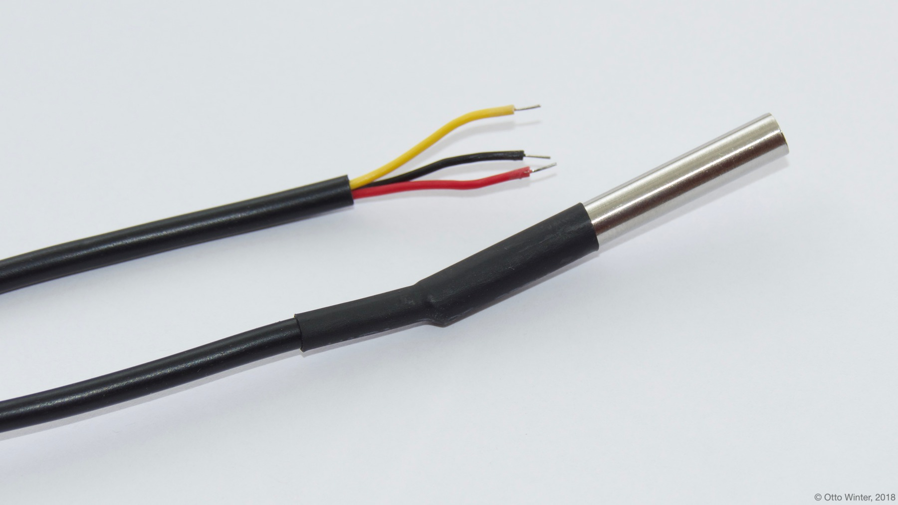

Dallas Temperature Sensor
=========================

The ``dallas`` sensor allows you to use ds18b20 and similar sensors.
First, you need to define a :doc:`dallas sensor component </esphomeyaml/components/dallas>`.
The dallas sensor component (or "hub") is an internal model that defines which pins the ds18b20
sensors are connected to. This is because with these sensors you can actually connect multiple
sensors to a single pin and use them all at once.

To initialize a sensor, first supply either ``address`` **or** ``index`` to identify the sensor.

    Wired Version of the DS18b20 One-Wire Temperature Sensor.

.. _Adafruit: https://www.adafruit.com/product/374

.. figure:: images/temperature.png
    :align: center
    :width: 80.0%

.. code:: yaml

    # Example configuration entry
    dallas:
      - pin: GPIO23

    # Individual sensors
    sensor:
      - platform: dallas
        address: 0x1C0000031EDD2A28
        name: "Living Room Temperature"

Configuration variables:
------------------------

- **address** (**Required**, int): The address of the sensor. Use either
  this option or index.
- **index** (**Required**, int): The index of the sensor starting with 0.
  So the first sensor will for example have index 0. :ref:`It’s recommended
  to use address instead <dallas-getting-ids>`.
- **resolution** (*Optional*, int): An optional resolution from 8 to
  12. Higher means more accurate. Defaults to the maximum for most dallas temperature sensors: 12.
- **dallas_id** (*Optional*, :ref:`config-id`): The ID of the :doc:`dallas hub </esphomeyaml/components/dallas>`.
  Use this if you have multiple dallas hubs.
- **id** (*Optional*, :ref:`config-id`): Manually specify the ID used for code generation.
- All other options from :ref:`Sensor <config-sensor>` and :ref:`MQTT Component <config-mqtt-component>`.

.. _dallas-getting-ids:

Getting Sensor IDs
------------------

It is highly recommended to use the ``address`` attribute for creating
dallas sensors, because if you have multiple sensors on a bus and the
automatic sensor discovery fails, all sensors indices will be shifted by
one. In order to get the address, simply start the firmware on your
device with a configured dallas hub and observe the log output (the :ref:`log
level <logger-log_levels>` must be set to at least
``debug``!). Note that you don't need to define the individual sensors just yet, as
the scanning will happen even with no sensors connected. For example with this configuration:

.. code:: yaml

    # Example configuration entry
    dallas:
      - pin: GPIO23

    # Note you don't have to add any sensors at this point

You will find something like this:

.. figure:: images/dallas-log.png

Now we can add the individual sensors to our configuration:

.. code:: yaml

    # Example configuration entry
    dallas:
      - pin: GPIO23

    sensor:
      - platform: dallas
        address: 0xA40000031F055028
        name: "Temperature #1"
      - platform: dallas
        address: 0xDD0000031EFB0428
        name: "Temperature #2"
      - platform: dallas
        # ...

Next, individually warm up or cool down the sensors and observe the log again.
You will see the outputted sensor values changing when they're being warmed.
When you're finished mapping each address to a name, just change the ``Temperature #1``
to your assigned names and you should be ready.

See Also
--------

- :ref:`sensor-filters`
- :doc:`/esphomeyaml/components/dallas`
- :doc:`max6675`
- `Arduino DallasTemperature library <https://github.com/milesburton/Arduino-Temperature-Control-Library>`__ by `Miles Burton <https://github.com/milesburton>`__
- :doc:`API Reference </api/sensor/dallas>`
- `Edit this page on GitHub <https://github.com/OttoWinter/esphomedocs/blob/current/esphomeyaml/components/sensor/dallas.rst>`__

.. disqus::
