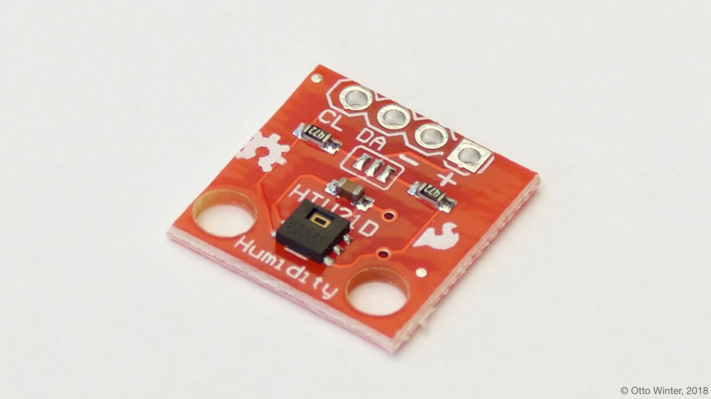

HTU21D Temperature+Humidity Sensor
==================================

The HTU21D Temperature+Humidity sensor allows you to use your HTU21D
(`datasheet <http://www.te.com/commerce/DocumentDelivery/DDEController?Action=showdoc&DocId=Data+Sheet%7FHPC199_6%7FA6%7Fpdf%7FEnglish%7FENG_DS_HPC199_6_A6.pdf%7FCAT-HSC0004>`__,
`adafruit <https://www.adafruit.com/product/1899>`__) sensors with
esphomelib. The :ref:`I²C Bus <i2c>` is
required to be set up in your configuration for this sensor to work.

    HTU21D Temperature & Humidity Sensor.

.. _Adafruit: https://learn.adafruit.com/adafruit-htu21d-f-temperature-humidity-sensor/overview

.. figure:: images/temperature-humidity.png
    :align: center
    :width: 80.0%

.. note::

    The **SI7021** sensor also works with this integration.

.. code:: yaml

    # Example configuration entry
    sensor:
      - platform: htu21d
        temperature:
          name: "Living Room Temperature"
        humidity:
          name: "Living Room Humidity"
        update_interval: 15s

Configuration variables:
------------------------

- **temperature** (**Required**): The information for the temperature sensor.

  - **name** (**Required**, string): The name for the temperature sensor.
  - **id** (*Optional*, :ref:`config-id`): Set the ID of this sensor for use in lambdas.
  - All other options from :ref:`Sensor <config-sensor>` and :ref:`MQTT Component <config-mqtt-component>`.

- **humidity** (**Required**): The information for the humidity sensor.

  - **name** (**Required**, string): The name for the humidity sensor.
  - **id** (*Optional*, :ref:`config-id`): Set the ID of this sensor for use in lambdas.
  - All other options from :ref:`Sensor <config-sensor>` and :ref:`MQTT Component <config-mqtt-component>`.

- **update_interval** (*Optional*, :ref:`config-time`): The interval to check the sensor. Defaults to ``15s``.
  See :ref:`sensor-default_filter`.

See Also
--------

- :ref:`sensor-filters`
- :doc:`dht`
- :doc:`dht12`
- :doc:`hdc1080`
- :doc:`sht3xd`
- :doc:`API Reference </api/sensor/htu21d>`
- `i2cdevlib <https://github.com/jrowberg/i2cdevlib>`__ by `Jeff Rowberg <https://github.com/jrowberg>`__
- `Edit this page on GitHub <https://github.com/OttoWinter/esphomedocs/blob/current/esphomeyaml/components/sensor/htu21d.rst>`__

.. disqus::
