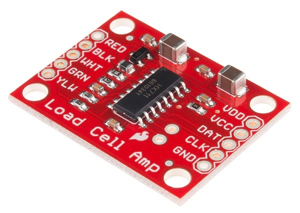

HX711 Load Cell Amplifier
=========================

The ``hx711`` sensor platform allows you to use your HX711
load cell amplifier
(`datasheet <https://www.mouser.com/ds/2/813/hx711_english-1022875.pdf>`__, `Sparkfun`_) with esphomelib

    HX711 Load Cell Amplifier. Image by `Sparkfun`_ licensed and re-distributed under `CC BY 2.0 <https://creativecommons.org/licenses/by/2.0/>`__.

.. _Sparkfun: https://www.sparkfun.com/products/13879

Connect ``GND`` to ``GND``, ``VCC`` to ``3.3V`` and the other three ``MISO`` (or ``SO`` for short),
``CS`` and ``CLOCK`` (or ``SCK``) to free GPIO pins.

.. code:: yaml

    # Example configuration entry
    sensor:
      - platform: hx711
        name: "HX711 Value"
        dout_pin: D0
        clk_pin: D1
        gain: 128
        update_interval: 15s

Configuration variables:
~~~~~~~~~~~~~~~~~~~~~~~~

- **name** (**Required**, string): The name for the load cell sensor.
- **dout_pin** (**Required**, :ref:`Pin Schema <config-pin_schema>`): The DOUT (or DAT) pin.
- **clk_pin** (**Required**, :ref:`Pin Schema <config-pin_schema>`): The CLK pin.
- **update_interval** (*Optional*, :ref:`config-time`): The interval to check the sensor. Defaults to ``15s``.
  See :ref:`sensor-default_filter`.
- **id** (*Optional*, :ref:`config-id`): Manually specify the ID used for codegeneration.
- All other options from :ref:`Sensor <config-sensor>` and :ref:`MQTT Component <config-mqtt-component>`.

See Also
^^^^^^^^

- :ref:`sensor-filters`
- :doc:`adc`
- :doc:`API Reference </api/sensor/hx711>`
- `HX711 Library <https://github.com/bogde/HX711>`__ by `@bogde <https://github.com/bogde>`__
- `Edit this page on GitHub <https://github.com/OttoWinter/esphomedocs/blob/current/esphomeyaml/components/sensor/hx711.rst>`__
