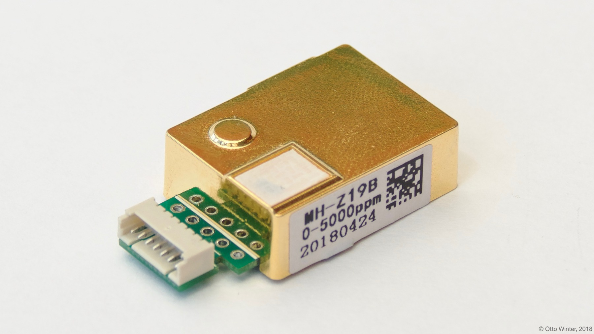
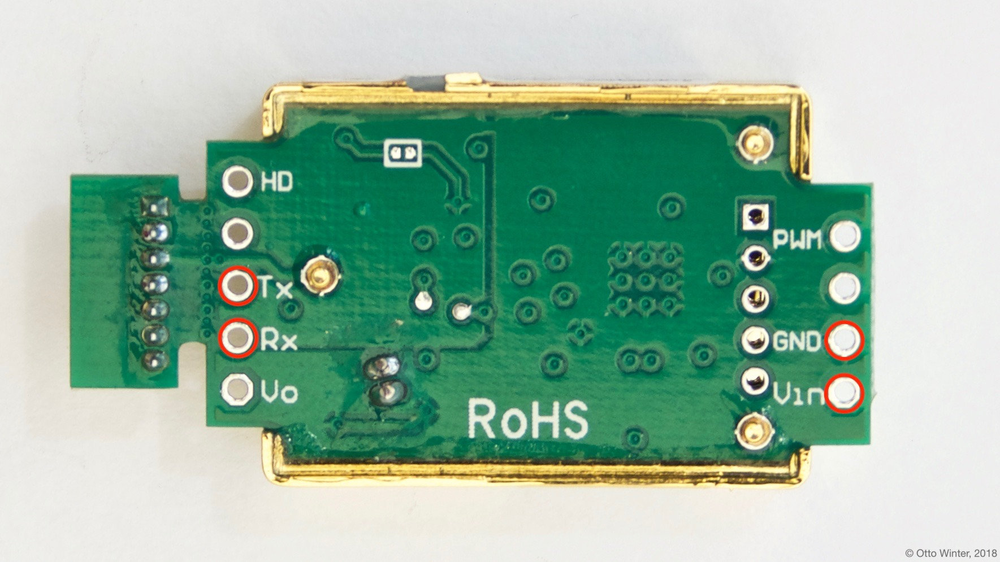

MH-Z19 CO_2 and Temperature Sensor
==================================

.. seo::
    :description: Instructions for setting up MH-Z19 CO2 and temperature sensors
    :image: mhz19.jpg
    :keywords: mh-z19

The ``mhz19`` sensor platform allows you to use MH-Z19 CO_2 and temperature sensors
(`refspace`_) with esphomelib.

    MH-Z19 CO_2 and Temperature Sensor.

.. _refspace: https://revspace.nl/MHZ19

As the communication with the MH-Z19 is done using UART, you need
to have an :ref:`UART bus <uart>` in your configuration with the ``rx_pin`` connected to the TX pin of the
MH-Z19 and the ``tx_pin`` connected to the RX Pin of the MH-Z19 (it's switched because the
TX/RX labels are from the perspective of the MH-Z19). Additionally, you need to set the baud rate to 9600.

.. code:: yaml

    # Example configuration entry
    uart:
      rx_pin: D0
      tx_pin: D1
      baud_rate: 9600

    sensor:
      - platform: mhz19
        co2:
          name: "MH-Z19 CO2 Value"
        temperature:
          name: "MH-Z19 Temperature"
        update_interval: 15s

Configuration variables:
------------------------

- **co2** (**Required**): The CO_2 data from the sensor in parts per million (ppm).

  - **name** (**Required**, string): The name for the CO_2 sensor.
  - **id** (*Optional*, :ref:`config-id`): Set the ID of this sensor for use in lambdas.
  - All other options from :ref:`Sensor <config-sensor>` and :ref:`MQTT Component <config-mqtt-component>`.

- **temperature** (**Required**): The information for the temperature sensor. Please note that this is
  not officially documented in the datasheet and seems to be quite inaccurate.

  - **name** (**Required**, string): The name for the temperature sensor.
  - **id** (*Optional*, :ref:`config-id`): Set the ID of this sensor for use in lambdas.
  - All other options from :ref:`Sensor <config-sensor>` and :ref:`MQTT Component <config-mqtt-component>`.

- **update_interval** (*Optional*, :ref:`config-time`): The interval to check the
  sensor. Defaults to ``15s``. See :ref:`sensor-default_filter`.

- **uart_id** (*Optional*, :ref:`config-id`): Manually specify the ID of the :ref:`UART Component <uart>` if you want
  to use multiple UART buses.

    Pins on the MH-Z19. Only the ones marked with a red circle need to be connected.

See Also
--------

- :ref:`sensor-filters`
- `MH-Z19 library <https://github.com/nara256/mhz19_uart>`__ by `@nara356 <https://github.com/nara256>`__
- :doc:`API Reference </api/sensor/mhz19>`
- `Edit this page on GitHub <https://github.com/OttoWinter/esphomedocs/blob/current/esphomeyaml/components/sensor/mhz19.rst>`__

.. disqus::
