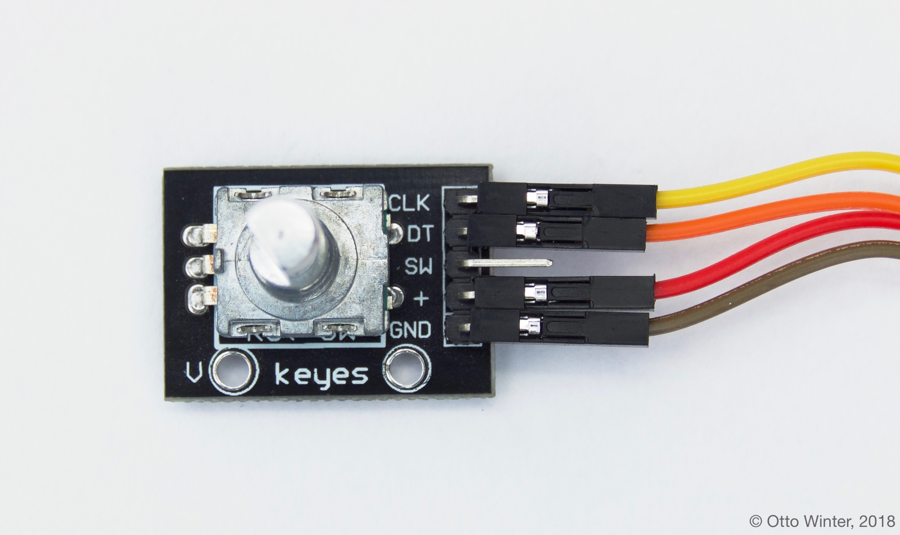

Rotary Encoder Sensor
=====================

.. seo::
    :description: Instructions for setting up rotary encoders.
    :image: rotary_encoder.jpg

The ``rotary_encoder`` sensor platform allows you to use any continuous-rotation
rotary encoders with esphomeyaml. These devices usually have two pins with which
they encode the rotation. Every time the knob of the rotary encoder is turned, the
signals of the two pins go HIGH and LOW in turn. See
`this Arduino article <https://playground.arduino.cc/Main/RotaryEncoders>`__ to gain
a better understanding of these sensors.

    Example of a continuous rotary encoder. Pin ``+`` is connected to ``3.3V``,
    ``GND`` is connected to ``GND``, and ``CLK`` & ``DT`` are A & B.

.. figure:: /esphomeyaml/components/sensor/images/rotary_encoder-ui.png
    :align: center
    :width: 75.0%

To use rotary encoders in esphomeyaml, first identify the two pins encoding th step value.
These are often called ``CLK`` and ``DT`` as in above image. Note if the values this sensor
outputs go in the wrong direction, you can just swap these two pins.

.. code-block:: yaml

    # Example configuration entry
    sensor:
      - platform: rotary_encoder
        name: "Rotary Encoder"
        pin_a: D1
        pin_b: D2

Configuration variables:
------------------------

- **pin_a** (**Required**, :ref:`Pin Schema <config-pin_schema>`):
  The first pin for determining the step value. Must not be a pin from an external I/O expander.
- **pin_b** (**Required**, :ref:`Pin Schema <config-pin_schema>`):
  The second pin for determining the step value. Must not be a pin from an external I/O expander.
- **name** (**Required**, string): The name of the rotary encoder sensor.
- **pin_reset** (*Optional*, :ref:`Pin Schema <config-pin_schema>`):
  An optional pin that resets the step value. This is useful with rotary encoders that have have a
  third pin. Defaults to no reset pin.
- **id** (*Optional*, :ref:`config-id`): Manually specify the ID used for code generation.
- All other options from :ref:`Sensor <config-sensor>` and :ref:`MQTT Component <config-mqtt-component>`.

Debouncing Output
-----------------

This sensor can output a lot of values in a short period of time when turning the knob.
In order to not put too much stress on your network connection, you can leverage esphomelib's
sensor filters. The following will only send out values if the last input value is at least
0.1s seconds old *or* if the new rotary encoder value has changed by 10 from the previous value.

.. code-block:: yaml

    # Example configuration entry
    sensor:
      - platform: rotary_encoder
        name: "Rotary Encoder"
        pin_a: D1
        pin_b: D2
        filters:
          - or:
            - debounce: 0.1s
            - delta: 10

See Also
--------

- :ref:`sensor-filters`
- :doc:`pulse_counter`
- :doc:`template`
- `Mechanical Input Library <https://github.com/jkDesignDE/MechInputs>`__ by `Jochen Krapf <https://github.com/JK-de>`__
- :doc:`API Reference </api/sensor/rotary_encoder>`
- `Edit this page on GitHub <https://github.com/OttoWinter/esphomedocs/blob/current/esphomeyaml/components/sensor/rotary_encoder.rst>`__

.. disqus::
