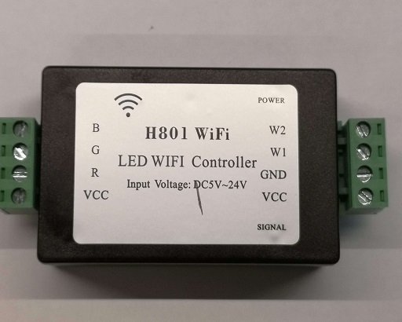
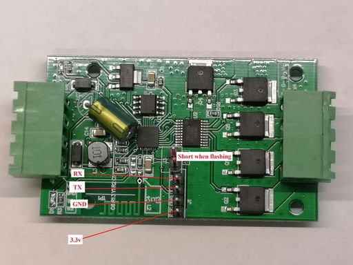
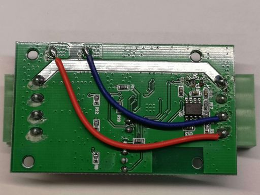
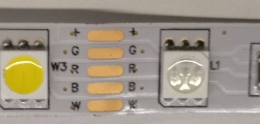
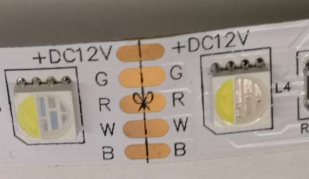

H801 RGBW LED controller
========================

| The H801 is pretty afordable and easy to hack and adapt to your needs. It can be found on `Aliexpress <https://s.click.aliexpress.com/e/bbnUDBZW>`__
| `Here <http://tinkerman.cat/closer-look-h801-led-wifi-controller/>`__ is an article about the hardware for those who have an interest for more details about the board.
| It can be used as a RGB, RGBW, RGB dual white or even control 5 individual monochromatic strips if you want or combinations of these.

For esphomelib, you can then use the :doc:`RGBW </esphomeyaml/components/light/rgbw.html>` 
and the :doc:`ESP8266 Software PWM output </esphomeyaml/components/output/esp8266_pwm.html>` components using below configuration (the commented out code is for the RBG cold white strip in pictures):

.. code-block:: yaml
esphomeyaml:
  name: h801test
  platform: ESP8266
  board: d1_mini
wifi:
  ssid: 'WIFI'
  password: 'WIFIPASS'
  manual_ip: 
    static_ip: x.x.x.x
    gateway: x.x.x.x
    subnet: 255.255.255.0
logger:
api:
ota:
sensor:
  - platform: wifi_signal
    name: "WiFi Signal h801test"
    update_interval: 60s
#RGBWarm
output:
  - platform: esp8266_pwm
    pin: 12
    frequency: 1000 Hz
    id: pwm_b  
  - platform: esp8266_pwm
    pin: 15
    frequency: 1000 Hz
    id: pwm_g      
  - platform: esp8266_pwm
    pin: 13
    frequency: 1000 Hz
    id: pwm_r 
  - platform: esp8266_pwm
    pin: 14
    frequency: 1000 Hz
    id: pwm_w
light:
  - platform: rgbw
    name: "H801 Light"
    red: pwm_r
    green: pwm_g
    blue: pwm_b
    white: pwm_w

Make your node in the esphome dashboard and compile/upload it. (The binary will be too big for OTA, or rather there doesn't seem to be a whole lot of memory in this device you'll have to upload it via the serial adapter every time)

Front side of board with pins soldered on

Back side of the board (don't melt the blue and red wire when soldering)

This LED stip can be used with the sketch as-is

For this type of led strip you have to swap the white and blue gpio numbers in the sketch

|
| You will need to solder pins to the board inside the h801 (fortunately its pretty roomy and not a lot of components or stuff in the way part from the 2 wires on the back)

| 3.3v, GND, TX and RX needs to be connected to your serial adapter, the two other pins must be shorted by a jumper or a breadboard cable when flashing. 
| (Remember to remove it afterwards) 

.. disqus::
