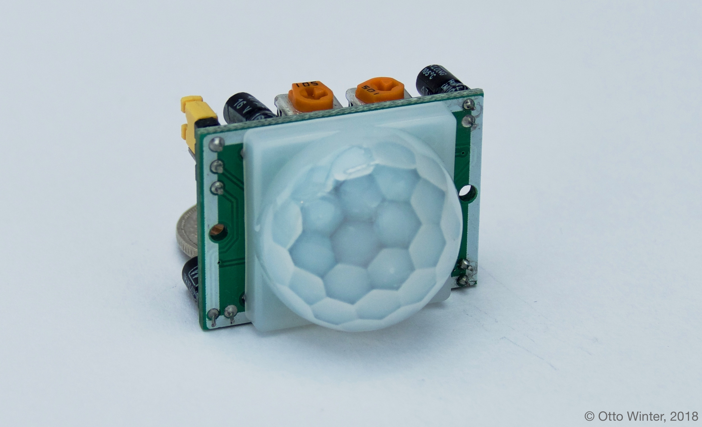
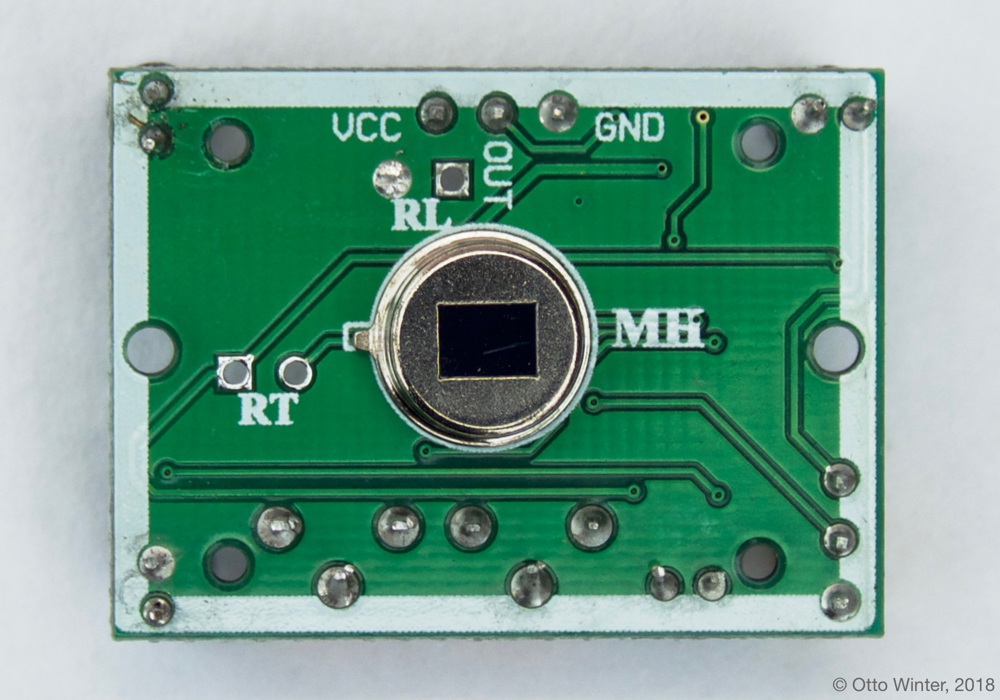
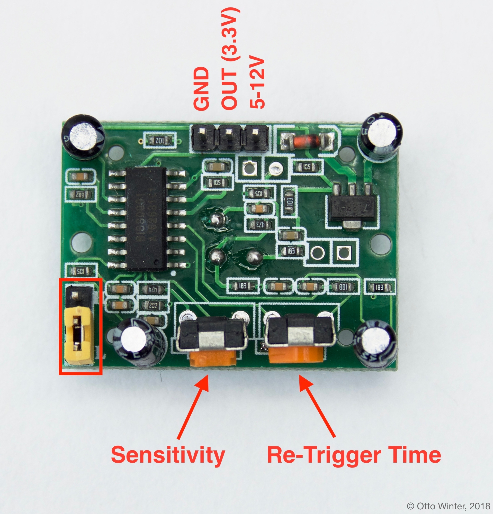

Passive Infrared Sensor
=======================

.. seo::
    :description: Instructions for setting up PIR (passive infrared) motion detection sensors in esphomelib
    :image: pir.jpg
    :keywords: PIR

Passive Infrared Sensors (or PIR sensors for short) are completely supported by
esphomelib. These sensors measure the infrared light emitted from objects in its
field of view, and if it detects a sudden change between different parts of the
sensing area, the signal is pulled high.

Connecting the PIR sensor is also quite simple. You need to connect ``GND`` to a GND pin
on your board and ``VCC`` to a ``5V`` or ``12V`` pin. Technically you can also connect
``VCC`` to ``3.3V``, but the sensor measurements won't be as stable.

Next you need to connect the signal pin (``OUT``). Fortunately, the sensor signal has
a voltage of ``3.3V`` max, so we can directly connect it to a free GPIO pin on the ESP board.
Otherwise, we would need to step down the voltage in order to not damage the ESP.

.. warning::

    Some PIR sensors have the GND and power supply pins swapped, please open the front
    cover to see which pin mapping your PIR sensor is using to make sure.

On the back side you will additionally find two knobs that you can turn to change the sensor
sensitivity and time the signal will stay active for once motion has been detected. Turning
these clockwise will increase sensitivity/re-trigger time.

To configure esphomeyaml for use with the PIR sensor, use a
:doc:`GPIO Binary Sensor </esphomeyaml/components/binary_sensor/gpio>`. It can detect
if a pin is pulled HIGH/LOW and reports those values to Home Assistant. Optionally also
set a ``device_class`` so that Home Assistant uses a nice icon for the binary sensor.

.. code-block:: yaml

    binary_sensor:
      - platform: gpio
        pin: <PIN_PIR_SENSOR_IS_CONNECTED_TO>
        name: "PIR Sensor"
        device_class: motion

See Also
--------

- `Awesome article explaining how PIR Sensors work <https://learn.adafruit.com/pir-passive-infrared-proximity-motion-sensor/how-pirs-work>`__.
- :doc:`/esphomeyaml/components/binary_sensor/gpio`
- :doc:`bruh`
- `Edit this page on GitHub <https://github.com/OttoWinter/esphomedocs/blob/current/esphomeyaml/cookbook/pir.rst>`__

.. disqus::
