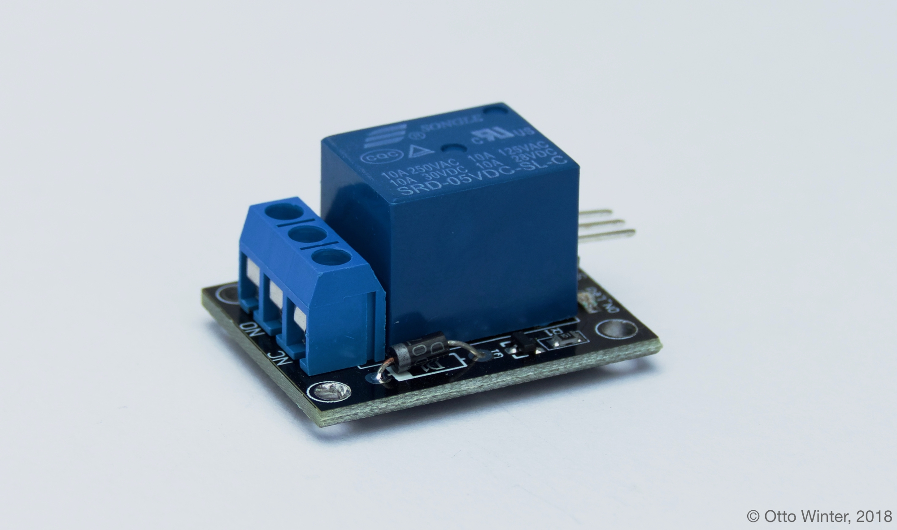

Relay
=====

.. seo::
    :description: Instructions for using relays in esphomelib.
    :image: relay.jpg
    :keywords: Relay

Relays are simple electronics components that allow you to switch a high load
using only a single pin on your board.

On the inside of a relay there is a coil that's connected to the input signal.
Every time the input signal switches on, the current flowing through the coil induces
a magnetic field that closes a contact.

On the output side you have three pins: common (``COM``), normally open (``NO``) and
normally closed (``NC``). Connect ``COM`` and one of ``NO`` and ``NC`` in series
with your load. When the input turns on, ``NO`` is connected to ``COM`` and
when the input turns off, ``NC`` is connected to ``COM``.

.. warning::

    Relays are a very common component in electronics, so there are *many* types of them and
    I won't attempt to describe all of them (partly due to my own lack of knowledge). Please
    check with the datasheet of your relay to see its current limits, what voltage it requires
    and so on. Please also note that relays are physical components - as such, they have a limited
    number of switches that can happen before they break.

To use a relay with esphomelib, use a :doc:`GPIO Switch </esphomeyaml/components/switch/gpio>`.

.. code:: yaml

    switch:
      - platform: gpio
        name: "Relay"
        pin: <PIN_RELAY_IS_CONNECTED_TO>

See Also
--------

- :doc:`/esphomeyaml/components/switch/gpio`
- :doc:`/esphomeyaml/components/output/gpio`
- `How do relays work <https://www.explainthatstuff.com/howrelayswork.html>`__.
- `Edit this page on GitHub <https://github.com/OttoWinter/esphomedocs/blob/current/esphomeyaml/cookbook/relay.rst>`__

.. disqus::
