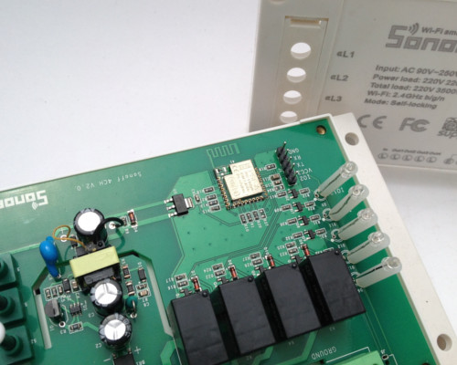
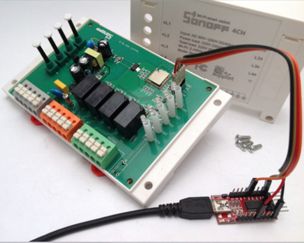

Sonoff 4CH Outdoor lights
=========================

.. seo::
    :description: Control outside lights with the Sonoff 4CH
    :image: images/sonoff-fishpond-pump-installed.jpg
    :keywords: sonoff, esp8266, home automation, ESPHome, hass, home assistant

The Sonoff range of products containing the ESP chips from espressif has a myriad of uses and best of all, you can customize it, aka hackable.
This quick cookbook aims to provide a clear, simple working example.

This example is very basic in it's operation.

* Switch 'ON' all lights for 1 minute once powered then switch 'OFF'
* Manually toggle each relay (L1 - L4)
* Switch 'OFF' all lights with press and hold
* Switch 'ON' all lights with press and hold

This example is using ESPHome 1.10.1 and Home Assistant 0.85.1

Assumptions
-----------

Many of the details in here a predicated on existing installations and knowledge, thus the following is assumed:

* You have installed the relevant environment and it is functional (Home Assisant, esphomeyaml).
* You need to create your own secrets.yaml file.
* You are proficient in reading instructions and capable of using a search engine.
* You will look at the documentation on https://esphomelib.com/ (we may have missed something in this example).
* This serves only as a guide and errors and outlets are excluded.

.. warning::

    Do NOT connect your device to electricity when programming it.
    Take care working with electricity at all times

1. Configuration
----------------

Here is the configuration with the basic operations outlined above.

.. code-block:: yaml

  ## DB Board sonoff
  # Sonoff 4CH v2 in ghrotto
  # Once powered, all lights will be 'ON' for one minutes (to indicate unit is working)
  # Each button on the unit will toggle the switch (L1-l4)
  # Press and hold (2-3 seconds) of L1 will 'ON' on all the switches
  # Press and hold (2-3 seconds) of L4 will 'OFF' on all the switches 

  ## pin outs - button
  # L1 - GPIO0
  # L2 - GPIO9
  # L3 - GPIO10
  # L4 - GPIO14

  ## pin outs - relays
  # L1 - GPIO12
  # L2 - GPIO5
  # L3 - GPIO4
  # L4 - GPIO15

  esphomeyaml:
    name: ghrotto
    platform: ESP8266
    board: esp01_1m
    board_flash_mode: dout
    esphomelib_version: 1.10.1

    # run on boot for 1 minute
    on_boot:
      priority: 50
      then:
        - switch.turn_on: esp_ghrotto_relay_l1
        - switch.turn_on: esp_ghrotto_relay_l2
        - switch.turn_on: esp_ghrotto_relay_l3
        - switch.turn_on: esp_ghrotto_relay_l4
        - delay: 60s
        - switch.turn_off: esp_ghrotto_relay_l1
        - switch.turn_off: esp_ghrotto_relay_l2
        - switch.turn_off: esp_ghrotto_relay_l3
        - switch.turn_off: esp_ghrotto_relay_l4

  wifi:
    ssid: !secret wifi_ssid
    password: !secret wifi_password
    ## fast connect is used to connect to a hidden wifi network
    fast_connect: true

  # Enable logging
  logger:
    level: DEBUG

  ota:

  ## used for HA
  api:
    password: !secret esplibapi_password

  status_led:
    pin: GPIO13

  sensor:
    - platform: uptime
      name: "esp_ghrotto_system_uptime"
      id: esp_ghrotto_system_uptime

    - platform: wifi_signal
      name: "esp_ghrotto_system_wifi_signal"
      id: esp_ghrotto_system_wifi_signal
      update_interval: 15s

  switch:
    ## restart
    - platform: restart
      name: "esp_ghrotto_system_restart"
      id: esp_ghrotto_system_restart

    ## pin outs - relays
    # L1 - GPIO12
    # L2 - GPIO5
    # L3 - GPIO4
    # L4 - GPIO15

    ## L1
    - platform: gpio
      pin: GPIO12
      name: "esp_ghrotto_relay_l1"
      id: esp_ghrotto_relay_l1

    ## L2
    - platform: gpio
      pin: GPIO5
      name: "esp_ghrotto_relay_l2"
      id: esp_ghrotto_relay_l2

    ## L3
    - platform: gpio
      pin: GPIO4
      name: "esp_ghrotto_relay_l3"
      id: esp_ghrotto_relay_l3

    ## L4
    - platform: gpio
      pin: GPIO15
      name: "esp_ghrotto_relay_l4"
      id: esp_ghrotto_relay_l4

  binary_sensor:
    - platform: status
      name: "esp_ghrotto_system_status"
      id: "esp_ghrotto_system_status"

    ## pin outs - button
    # L1 - GPIO0
    # L2 - GPIO9
    # L3 - GPIO10
    # L4 - GPIO14

    ## button - toggle relay L1
    - platform: gpio
      name: "esp_ghrotto_button_l1"
      pin:
        number: GPIO0
        inverted: true
      on_press:
        then:
          - switch.toggle: esp_ghrotto_relay_l1
      ## L1 (top button) - press and hold turn 'ON' all
      on_click:
        min_length: 1s
        max_length: 3s
        then:
          - switch.turn_on: esp_ghrotto_relay_l1
          - switch.turn_on: esp_ghrotto_relay_l2
          - switch.turn_on: esp_ghrotto_relay_l3
          - switch.turn_on: esp_ghrotto_relay_l4

    ## button - toggle relay L2
    - platform: gpio
      name: "esp_ghrotto_button_l2"
      pin:
        number: GPIO9
        inverted: true
      on_press:
        then:
          - switch.toggle: esp_ghrotto_relay_l2

    ## button - toggle relay L3
    - platform: gpio
      name: "esp_ghrotto_button_l3"
      pin:
        number: GPIO10
        inverted: true
      on_press:
        then:
          - switch.toggle: esp_ghrotto_relay_l3

    ## button - toggle relay L4
    - platform: gpio
      name: "esp_ghrotto_button_l4"
      pin:
        number: GPIO14
        inverted: true
      on_press:
        then:
          - switch.toggle: esp_ghrotto_relay_l4
      ## L4 (top button) - press and hold turn 'OFF' all
      on_click:
        min_length: 1s
        max_length: 3s
        then:
          - switch.turn_off: esp_ghrotto_relay_l1
          - switch.turn_off: esp_ghrotto_relay_l2
          - switch.turn_off: esp_ghrotto_relay_l3
          - switch.turn_off: esp_ghrotto_relay_l4

2. Programming
**************
Follow the standard way of uploading to your Sonoff 4CH.

For USB uploads this generally includes:

* The Sonoff 4CH has header pins already soldered.
* The relevant USB UART / FTDI uploads device connected to you PC and to your Sonoff.
* Start Sonoff in programming mode. (Press and hold L1 for approximatedly 3-5 seconds when powering on)
* Compile and upload the firmware via USB using ``esphomeyaml <some-yaml-file> run``.

For OTA the generally includes:

* Ensure device is on.
* Compile and upload the firmware via USB using ``esphomeyaml <some-yaml-file> run``.

Both options USB and OTA are done by running the command:

.. code-block:: bash

    esphomeyaml <some-yaml-file> run

More details on programming can be found on :doc:`Sonoff Basic section </esphomeyaml/devices/sonoff_basic>`

3. Prepping and installing
****************************

* The Sonoff 4CH is designed to be mounted onto a DIN rail.
* When working with electricity always remember safety first.
* Ensure you comply with your local laws when installing electrical equipment.
* If you think hiring a professional is expensive, try hiring an amateur.

4. Home Assistant
*******************

You can now add your device to home assistant via the configurations page and under the Integrations option

See Also
--------

- :doc:`/esphomeyaml/devices/sonoff_4ch`
- `Flashing Sonoff 4CH (Youtube) <https://www.youtube.com/watch?v=QlJq7XzctTg/>`__.
- `Adding ESPHome to Home Assistant <https://www.home-assistant.io/components/esphome/>`__.

.. disqus::
