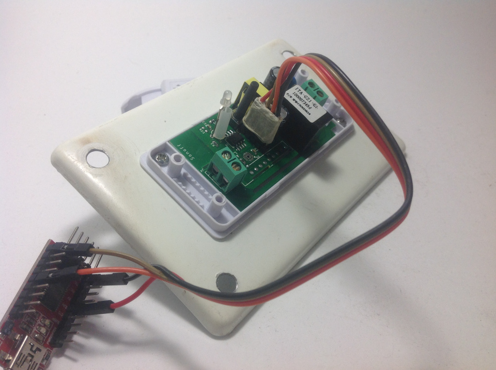
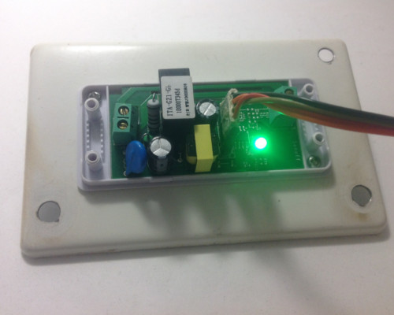
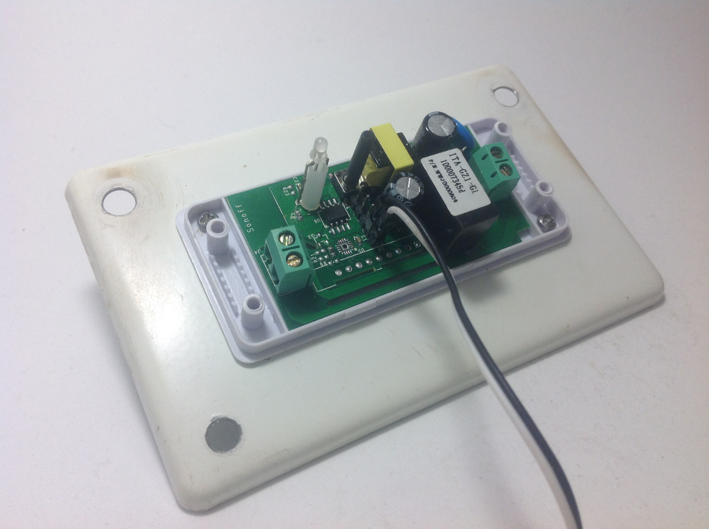
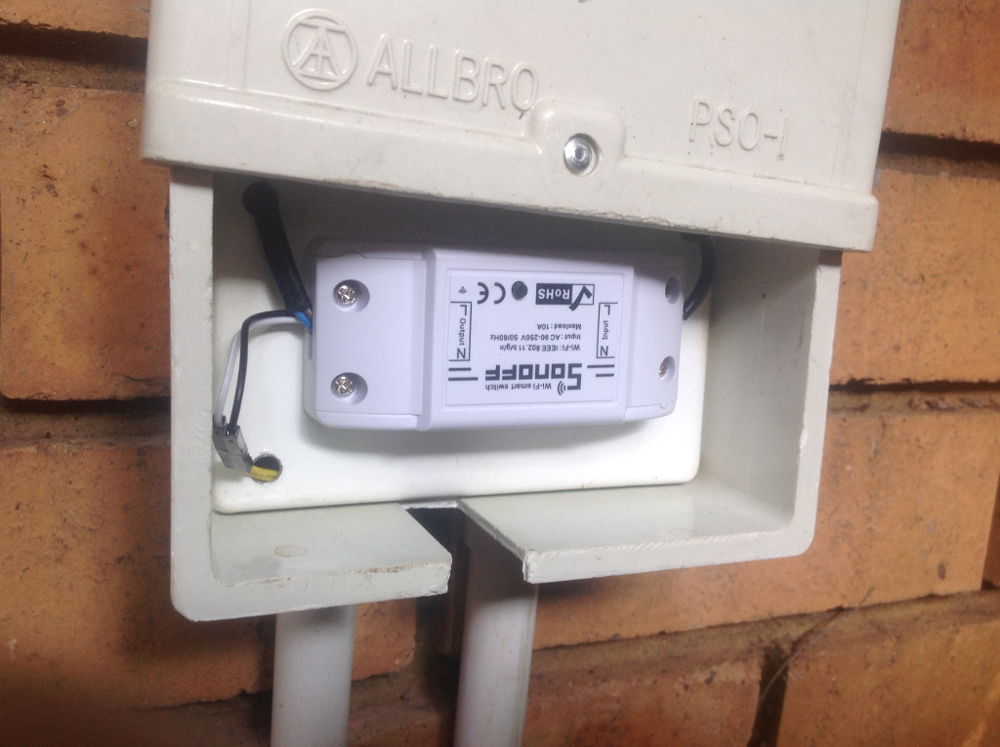

Sonoff Fish Pond Pump
=====================

.. seo::
    :description: Making an automated fish pond pump with timing and auto stop safety with Sonoff Basic ESP8266 chip
    :image: images/sonoff-fishpond-pump-installed.jpg
    :keywords: sonoff, esp8266, home automation, ESPHome, hass, home assistant

.. figure:: images/sonoff-fishpond.jpg
    :align: center
    :width: 75.0%

The Sonoff range of products containing the ESP chips from espressif has a myriad of uses and best of all, you can customize it, aka hackable.
This quick cookbook aims to provide a clear, simple working example.

This example is very basic in it's operation.

* Start the pump every hour and run it for 10 minutes.
* Manually start and stop the pump with the toggle button on the Sonoff basic.
* Use a water float sensor and stop the pump if water level is too low.

*Some of the later Sonoff basics does not have GPIO pin available, check your board first*

This example is using ESPHome 1.10.1 and Home Assistant 0.85.1

Assumptions
-----------

As many of the details on here a predicated on existing installations and knowledge the following is assumed:

* You have installed the relevant environment and it is functional (Home Assisant, esphomeyaml).
* You need to create your own secrets.yaml file.
* You are proficient in reading instructions and capable of using a search engine.
* You will look at the documentation on https://esphomelib.com/ (we may have missed something in this example).
* This serves only as a guide and errors and outlets are excluded.

.. warning::

    Do NOT connect your device to electricity when programming it.
    Take care working with electricity at all times

1. Configuration
----------------

Here is the configuration with the basic operations outlined above.

.. code-block:: yaml

    ## Fish pond sonoff
    ## filename: fishpond.yaml
    # Sonoff basic
    # Button toggles pump on/off
    # Float sensor stops pump
    # Cron'd to run every hour, on the hour for 10 minutes
    esphomeyaml:
      name: fishpond
      platform: ESP8266
      board: esp01_1m
      board_flash_mode: dout

    wifi:
      ssid: !secret wifi_ssid
      password: !secret wifi_password
      ## use fast_connect of you are connecting to a hidden WiFi network, else comment it out
      fast_connect: true

    # Enable logging
    logger:
      level: DEBUG

    ota:

    api:
      password: !secret esplibapi_password

    status_led:
      pin: GPIO13

    sensor:
      - platform: uptime
        name: "ESP Fish Pond System Uptime"

      - platform: wifi_signal
        name: "ESP Fish Pond WiFi Signal"
        update_interval: 15s

    switch:
      ## restart
      - platform: restart
        name: "ESP Fish Pond Restart"

      ## relay / pump
      - platform: gpio
        pin: GPIO12
        name: "ESP Fish Pond Pump"
        id: esp_fishpond_pump

    binary_sensor:
      - platform: status
        name: "ESP Fish Pond System Status"

      ## button - toggle relay
      - platform: gpio
        name: "ESP Fish Pond Button"
        pin:
          number: GPIO0
          inverted: true
        # Toggle pump when user presses the Sonoff Button
        on_press:
          - switch.toggle: esp_fishpond_pump

      # onboard header pin - sensor
      # when threshold is reached, turn off
      - platform: gpio
        name: "esp_fishpond_gpio14"
        pin:
          number: 14
          mode: INPUT_PULLUP
        on_press:
          - switch.turn_off: esp_fishpond_pump

    ## Use time
    time:
      - platform: homeassistant
        ## Set your timezone
        timezone: Africa/Johannesburg
        on_time:
          # Switch on on the hour
          - seconds: 0
            minutes: 0
            hours: '*'
            then:
              - switch.turn_on: esp_fishpond_pump
              # Switch off 10 minutes later
              - delay: 10min
              - switch.turn_off: esp_fishpond_pump

2. Programming
--------------

Ensure you have soldered on the additional header pins to the PCB and connect your USB FTDI programmer.
See https://randomnerdtutorials.com/how-to-flash-a-custom-firmware-to-sonoff/ for more details on the pinout and FTDI.

2.1. Put Sonoff into programming mode.
**************************************

* Press and hold the toggle pin (long black pin next to LED and custom soldered pins).
* Supply USB power to Sonoff via FTDI (e.g. plug in USB to the FTDI, or use a power switch as explained in link above).
* Keep holding the toggle pin for approx 3-5 seconds now you should be ready to program. If you get a message unable to communicate when trying flash, check your TX/RX pin or retry entering boot mode again.

Quick notes:

* 3.3V setting on FTDI, 5V will cause damage.
* Ensure the connections on the PCB starts at  the closed to the toggle pin, it uses 4 pins, but 5 pins are soldered on.
* TX and RX should be swapped - RX on Sonoff goes to TX on FTDI.

2.2. Upload the firmware
************************

Run this command from the same directory where your fishpond.yaml file is located

.. code-block:: bash

  esphomeyaml fishpond.yaml run

Or if you're using the dashboard, just click the "UPLOAD" button.

You should get an output starting like this

.. code-block:: text

  INFO Reading configuration...
  INFO Detected timezone 'SAST' with UTC offset 2
  INFO Generating C++ source...
  INFO Compiling app...
  INFO Running:  platformio run -d fishpond
  ********************************************************************************************************
  Obsolete PIO Core v3.6.3 is used (previous was 3.6.4b1)
  Please remove multiple PIO Cores from a system:
  https://docs.platformio.org/page/faq.html#multiple-pio-cores-in-a-system
  ...
  lots of compile stuff
  ...
  Memory Usage -> http://bit.ly/pio-memory-usage
  DATA:    [======    ]  55.6% (used 45512 bytes from 81920 bytes)
  PROGRAM: [====      ]  38.1% (used 390576 bytes from 1023984 bytes)
  ===================================== [SUCCESS] Took 4.70 seconds =====================================
  INFO Successfully compiled program.
  Found multiple options, please choose one:
    [1] /dev/ttyUSB0 (FT232R USB UART)
    [2] Over The Air (fishpond.device)
  (number): 1
  INFO Running:  esptool.py --before default_reset --after hard_reset --chip esp8266 --port /dev/ttyUSB0 write_flash 0x0 fishpond/.pioenvs/fishpond/firmware.bin
  esptool.py v2.6
  Serial port /dev/ttyUSB0
  Connecting....
  Chip is ESP8266EX
  Features: WiFi
  MAC: xx:xx:xx:xx:xx:xx
  Uploading stub...
  Running stub...
  Stub running...
  Configuring flash size...
  Auto-detected Flash size: 1MB
  Compressed 394720 bytes to 267991...
  Wrote 394720 bytes (267991 compressed) at 0x00000000 in 23.8 seconds (effective 132.7 kbit/s)...
  Hash of data verified.

  Leaving...
  Hard resetting via RTS pin...
  INFO Successfully uploaded program.
  INFO Starting log output from /dev/ttyUSB0 with baud rate 115200

2.3. And then nothing will happen
*********************************

Once you have flashed the device, nothing will happen. You need to power cycle the device. You will notice the LED will start to flash and then becomes solid once connected to the WiFi network.

You can follow the logs produced by the running module by running the command

.. code-block:: bash

  esphomeyaml fishpond.yaml logs

Your output will possibly look like this

.. code-block:: text

    INFO Reading configuration...
    INFO Detected timezone 'SAST' with UTC offset 2
    INFO Starting log output from fishpond.device using esphomelib API
    INFO Connecting to fishpond.device:6053 (192.168.13.15)
    INFO Successfully connected to fishpond.device
    [11:13:27][D][time.homeassistant:029]: Synchronized time: Wed Jan 16 11:13:27 2019
    [11:13:27][I][application:097]: You're running esphomelib v1.10.1 compiled on Jan 16 2019, 08:12:59
    [11:13:27][C][status_led:023]: Status LED:
    [11:13:27][C][status_led:024]:   Pin: GPIO13 (Mode: OUTPUT)
    [11:13:27][C][wifi:341]: WiFi:
    [11:13:27][C][wifi:240]:   SSID: 'some-ssid'
    [11:13:27][C][wifi:241]:   IP Address: 192.168.13.15
    [11:13:27][C][wifi:243]:   BSSID: xx:xx:xx:xx:xx:xx
    [11:13:27][C][wifi:245]:   Hostname: 'fishpond'
    [11:13:27][C][wifi:250]:   Signal strength: -91 dB ▂▄▆█
    [11:13:27][C][wifi:251]:   Channel: 1
    [11:13:27][C][wifi:252]:   Subnet: 255.255.255.0
    [11:13:27][C][wifi:253]:   Gateway: 192.168.13.1
    [11:13:27][C][wifi:254]:   DNS1: 192.168.13.1
    [11:13:27][C][wifi:255]:   DNS2: 0.0.0.0
    [11:13:27][C][binary_sensor.status:046]: Status Binary Sensor 'esp_fishpond_system_status'
    [11:13:27][C][binary_sensor.status:046]:   Device Class: 'connectivity'
    [11:13:28][C][switch.gpio:049]: GPIO Switch 'esp_fishpond_gpio12'
    [11:13:28][C][switch.gpio:050]:   Pin: GPIO12 (Mode: OUTPUT)
    [11:13:28][C][switch.gpio:066]:   Restore Mode: Restore (Default to OFF)
    [11:13:28][C][binary_sensor.gpio:023]: GPIO Binary Sensor 'esp_fishpond_gpio0'
    [11:13:28][C][binary_sensor.gpio:024]:   Pin: GPIO0 (Mode: INPUT, INVERTED)
    [11:13:28][C][binary_sensor.gpio:023]: GPIO Binary Sensor 'esp_fishpond_gpio14'
    [11:13:28][C][binary_sensor.gpio:024]:   Pin: GPIO14 (Mode: INPUT_PULLUP)
    [11:13:28][C][output.esp8266_pwm:028]: ESP8266 PWM:
    [11:13:28][C][output.esp8266_pwm:029]:   Pin: GPIO13 (Mode: OUTPUT)
    [11:13:28][C][output.esp8266_pwm:030]:   Frequency: 1000.0 Hz
    [11:13:28][C][logger:099]: Logger:
    [11:13:28][C][logger:100]:   Level: DEBUG
    [11:13:28][C][logger:101]:   Log Baud Rate: 115200
    [11:13:28][C][light.state:266]: Light 'esp_fishpond_gpio13'
    [11:13:28][C][light.state:268]:   Default Transition Length: 1000 ms
    [11:13:28][C][light.state:269]:   Gamma Correct: 2.80
    [11:13:28][C][switch.restart:034]: Restart Switch 'esp_fishpond_system_restart'
    [11:13:28][C][switch.restart:034]:   Icon: 'mdi:restart'
    [11:13:28][C][time.homeassistant:032]: Home Assistant Time:
    [11:13:28][C][time.homeassistant:033]:   Timezone: 'SAST-2'
    [11:13:28][C][sensor.wifi_signal:042]: WiFi Signal 'esp_fishpond_system_wifi_signal'
    [11:13:28][C][sensor.wifi_signal:042]:   Unit of Measurement: 'dB'
    [11:13:28](Message skipped because it was too big to fit in TCP buffer - This is only cosmetic)
    [11:13:28](Message skipped because it was too big to fit in TCP buffer - This is only cosmetic)
    [11:13:28][C][api:072]: API Server:
    [11:13:28][C][api:073]:   Address: 192.168.13.15:6053
    [11:13:28][C][ota:129]: Over-The-Air Updates:
    [11:13:28][C][ota:130]:   Address: 192.168.13.15:8266

2.4. Test now with OTA flashing
*******************************

Before installing the Sonoff, do a final OTA test, and this time selecting the OTA option and NOT the USB option when reflashing.

.. code-block:: bash

    esphomeyaml fishpond.yaml run

Once these actions succeeded you are pretty much in the clear and can be sure your device is ready.

2.5. Prepping and installing
****************************

* Ensure power is switched off.
* You can now add your water level sensor wiring to the PCB and have it extrude, SAFELY, next to your connector block.
* Here it will be the further most pin (GPIO14) you soldered from the toggle button and then pin (Ground) next to it.
* You can now easily connect and disconnect your liquid level sensor.

Connecting it

* Connect your water level sensor.
* Connect your pump to the Sonoff output.
* Connect your input electrical wiring.
* Test all connections are securely fastened.
* You can toggle the on/off of the pump by pressing the toggle button.

Once the pump is running changing the position of the float in the float sensor will cause the Sonoff to stop the pump.

Wires connected for easier access to connect and disconnect water level sensor

.. figure:: images/sonoff-fishpond-pump-and-sensor.jpg
    :align: center
    :width: 75.0%

This needs to be submursed, pump (bio filter) and sensor connected in single housing (icecream tub).

In this PVC housing the plates are secured using cabinet door magnets for easier access and maintenance.

* Ensure you are using a proper and compliant waterproof box to house your electrical equipment (Sonoff basic) in.
* Ensure you plan to be able to remove the unit with minimal effort should you need to manually USB reflash it again in future.

2.6. Home Assistant
*******************

You can now add your device to home assistant via the configurations page and under the Integrations option

See Also
--------

- `Flashing sonoff basic <https://randomnerdtutorials.com/how-to-flash-a-custom-firmware-to-sonoff/>`__.
- `Adding ESPHome to Home Assistant <https://www.home-assistant.io/components/esphome/>`__.

.. disqus::
