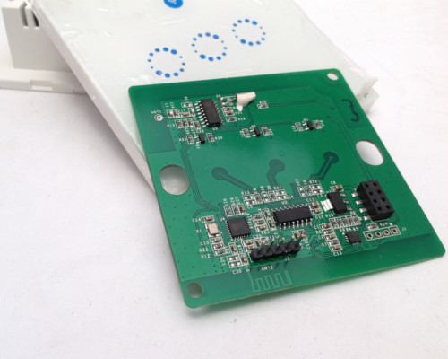
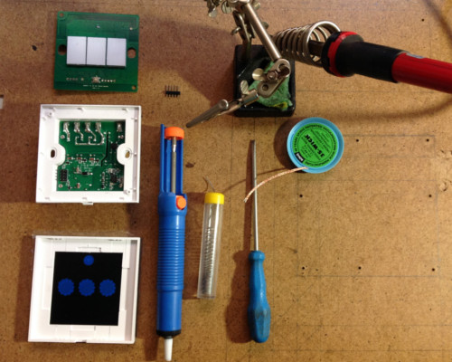
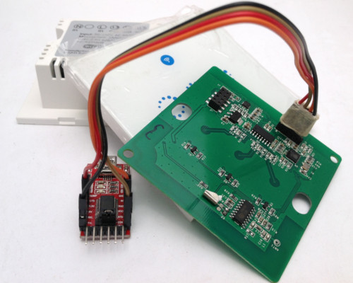

Sonoff T1 Touch 3 Gang UK v1.0
==============================

.. seo::
    :description: Control outside lights with the Sonoff 4CH
    :image: images/sonoff-touch-3ch-uk-lights-deconstructed.jpg
    :keywords: sonoff, esp8266, home automation, ESPHome, hass, home assistant

The Sonoff range of products containing the ESP chips from espressif has a myriad of uses and best of all, you can customize it, aka hackable.
This quick cookbook aims to provide a clear, simple working example.

This example is very basic in it's operation.

* Switch 'ON' all lights for 1 minute once powered then switch 'OFF'
* Manually toggle each relay (left, middle and right)
* Switch 'OFF' all lights with press and hold
* Switch 'ON' all lights with press and hold

This example is using ESPHome 1.10.1 and Home Assistant 0.85.1 and Sonoff T1 Touch 3 Gang UK

Assumptions
-----------

Many of the details in here a predicated on existing installations and knowledge, thus the following is assumed:

* You have installed the relevant environment and it is functional (Home Assisant, esphomeyaml).
* You need to create your own secrets.yaml file.
* You are proficient in reading instructions and capable of using a search engine.
* You will look at the documentation on https://esphomelib.com/ (we may have missed something in this example).
* This serves only as a guide and errors and outlets are excluded.

.. warning::

    Do NOT connect your device to electricity when programming it.
    Take care working with electricity at all times

*Solder wick makes life so much easier to remove the soldered header pins*

1. Configuration
----------------

Here is the configuration with the basic operations outlined above.

.. code-block:: yaml

  ## Sonoff t1 3ch touch UK
  # All lights will go on for 1 munite once unit receives power.
  # Each button on the unit will toggle the switch (left, middle, right).
  # Press and hold (2-3 seconds) of left will 'ON' on all the switches.
  # Press and hold (2-3 seconds) of right will 'OFF' on all the switches.

  ## pin outs - button
  # left    - GPIO0
  # middle  - GPIO9
  # right   - GPIO10

  ## pin outs - relays
  # left    - GPIO12
  # middle  - GPIO5
  # right   - GPIO4

  esphomeyaml:
    name: esp_ghrotto_indoor_t1
    platform: ESP8266
    board: esp01_1m
    board_flash_mode: dout
    esphomelib_version: 1.10.1

    # run on boot for 1 minute
    on_boot:
      priority: 50
      then:
        - switch.turn_on: esp_ghrotto_indoor_t1_relay_left
        - switch.turn_on: esp_ghrotto_indoor_t1_relay_middle
        - switch.turn_on: esp_ghrotto_indoor_t1_relay_right
        - delay: 60s
        - switch.turn_off: esp_ghrotto_indoor_t1_relay_left
        - switch.turn_off: esp_ghrotto_indoor_t1_relay_middle
        - switch.turn_off: esp_ghrotto_indoor_t1_relay_right

  wifi:
    ssid: !secret wifi_ssid
    password: !secret wifi_password
    fast_connect: true

  # Enable logging
  logger:
    level: DEBUG

  ota:

  api:
    password: !secret esplibapi_password

  status_led:
    pin: GPIO13

  sensor:
    - platform: uptime
      name: "esp_ghrotto_indoor_t1_system_uptime"
      id: esp_ghrotto_indoor_t1_system_uptime

    - platform: wifi_signal
      name: "esp_ghrotto_indoor_t1_system_wifi_signal"
      id: esp_ghrotto_indoor_t1_system_wifi_signal
      update_interval: 15s

  switch:
    ## restart
    - platform: restart
      name: "esp_ghrotto_indoor_t1_system_restart"
      id: esp_ghrotto_indoor_t1_system_restart

    ## pin outs - relays
    # left    - GPIO12
    # middle  - GPIO5
    # right   - GPIO4

    ## left
    - platform: gpio
      pin: GPIO12
      name: "esp_ghrotto_indoor_t1_relay_left"
      id: esp_ghrotto_indoor_t1_relay_left

    ## middle
    - platform: gpio
      pin: GPIO5
      name: "esp_ghrotto_indoor_t1_relay_middle"
      id: esp_ghrotto_indoor_t1_relay_middle

    ## right
    - platform: gpio
      pin: GPIO4
      name: "esp_ghrotto_indoor_t1_relay_right"
      id: esp_ghrotto_indoor_t1_relay_right

  binary_sensor:
    - platform: status
      name: "esp_ghrotto_indoor_t1_system_status"
      id: "esp_ghrotto_indoor_t1_system_status"

    ## pin outs - button
    # left    - GPIO0
    # middle  - GPIO9
    # right   - GPIO10

    ## button - toggle relay left
    - platform: gpio
      name: "esp_ghrotto_indoor_t1_button_left"
      pin:
        number: GPIO0
        inverted: true
      on_press:
        then:
          - switch.toggle: esp_ghrotto_indoor_t1_relay_left
      ## most left button - press and hold turn 'ON' all
      on_click:
        min_length: 1s
        max_length: 3s
        then:
          - switch.turn_on: esp_ghrotto_indoor_t1_relay_left
          - switch.turn_on: esp_ghrotto_indoor_t1_relay_middle
          - switch.turn_on: esp_ghrotto_indoor_t1_relay_right

    ## button - toggle relay middle
    - platform: gpio
      name: "esp_ghrotto_indoor_t1_button_middle"
      pin:
        number: GPIO9
        inverted: true
      on_press:
        then:
          - switch.toggle: esp_ghrotto_indoor_t1_relay_middle

    ## button - toggle relay right
    - platform: gpio
      name: "esp_ghrotto_indoor_t1_button_right"
      pin:
        number: GPIO10
        inverted: true
      on_press:
        then:
          - switch.toggle: esp_ghrotto_indoor_t1_relay_right
      ## most right - press and hold turn 'OFF' all
      on_click:
        min_length: 1s
        max_length: 3s
        then:
          - switch.turn_off: esp_ghrotto_indoor_t1_relay_left
          - switch.turn_off: esp_ghrotto_indoor_t1_relay_middle
          - switch.turn_off: esp_ghrotto_indoor_t1_relay_right

2. Programming
**************
Follow the standard way of uploading to your Sonoff T1 Touch.

The T1 Touch is tricky to get into bootmode. The v1.0 is slightly easier

For USB uploads this generally includes:

* Header pins need to be soldered onto the circuit board to connected the USB UART device for programming
* The relevant USB UART / FTDI uploads device connected to you PC and to your Sonoff.
* Start Sonoff in programming mode. (v1.0 guideline)
  * Connect to USB uploader and allow to boot.
  * Press and hold the left most button, press reset, release left most button
  * OR, double click reset (not too fast and not too slow)
  * You know you are in programming mode when all backlights on slightly dimmed and status led is not flashing.
* Compile and upload the firmware via USB using ``esphomeyaml <some-yaml-file> run``.

For OTA the generally includes:

* Ensure device is on.
* Compile and upload the firmware via USB using ``esphomeyaml <some-yaml-file> run``.

Both options USB and OTA are done by running the command:

.. code-block:: bash

    esphomeyaml <some-yaml-file> run

More details on programming can be found on in "See Also" links below

3. Prepping and installing
****************************

* Remove the soldered header pins (solder wick is your best friend here) to ensure the unit can close again.
* The Sonoff T1 Touch is designed to be mounted inside a wall box. The UK and US wall boxes differ.
* The electicity coming into the wall box must have both Live and Neutral wires.
* When working with electricity always remember safety first.
* Ensure you comply with your local laws when installing electrical equipment.
* If you think hiring a professional is expensive, try hiring an amateur.

4. Home Assistant
*******************

You can now add your device to home assistant via the configurations page and under the Integrations option

See Also
--------

- :doc:`/esphomeyaml/devices/sonoff_4ch`
- :doc:`/esphomeyaml/devices/sonoff.html#sonoff-t1-1ch-2ch-3ch`
- `Sonoff-Tasmota git page <https://github.com/arendst/Sonoff-Tasmota/wiki/Sonoff-T1-UK,-EU,-and-US/>`__.
- `Video: Flashing Sonoff Touch  <https://www.youtube.com/watch?v=LPUq-SOzI-o/>`__.
- `Video: Smart Touch Switch (UK/EU version) loaded with Tasmota and ready of Home Assistant  <https://www.youtube.com/watch?v=yj3_6oKUh1w/>`__.
- `Adding ESPHome to Home Assistant <https://www.home-assistant.io/components/esphome/>`__.

.. disqus::
