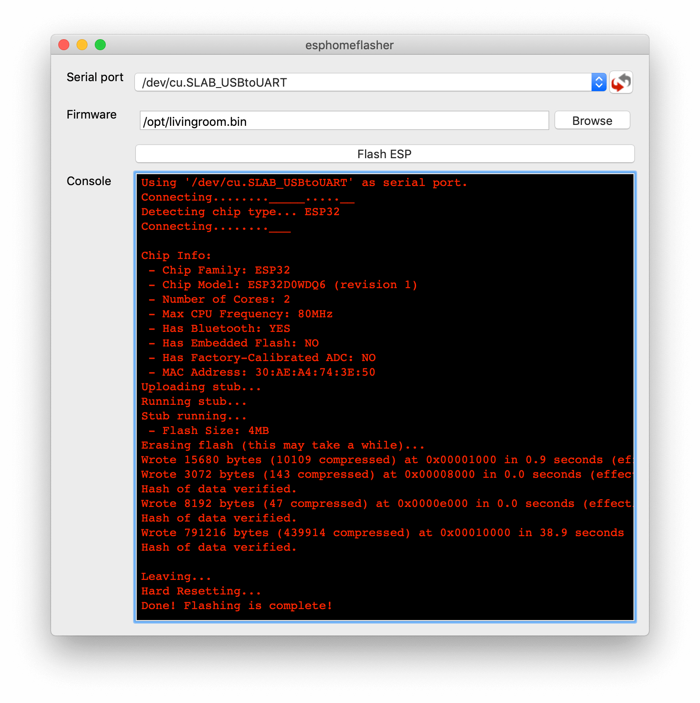

Frequently Asked Questions
==========================

.. seo::
    :description: Frequently asked questions in esphomelib.
    :image: question_answer.png

Tips for using esphomeyaml
--------------------------

1. esphomeyaml supports (most of) Home Assistant's YAML configuration directives like
   ``!include``, ``!secret``. So you can store all your secret WiFi passwords and so on
   in a file called ``secrets.yaml`` within the directory where the configuration file is.

   For even more configuration templating, take a look at :ref:`config-substitutions`.

2. If you want to see how esphomeyaml interprets your configuration, run

   .. code-block:: bash

       esphomeyaml livingroom.yaml config

3. To view the logs from your node without uploading, run

   .. code-block:: bash

       esphomeyaml livingroom.yaml logs

4. If you have changed the name of the node and want to update over-the-air, just specify
   ``--upload-port`` when running esphomeyaml. For example:

   .. code-block:: bash

       esphomeyaml livingroom.yaml run --upload-port 192.168.178.52

5. You can always find the source esphomeyaml generates under ``<NODE_NAME>/src/main.cpp``. It's even
   possible to edit anything outside of the ``AUTO GENERATED CODE BEGIN/END`` lines for creating
   :doc:`custom sensors </esphomeyaml/components/sensor/custom>`.

6. You can view the full command line interface options here: :doc:`/esphomeyaml/guides/cli`

7. Use :ref:`substitutions <config-substitutions>` to reduce repetition in your configuration files.

.. |secret| replace:: ``!secret``
.. _secret: https://www.home-assistant.io/docs/configuration/secrets/
.. |include| replace:: ``!include``
.. _include: https://www.home-assistant.io/docs/configuration/splitting_configuration/

.. _esphomeflasher:

I can't get flashing over USB to work.
--------------------------------------

esphomeyaml depends on the operating system the tool is running on to recognize
the ESP. This can sometimes fail (driver missing, inside docker container, ...).
Starting with esphomelib 1.9.0, the esphomelib suite provides
`esphomeflasher <https://github.com/OttoWinter/esphomeflasher>`__, a tool to flash ESPs over USB.

First, you need to get the firmware file to flash. For Hass.io add-on based installs you can
use the ``COMPILE`` button (click the overflow icon with the three dots) and then press
``Download Binary``. For command line based installs you can access the file under
``<CONFIG_DIR>/<NODE_NAME>/.pioenvs/<NODE_NAME>/firmware.bin``.

Then, install esphomeflasher by going to the `releases page <https://github.com/OttoWinter/esphomeflasher/releases>`__
and downloading one of the pre-compiled binaries. Open up the application and select the serial port
you want to flash to (on windows you can use the "device manager" to check if it's the right one).

Select the firmware binary and finally press "Flash ESP".

.. note::

    If the serial port is not showing up, you might not have the required drivers installed.
    ESPs usually ship with one of these two UART chips:

     * CP2102 (square chip): `driver <https://www.silabs.com/products/development-tools/software/usb-to-uart-bridge-vcp-drivers>`__
     * CH341: `driver <https://github.com/nodemcu/nodemcu-devkit/tree/master/Drivers>`__

.. note::

    If you're just seeing ``Connecting....____....`` on the screen and the flashing fails, that's
    usually a sign that the ESP is defect or cannot be programmed. Please double check the UART wires
    are connected correctly if flashing using a USB to UART bridge.

What's the difference between esphomelib and esphomeyaml?
---------------------------------------------------------

`esphomelib <https://github.com/OttoWinter/esphomelib>`__ is a C++ framework
around Arduino for creating custom firmwares for ESP8266/ESP32 devices. So with
esphomelib, you need to write C++ code.

`esphomeyaml <https://github.com/OttoWinter/esphomeyaml>`__ is a tool, written in python,
that creates source code that uses the esphomelib framework. It does this by parsing in
a YAML file and generating a C++ source file, compiling it and uploading the binary to the
device. It is meant to be a powerful yet user-friendly engine for creating custom
firmwares for ESP8266/ESP32 devices. Ideally, it should enable users to use a single command
to do everything they want to do with their device without messing around with build systems and so on.

The nice part of the esphomelib/esphomeyaml combo is that you can easily edit the source code
esphomeyaml generates and insert your own custom components such as sensors in it. So, if for example
a sensor you really want to use, is not supported, you can easily `create a custom component
<https://github.com/OttoWinter/esphomelib/wiki/Custom-Sensor-Component>`__ for it.

Help! Something's not working!1!
--------------------------------

That's no good. Here are some steps that resolve some problems:

-  **If you're having WiFi problems**: See :ref:`wifi-problems`.
-  **Try with the latest Arduino framework version**: See :ref:`this <esphomeyaml-arduino_version>`.
-  **Still an error?** Please file a bug report over in the `esphomelib issue tracker <https://github.com/OttoWinter/esphomelib/issues>`__.
   I will take a look at it as soon as I can. Thanks!

.. _faq-bug_report:

How to submit an issue report
-----------------------------

First of all, thank you very much to everybody submitting issue reports! While I try to test esphomelib/yaml as much as
I can using my own hardware, I don't own every single device type and mostly only do tests with my own home automation
system. When doing some changes in the core, it can quickly happen that something somewhere breaks. Issue reports are a
great way for me to track and (hopefully) fix issues, so thank you!

For me to fix the issue the quickest, there are some things that would be really helpful:

1.  **Just writing "X doesn't work" or "X gives bug" is not helpful!!!** Seriously, how do you expect
    me to help given just that information?
2.  A snippet of the code/configuration file used is always great for me to reproduce this issue.
    Please read `How to create a Minimal, Complete, and Verifiable example <https://stackoverflow.com/help/mcve>`__.
3.  If it's an i2c or hardware communication issue please also try setting the
    :ref:`log level <logger-log_levels>` to ``VERY_VERBOSE`` as it provides helpful information
    about what is going on.
4.  Please also include what you've already tried and didn't work so that these things can
    be

You can find the issue tracker here https://github.com/OttoWinter/esphomelib/issues

How do I update to the latest version?
--------------------------------------

It's simple. Run:

.. code-block:: bash

    pip2 install -U esphomeyaml
    # From docker:
    docker pull ottowinter/esphomeyaml:latest

And in Hass.io, there's a simple UPDATE button when there's an update available as with all add-ons

.. _faq-beta:

How do I update to the latest beta release?
-------------------------------------------

esphomelib has a beta release cycle so that new releases can easily be tested before
the changes are deployed to the stable channel. You can help test esphomeyaml (and use new features)
by installing the esphomeyaml beta:

.. code-block:: bash

    # For pip-based installs
    pip2 install --pre -U esphomeyaml

    # From docker-based installs
    docker pull ottowinter/esphomeyaml:rc
    # In each command:
    docker run [...] -it ottowinter/esphomeyaml:rc livingroom.yaml run

And for Hass.io, you will see a "esphomeyaml Beta" Add-On for the beta channel.

The beta docs can be viewed at `https://beta.esphomelib.com <https://beta.esphomelib.com>`__

How do I use the latest bleeding edge version?
----------------------------------------------

First, a fair warning that the latest bleeding edge version is not always stable and might have issues.
If you find some, please do however report them if you have time :)

Installing the latest bleeding edge version of esphomelib is also quite easy. It's most often required
if there was a bug somewhere and I didn't feel like building & pushing a whole new release out (this often
takes up to 2 hours!). To install the dev version of esphomeyaml:

- In Hass.io: In the esphomeyaml add-on repository there's also a second add-on called ``esphomeyaml-edge``.
  Install that and stop the stable version (both can't run at the same time without port collisions).
- From ``pip``: Run ``pip install git+git://github.com/OttoWinter/esphomeyaml.git``
- From docker: Run ``docker pull ottowinter/esphomeyaml:dev`` and use ``ottowinter/esphomeyaml:dev`` in all
  commands.

Next, if you want to use the latest version of the esphomelib C++ framework too:

.. code-block:: yaml

    # Sample configuration entry
    esphomeyaml:
      name: ...
      esphomelib_version: dev
      # ...

In some cases it's also a good idea to use the latest Arduino framework version. See
:ref:`this <esphomeyaml-arduino_version>`.

Does esphomelib support [this device/feature]?
----------------------------------------------

If it's not in :doc:`the docs </esphomeyaml/index>`, it's probably sadly not
supported. However, I'm always trying to add support for new features, so feel free to create a feature
request in the `esphomelib issue tracker <https://github.com/OttoWinter/esphomelib/issues>`__. Thanks!

I have a question... How can I contact you?
-------------------------------------------

Sure! I'd be happy to help :) You can contact me here:

-  `Discord <https://discord.gg/KhAMKrd>`__
-  `Home Assistant Community Forums <https://community.home-assistant.io/t/esphomelib-library-to-greatly-simplify-home-assistant-integration-with-esp32/402452>`__
-  `esphomelib <https://github.com/OttoWinter/esphomelib/issues>`__ and
   `esphomeyaml <https://github.com/OttoWinter/esphomeyaml/issues>`__ issue trackers. Preferably only for issues and
   feature requests.
-  Alternatively, also under my e-mail address contact (at) otto-winter.com

.. _wifi-problems:

My node keeps reconnecting randomly
-----------------------------------

Jep, that's a known issue. However, it seems to be very low-level and I don't really know
how to solve it. I'm working on possible workarounds for the issue but currently I do
not have a real solution.

Some steps that can help with the issue:

-  Set the ``power_save_mode`` to ``light`` in the ``wifi:`` config. See :ref:`wifi-power_save_mode`.
-  Use the most recent version of th arduino framework. The platformio arduino package
   always takes some time to update and the most recent version often includes some awesome
   patches. See :ref:`esphomeyaml-arduino_version`.
-  The issue seems to be happen with cheap boards more frequently. Especially the "cheap" NodeMCU
   boards from eBay sometimes have quite bad antennas.
-  Give your ESP a :ref:`static IP <wifi-manual_ip>`.

Devices that will (hopefully) be supported soon:
------------------------------------------------

Devices/Sensors that I've bought and will be supported at some point (ordered by priority):

-  GP2Y10 Dust Sensor
-  APDS-9960 RGB Gesture Sensor
-  MCP2301 16-Channel I/O Expander
-  MLX90614 Infrared Thermometer
-  PCF8591 ADC
-  OV2640 Camera
-  L298N H-Bridge Motor Driver
-  A4988 Stepper Motor Driver

Other features that I'm working on:

-  Multiple WiFi Networks to connect to
-  Color Temperature for Lights
-  Cameras (probably through ArduCAM)

Anything missing? I'd be happy to chat about more integrations over on the `discord channel
<https://discord.gg/KhAMKrd>`__ - no guarantees that everything will be supported though!

I can't update using OTA because of to little space, now what?
--------------------------------------------------------------

If you are using ESP8266/Sonoff devices and you have many components enabled you will probably encounter this error during OTA update:

.. code::

  ERROR [esphomeyaml.espota] Bad Answer: ERR: ERROR[4]: Not Enough Space

This is because of the limited amount of flash memory available on these devices (often just 1M). The size of the firmware data that is created by esphomeyaml depends on the number of components enabled (eg: webserver, sensors, etc). Especially the webserver component is very large.

During an OTA update the new firmware data needs to be stored on the flash chip so it can be used to replace the old firmware. However it is possible the old firmware is taking up to much space so the new firmware won't fit next to it. This makes a normal OTA update impossible. Forcing you to choose between easy updates or components.

A possible solution is to disable (large) components like webserver so the size of the firmware data stays below a certain size.

If even this doesn't work or you like to have a lot of components enabled there is a workaround that might help you out so you can have your cake and eat it too. Using a two stage OTA update.

First we temporary 'remove' (comment out) all components from the ``yaml`` file, leaving only: ``esphomeyaml``, ``ota`` and ``wifi``, example:

.. code-block:: yaml

    esphomeyaml:
      name: sonoff_basic
      platform: espressif8266
      board: esp01_1m
      board_flash_mode: dout

    wifi:
      ssid: '***'
      password: '***'

    ota:

    # mqtt:
    #   broker: 'mqtt'
    #   username: ''
    #   password: ''
    #
    #
    # logger:
    #
    # switch:
    # ...

This will result in really small firmware data which has a high chance of fitting the remaining space on your device. After this OTA update has succeeded you are left with a device with no functionality except OTA. Now you can re-enable all components previously commented out and perform a 'normal' OTA update again.

Donations
---------

I invest lots of time into this project, so if you like esphomelib and want to support the project, donations
are very welcome.

Before donating here though, please consider donating to charity (for example the red cross, UNICEF, greenpeace, ...).
They can use the money much better than I can. Also, I don't want donations for feature requests as I cannot
_guarantee_ that I can get a specific feature to work reliably.

Donations are currently only possible via PayPal: https://www.paypal.me/ottowinter

See Also
--------

- :doc:`esphomeyaml index </esphomeyaml/index>`
- :doc:`contributing`
- `Edit this page on GitHub <https://github.com/OttoWinter/esphomedocs/blob/current/esphomeyaml/guides/faq.rst>`__

.. disqus::
