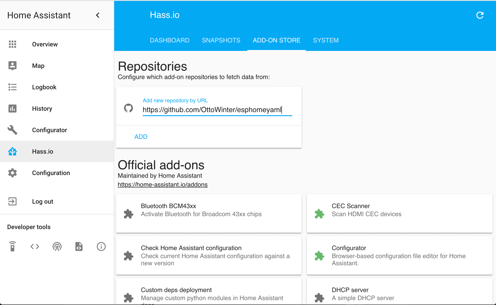

Getting Started with esphomeyaml through HassIO
===============================================

.. seo::
    :description: Getting Started guide for installing esphomeyaml as a HassIO Add-on and creating a basic configuration.
    :image: home-assistant.svg

esphomeyaml is the perfect solution for creating custom firmwares for
your ESP8266/ESP32 boards. In this guide we’ll go through how to setup a
basic "node" by use of the HassIO add-on.

But first, here's a very quick introduction of how esphomeyaml works:
esphomeyaml is a *tool* which reads in YAML configuration files (just like Home Assistant)
and creates custom firmwares. The tool also has many helpers that simplify flashing devices
and aims to make managing your ESP boards as simple as possible. Once you have added devices
or sensors in esphomeyaml's configuration, they will even automatically show up in Home
Assistant's UI.

Installation
------------

Installing the esphomeyaml HassIO add-on is easy. Just navigate to the HassIO
panel in your Home Assistant frontend and add the esphomeyaml add-on repository:
https://github.com/OttoWinter/esphomeyaml

After that, wait a bit until the add-on is installed (this can take a while) and
go to the add-on page. Start the add-on and then click "Open Web UI".

.. figure:: images/hassio_addon.png
    :align: center
    :width: 75.0%

You should now be greeted by a nice introduction wizard which will step you through
creating your first configuration.

.. figure:: images/hassio_start.png
    :align: center
    :width: 95.0%

Dashboard Interface
-------------------

Assuming you created your first configuration file with the wizard, let's take a quick
tour of the esphomeyaml dashboard interface.

.. figure:: images/hassio_interface.png
    :align: center
    :width: 95.0%

On the front page you will see all configurations for nodes you created. For each file,
there are three basic actions you can perform:

- **UPLOAD**: This compiles the firmware for your node and uploads it using any connected
  USB device or, if no USB devices are connected, over-the-air using the :doc:`/esphomeyaml/components/ota`.

  .. warning::

      The HassIO Add-On is currently not capable of discovering new USB ports after the add-on
      has started due to some docker restrictions. Please go to the add-on details page
      and restart the add-on if a new USB device is not automatically found.

- **COMPILE**: This command compiles the firmware and gives you the option of downloading the generated
  binary so that you can upload it yourself from your computer.

  .. note::

      If you're having problems with flashing over USB, you can always download the firmware using the
      ``COMPILE`` button and flash the firmware using :ref:`esphomeflasher <esphomeflasher>`.

- **SHOW LOGS**: With this command you can view all the logs the node is outputting. If a USB device is
  connected, it will attempt to use the serial connection. Otherwise it will use the built-in MQTT logs.

The configuration files for esphomeyaml can be found and edited under ``<HOME_ASSISTANT_CONFIG>/esphomeyaml/``.
For example the configuration for the node in above picture can be found in ``/config/esphomeyaml/livingroom.yaml``.

.. tip::

    Use the awesome `HASS Configurator Add-On <https://www.home-assistant.io/addons/configurator>`__ to edit your
    esphomeyaml configuration files.

Now go ahead and use one of the :ref:`devices guides <devices>` to extend your configuration for the device you
intend to flash an esphomeyaml firmware onto. Then proceed with uploading the first firmware using the
upload button.

HassIO add-on options
*********************

Since version 1.8.0, you can optionally specify a password to use for all traffic to esphomeyaml
using the ``password`` option in the HassIO add-on page. By default, this is an empty string
(which means no password), but you can enter any string in there to set your password.

Adding some (basic) features
----------------------------

So now you should have a file called ``/config/esphomeyaml/livingroom.yaml`` (or similar).
Go open that file in and add a :doc:`simple GPIO switch </esphomeyaml/components/switch/gpio>`
to the configuration like this:

.. code:: yaml

    switch:
      - platform: gpio
        name: "Living Room Dehumidifier"
        pin: 5

In above example, we're simply adding a switch that's called "Living Room Relay" (could control
anything really, for example lights) and is connected to the pin ``GPIO5``.

Now if you have `MQTT
Discovery <https://www.home-assistant.io/docs/mqtt/discovery/>`__
enabled in your Home Assistant configuration, the switch should already
be automatically be added 🎉 (Make sure you’ve added it to a view too.)

.. figure:: /esphomeyaml/components/switch/images/gpio-ui.png
    :align: center
    :width: 75.0%

After the first upload, you will probably never need to use the USB
cable again, as all features of esphomelib are enabled remotely as well.
No more opening hidden boxes stowed in places hard to reach. Yay!

Adding A Binary Sensor
----------------------

Next, we’re going to add a very simple binary sensor that periodically
checks a GPIO pin whether it’s pulled high or low - the :doc:`GPIO Binary
Sensor </esphomeyaml/components/binary_sensor/gpio>`.

.. code:: yaml

    binary_sensor:
      - platform: gpio
        name: "Living Room Window"
        pin:
          number: 16
          inverted: True
          mode: INPUT_PULLUP

This is an advanced feature of esphomeyaml, almost all pins can
optionally have a more complicated configuration schema with options for
inversion and pinMode - the :ref:`Pin Schema <config-pin_schema>`.

This time when uploading, you don’t need to have the device plugged in
through USB again. The upload will magically happen :doc:`"over the air" </esphomeyaml/components/ota>`.

.. figure:: /esphomeyaml/components/binary_sensor/images/gpio-ui.png
    :align: center
    :width: 75.0%

Where To Go Next
----------------

Great 🎉! You’ve now successfully setup your first esphomeyaml project
and uploaded your first esphomelib custom firmware to your node. You’ve
also learned how to enable some basic components via the configuration
file.

So now is a great time to go take a look at the :doc:`Components Index </esphomeyaml/index>`,
hopefully you’ll find all sensors/outputs/… you’ll need in there. If you’re having any problems or
want new features, please either create a new issue on the `GitHub issue
tracker <https://github.com/OttoWinter/esphomeyaml/issues>`__ or contact
me via the `Discord chat <https://discord.gg/KhAMKrd>`__.

Using Custom components
-----------------------

esphomelib’s powerful core makes it easy to create own custom sensors.
Please first follow the `Custom Sensor Component
Guide <https://github.com/OttoWinter/esphomelib/wiki/Custom-Sensor-Component>`__
to see how this can be done. For using custom components with
esphomeyaml you only need to open up the auto-generated ``<NODE_NAME>/src/main.cpp``
file in the platformio project folder. The lines in between
``AUTO GENERATED CODE BEGIN`` and ``AUTO GENERATED CODE END`` should not
be edited and all changes in there will be overridden, but outside of
those comments you can safely create custom sensors while still using
esphomeyaml’s great configuration options.

.. code:: cpp

    // Auto generated code by esphomeyaml
    #include "esphomelib/application.h"

    using namespace esphomelib;

    void setup() {
      // ===== DO NOT EDIT ANYTHING BELOW THIS LINE =====
      // ========== AUTO GENERATED CODE BEGIN ===========
      App.set_name("cabinet");
      // ...
      // =========== AUTO GENERATED CODE END ============
      // ========= YOU CAN EDIT AFTER THIS LINE =========
      App.setup();
    }

    void loop() {
      App.loop();
      delay(20);
    }

See Also
--------

- :doc:`esphomeyaml index </esphomeyaml/index>`
- :doc:`getting_started_command_line`
- `Edit this page on GitHub <https://github.com/OttoWinter/esphomedocs/blob/current/esphomeyaml/guides/getting_started_hassio.rst>`__

.. disqus::
