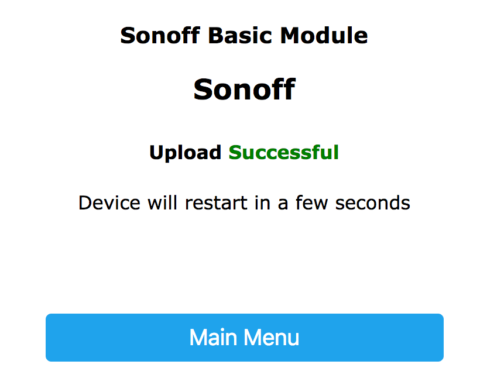

Migrating from Sonoff Tasmota
=============================

.. seo::
    :description: Migration guide for installing esphomelib on ESPs running Sonoff Tasmota.
    :image: tasmota.png

Migrating from previous Sonoff Tasmota setups is very easy. You just need to have
esphomeyaml create a binary for you and then upload that in the Tasmota web interface.

Getting Binary
--------------

First follow the guides for the :ref:`different supported devices <devices>` and create a configuration
file. Then, generate and download the binary:

- **Using the HassIO add-on/dashboard**: Just click the ``COMPILE`` button, wait for
  the compilation to end and press the ``DOWNLOAD BINARY`` button.

  .. figure:: images/download_binary.png

- **Using the command line**: run ``esphomeyaml livingroom.yaml compile`` (replacing
  ``livingroom.yaml`` with your configuration file of course) and navigate to the
  ``<NODE_NAME>/.pioenvs/<NODE_NAME>/`` folder. There you will find a ``firmware.bin`` file,
  this is the binary you will upload.

Uploading Binary
----------------

To upload the binary, navigate to the tasmota web interface and enter the
"Firmware Upgrade" section.

.. figure:: images/tasmota_main.png
    :align: center
    :width: 60.0%

In the "Upgrade by file upload" section, choose the binary you previously downloaded

.. figure:: images/tasmota_ota.png
    :align: center
    :width: 60.0%

If everything succeeds, you will see an "Upload Successful" message and esphomelib
will connect to the configured WiFi network 🎉

Happy Hacking!

See Also
--------

- :doc:`/esphomeyaml/devices/sonoff_s20`
- :doc:`/esphomeyaml/devices/sonoff_4ch`
- :doc:`/esphomeyaml/devices/sonoff`
- :doc:`/esphomeyaml/devices/nodemcu_esp8266`
- :doc:`/esphomeyaml/devices/nodemcu_esp32`
- :doc:`/esphomeyaml/devices/esp8266`
- :doc:`/esphomeyaml/devices/esp32`
- :doc:`migrate_espurna`
- :doc:`migrate_espeasy`
- `Edit this page on GitHub <https://github.com/OttoWinter/esphomedocs/blob/current/esphomeyaml/guides/migrate_sonoff_tasmota.rst>`__

.. disqus::
