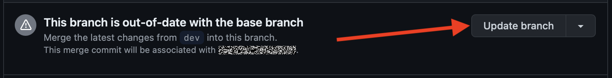

Contributing
============

.. seo::
    :description: Getting started guide for contributing to the ESPHome project
    :image: github-circle.svg

We welcome contributions to the ESPHome suite of code and documentation! All of the project code is hosted on GitHub:

- `ESPHome <https://github.com/esphome/esphome>`__ (Project Source Code)
- `ESPHome-Docs <https://github.com/esphome/esphome-docs>`__ (The documentation which you're reading here)

Just clone the repository locally, make changes for your new feature/bug fix and submit a pull request.

Contributing to ``esphome-docs``
--------------------------------

.. image:: /images/logo-docs.svg
    :align: center
    :width: 60.0%
    :class: dark-invert

Our documentation can always be improved. We rely on contributions from our users to do so. If you notice an issue (for
example, spelling/grammar mistakes) or if you want to share your awesome new setup, we encourage you to submit a pull
request (PR).

The ESPHome documentation is built using `sphinx <http://www.sphinx-doc.org/>`__ and uses
`reStructuredText <http://docutils.sourceforge.net/rst.html>`__ for all source (``.rst``) files.

If you're not familiar with rST, see :ref:`rst-syntax` for a quick refresher.

Through GitHub
**************

This guide essentially goes over the same material found in
`GitHub's Editing files in another user's repository <https://docs.github.com/en/repositories/working-with-files/managing-files/editing-files#editing-files-in-another-users-repository>`__.
You may also find that page helpful to read.

At the bottom of each page in the docs, there is a "Edit this page on GitHub" link. Click this link and you'll see
something like this:

.. figure:: images/docs_ghedit_1.png
    :align: center
    :width: 80.0%
    :alt: a screenshot of an rST file opened in GitHub, with the edit button circled

Click the edit button to start making changes. If you're unsure about syntax, see the quick-start :ref:`rst-syntax`
guide.

Once you've made your changes, give them a useful name and press "Propose changes". At this point, you've made the
changes on your own personal copy of the docs in GitHub, but you still need to submit them to us.

To do that, you need to create a "Pull request" (PR):

Fill out the new pull request form, replacing the ``[ ]`` with ``[x]`` to indicate that you have followed the
instructions.

.. figure:: images/docs_ghedit_4.png
    :align: center
    :width: 80.0%
    :alt: the pull request creation screen in GitHub with the "Create pull request" button circled

After a few minutes, you'll see either a green check ✅ or a red ❌ next to your commit in your pull request:

If you see the red ❌, there is at least one error preventing your pull request from being fully processed. Click on the
❌, then click on "Details" next to the lint step to determine what's wrong with your change(s).

.. figure:: images/docs_ghedit_ci_details.png
    :align: center
    :width: 80.0%
    :alt: failed lint substep of build, with "details" link circled

.. figure:: images/docs_ghedit_ci_logs.png
    :align: center
    :width: 80.0%
    :alt: log messages showing reason for failed build

In this example, you need to go to line 136 of ``pzemac.rst`` and adjust the number of ``===`` so that it completely
underlines the section heading.

Once you make that change, the pull request will be tested & built again; ideally, this time where will be no remaining
errors. If, however, more errors are discovered, simply repeat the process above to correct them.

.. note::

    All tests must be passing before we will review (and merge) a pull request.

Build
*****

.. note::

    The easiest way is to use the `esphome-docs container image <ghcr.io/esphome/esphome-docs/>`__:

    .. code-block:: bash

        docker run --rm -v "${PWD}/":/workspaces/esphome-docs -p 8000:8000 -it ghcr.io/esphome/esphome-docs

    ...with ``PWD`` referring to the root of the ``esphome-docs`` git repository. Then, to see the preview, go to
    ``<HOST_IP>:8000`` in your browser.

    This way, you don't have to install the dependencies to build the documentation.

To check your documentation changes locally, you first need install Sphinx (with **Python 3**).

.. code-block:: bash

    # in ESPHome-Docs repo:
    pip install -r requirements.txt

Then, use the provided Makefile to build the changes and start a live-updating web server:

.. code-block:: bash

    # Start web server on port 8000
    make live-html

Notes
*****

- Use the English language (duh...)
- An image is worth a thousand words, please use them wherever possible. Regardless, don't forget to optimize them so
  pages load quickly; you might try using https://tinypng.com/
- Try to use examples as often as possible.
- When using highly accurate, domain-specific terminology, be sure that it does not interfere with new users
  understanding the content.
- Be sure to target the correct **base branch** of the ``esphome-docs`` repository:

  - **Fixes/improvements** for documentation must target the ``current`` branch.
  - **New features** must target the ``next`` branch.

- **Create new branches in your fork** for each pull request; to avoid confusion (and other potential issues), do not
  make changes directly in the ``next`` and ``current`` branches in your fork.
- Wrap lines in all files at no more than 120 characters. This makes reviewing PRs faster and easier. Exceptions should
  be made only for lines which contain long links or other specific content/metadata that cannot be wrapped.

.. _rst-syntax:

Syntax
******

Here's a quick RST primer:

Title hierarchy is based on order of occurrence, not on type of character used to underline it. For consistency, we
adhere to the following order:

- **Headers**:

  You can write titles like this:

  .. code-block:: rst

      My Title
      ========

  and section headers like this:

  .. code-block:: rst

      My Section
      ----------

  and sub-section headers like this:

  .. code-block:: rst

      My Sub-section
      **************

  and sub-sub-section headers like this:

  .. code-block:: rst

      My Sub-sub-section
      ^^^^^^^^^^^^^^^^^^

  .. note::

      - The length of the bar below the text **must** match the title text length.
      - Section titles should use Title Case.

- **Links**: To create a link to an external resource (for example https://www.google.com), use
  ``\`Link text <link_url>\`__``. For example:

  .. code-block:: rst

      `Google.com <https://www.google.com>`__

  `Google.com <https://www.google.com>`__

- **References**: To reference another document, use the ``:doc:`` and ``:ref:`` roles (references are set up globally
  and can be used between documents):

  .. code-block:: rst

      .. _my-reference-label:

      Section to cross-reference
      --------------------------

      See :ref:`my-reference-label`, also see :doc:`/components/switch/gpio`.
      :doc:`Using custom text </components/switch/gpio>`.

  See :ref:`devices`, also see :doc:`/components/switch/gpio`.
  :doc:`Using custom text </components/switch/gpio>`.

- **Inline code**: To have text appear ``like this``, use double backticks:

  .. code-block:: rst

      To have text appear ``like this``, use double backticks.

  To have text appear ``like this``, use double backticks.

- **Code blocks**: To show a sample configuration file, use the ``code-block`` directive:

  .. code-block:: rst

      .. code-block:: yaml

          # Sample configuration entry
          switch:
            - platform: gpio
              name: "Relay #42"
              pin: GPIOXX

  .. code-block:: yaml

      # Sample configuration entry
      switch:
        - platform: gpio
          name: "Relay #42"
          pin: GPIOXX

  .. note::

      Note that a blank line is *required* after every ``code-block`` directive.

- **Collapsible section**: To add a collapsible section, use the ``collapse`` directive:

  .. code-block:: rst

      .. collapse:: Details

          Something small enough to escape casual notice.

  .. collapse:: Details

      Something small enough to escape casual notice.

  .. code-block:: rst

      .. collapse:: A long code block

          .. code-block:: yaml

              # Sample configuration entry
              switch:
                - platform: gpio
                  name: "Relay #42"
                  pin: GPIOXX

  .. collapse:: A long code block

      .. code-block:: yaml

          # Sample configuration entry
          switch:
            - platform: gpio
              name: "Relay #42"
              pin: GPIOXX

  The ``:open:`` flag can be used to have the section open by default.

  .. code-block:: rst

      .. collapse:: Open
          :open:

          This section is open by default.

  .. collapse:: Open
      :open:

      This section is open by default.

  .. note::

      - The ``:open:`` flag must immediately follow the ``collapse`` directive without a blank line between them.
      - A blank line is *required* after every ``collapse`` directive.

- **Tabs**: To group content into tabs, use the ``tabs`` directive. The tabs directive defines a tab set.
  Basic tabs are added using the ``tab`` directive (without s), which takes the tab’s label as an argument:

  .. code-block:: rst

      .. tabs::

          .. tab:: Apples

              Apples are green, or sometimes red.

          .. tab:: Pears

              Pears are green.

          .. tab:: Oranges

              Oranges are orange.

  This will appear as

  .. tabs::

      .. tab:: Apples

          Apples are green, or sometimes red.

      .. tab:: Pears

          Pears are green.

      .. tab:: Oranges

          Oranges are orange.

  Tabs can also be nested inside one another:

  .. code-block:: rst

      .. tabs::

          .. tab:: Stars

              .. tabs::

                  .. tab:: The Sun

                      The closest star to us.

                  .. tab:: Proxima Centauri

                      The second closest star to us.

                  .. tab:: Polaris

                      The North Star.

          .. tab:: Moons

              .. tabs::

                  .. tab:: The Moon

                      Orbits the Earth

                  .. tab:: Titan

                      Orbits Jupiter

  .. tabs::

      .. tab:: Stars

          .. tabs::

              .. tab:: The Sun

                  The closest star to us.

              .. tab:: Proxima Centauri

                  The second closest star to us.

              .. tab:: Polaris

                  The North Star.

      .. tab:: Moons

          .. tabs::

              .. tab:: The Moon

                  Orbits the Earth

              .. tab:: Titan

                  Orbits Jupiter

  .. note::

      - A blank line is *required* after every ``tabs`` directive.
      - The contents of each tab can be displayed by clicking on the tab that you wish to show.
        Clicking again on the tab that is currently open will hide its content, leaving only the tab set labels visible.
      - For advanced features like tab-groupings, refer to https://sphinx-tabs.readthedocs.io/en/latest/

- **Images**: Use the ``figure`` directive to display an image:

  .. code-block:: rst

      .. figure:: images/dashboard_states.png
          :align: center
          :width: 40.0%

          Optional figure caption.

  .. figure:: images/dashboard_states.png
      :align: center
      :width: 40.0%

      Optional figure caption.

  .. note::

      All images in the documentation need to be as small as possible to minimize page load times. Typically, the
      maximum size should be roughly 1000x800 px or so. Additionally, please use online tools like
      https://tinypng.com/ or https://tinyjpg.com/ to further compress images.

- **Notes and warnings**: You can create simple notes and warnings using the ``note`` and ``warning`` directives:

  .. code-block:: rst

      .. note::

          This is a note.

      .. warning::

          This is a warning.

  .. note::

      This is a note.

  .. warning::

      This is a warning.

- **Italic and boldface font families**: To *italicize* text, use one asterisk around the text. To put
  **a strong emphasis** on a piece of text, put two asterisks around it.

  .. code-block:: rst

      *This is italicized.* (A weird word...)
      **This is very important.**

  *This is italicized.* (A weird word...)
  **This is very important.**

- **Ordered and unordered list**: The syntax for lists in RST is more or less the same as in Markdown:

  .. code-block:: rst

      - Unordered item

        - Unordered sub-item

      - Item with a very long text so that it does not fully fit in a single line and
        must be split up into multiple lines.

      1. Ordered item #1
      2. Ordered item #2

  - Unordered item

    - Unordered sub-item

  - Item with a very long text so that it does not fully fit in a single line and
    must be split up into multiple lines.

  1. Ordered item #1
  2. Ordered item #2

- **imgtable**: ESPHome uses a custom RST directive to show the table on the front page (see
  `index.rst <https://github.com/esphome/esphome-docs/blob/current/index.rst>`__). New pages need to be added to the
  ``imgtable`` list. The syntax is CSV with <PAGE NAME>, <FILE NAME> (without RST), <IMAGE> (in the top-level
  ``images/`` directory), <COMMENT> (optional; short text to describe the component). The aspect ratio of these images
  should be 8:10 (or 10:8) but exceptions are possible.

  Because these images are served on the main page, they need to be compressed heavily. SVGs are preferred over JPGs
  and JPGs should be no more than 300x300px.
  
  If you have imagemagick installed, you can use this command to convert the thumbnail:

  .. code-block:: bash

      convert -sampling-factor 4:2:0 -strip -interlace Plane -quality 80% -resize 300x300 in.jpg out.jpg

reStructured text can do a lot more than this; if you're looking for a more complete guide, please have a look at the
`Sphinx reStructuredText Primer <http://www.sphinx-doc.org/en/master/usage/restructuredtext/basics.html>`__.

.. _setup_dev_env:

Setting Up a Development Environment
------------------------------------

If you want to develop (a) new feature(s) for ESPHome, you need to set up a development environment.
Note that ``pip`` must be installed before running the ``setup`` script.

.. code-block:: bash

    # Clone repos
    git clone https://github.com/esphome/esphome.git
    git clone https://github.com/esphome/esphome-docs.git

    # Install ESPHome
    cd esphome/
    script/setup
    # Start a new feature branch
    git checkout -b my-new-feature
    cd ..

The environment is now ready for use, but you'll need to activate the Python virtual environment (venv) each time you
wish to use it.

.. code-block:: bash

    # Activate venv
    source venv/bin/activate

Now you can open ESPHome in your IDE of choice (many of us are using `VSCode <https://code.visualstudio.com/download>`__)
with the PlatformIO addons (see PlatformIO docs for more info) and develop the new feature with the guidelines below.

All PRs are automatically checked and tested for some common formatting/code errors with Github Actions. *These checks*
**must all pass** *before we will review (and eventually merge) your PR.*

Setting Up Git Environment
--------------------------

ESPHome's codebase is hosted on GitHub; contributing is done exclusively through "Pull Requests" (PRs) in the
GitHub interface. To use this, you need to set up your ``git`` environment first.

If you want to contribute changes/fixes you've made back to ESPHome, first, go to the repository you want to contribute
to (``esphome``, for example) and click "fork" in the top right corner. This will create a fork of the repository that
you can modify and create branches on.

.. code-block:: bash

    # Clone your fork
    git clone https://github.com/<YOUR_GITHUB_USERNAME>/<REPO_NAME>.git
    # For example: git clone https://github.com/OttoWinter/esphome.git

    # To continue you now need to enter the directory you created above
    cd <REPO_NAME>
    # For example: cd esphome

    # Add "upstream" remote
    git remote add upstream https://github.com/esphome/<REPO_NAME>.git
    # For example: git remote add upstream https://github.com/esphome/esphome.git

    # For each patch, create a new branch from latest dev
    git checkout dev
    git pull upstream dev
    git checkout -b <MY_NEW_FEATURE>
    # For example: git checkout -b gpio-switch-fix

    # Make your modifications, then commit changes with message describing changes
    git add .
    git commit -m "<COMMIT_MESSAGE>"
    # For example: git commit -m "Fix GPIO Switch Not Turning Off Interlocked Switches"

    # Upload changes
    git push -u origin <BRANCH_NAME>
    # For example: git push -u origin gpio-switch-fix

Submitting a Pull Request
*************************

After you have pushed your changes to GitHub, go to your repository fork and look for a "create pull request" button
near the top of the page (or, alternatively, go to branches and create it from there). As you create the PR:

- Complete the Pull Request template:

  - Include a brief (but complete) summary of your changes.
  - PRs without a descrption/summary of the changes will not be reviewed or merged, although exceptions may
    occasionally be made for small PRs and/or PRs made by frequent contributors/maintainers.
  - **Do not delete the template.**

- **Mark your PR as a draft** if it is not ready to be reviewed or merged yet. Your PR should be considered a draft if:

  - You still plan to make more changes to the code/documentation.
  - Changes have been requested to the PR but you have not completed making (or discussing) the requested changes yet.
  - You are waiting on feedback from the community and/or maintainers to complete your changes.

  This lets reviewers know that the PR may continue to change so they will not spend valuable time reviewing it until
  it is ready. We do this because, if a PR is reviewed and then it changes, it must be re-reviewed. Reviewing a single
  PR multiple times is not a productive use of time and we try as much as possible to avoid doing so.

Review Process
**************

ESPHome's maintainers work hard to maintain a high standard for its code, so reviews can take some time. At the bottom
of each pull request you will see the "Github Actions" continuous integration (CI) checks which will automatically
analyize all code changed in your branch. These checks try to spot (and suggest corrections for) errors. If any CI
check fails, please look at the Github Actions log and fix all errors that appear there.

**All automated checks must be passing** before a given PR will be reviewed and (eventually) merged!

**When will my PR be reviewed/merged?**

ESPHome is a big project; :ref:`we encourage everybody to test, review and comment on PRs.<can_i_help_review>` Despite
this, reviews can (and often do) take some time.

**But howwww looonnnggg???**

Small PRs are easier to review and are often reviewed first. If you want your PR to be reviewed (and merged) quickly,
here are some tips:

- *Keep PRs as small and as focused as possible.* Smaller PRs tend to be easier to understand and take less time to
  review. Large PRs (many hundreds or thousands of lines) by their nature (of being large) tend to keep changing which
  means reviewers have to revisit them over and over as they evolve. This isn't a tenable practice for project
  maintainers. Break your work into multiple, smaller PRs and link these PRs together with comments in the description
  so reviewers can follow the work more easily.
- The above bullet paraphrased: *we would rather review ten ten-line PRs than one 100-line PR.*
- *Be sure to follow all* :ref:`codebase_standards`. When reviewers have to spend time commenting on/correcting your PR
  because you didn't name variables correctly or didn't prefix member variable accesses with ``this->``, it wastes time
  we could be using to review other PRs which *do* follow the standards.
- If you wish to take on a big project, such as refactoring a substantial section of the codebase or integrating
  another open source project with ESPHome, please discuss this with us on `Discord <https://discord.gg/KhAMKrd>`__ or
  `create a discussion on GitHub <https://github.com/esphome/esphome/discussions>`__ **before** you do all the work and
  attempt to submit a massive PR.
- If you are not sure about how you should proceed with some changes, **please**
  `discuss it with us on Discord <https://discord.gg/KhAMKrd>`__ *before* you go do a bunch of work that we can't (for
  whatever reason) accept...and then you have to go back and re-do it all to get your PR merged. It's easier to make
  corrections early-on -- and we want to help you!

.. _can_i_help_review:

Can I Help Review PRs?
**********************

**YES! PLEASE!!!**

While only maintainers can *merge* PRs, we value feedback from the community and it *is considered* as we review them.
Put another way, when a PR has several "This worked for me!" comments on it, we know that the author's work is doing
what it's supposed to, even if some other, underlying aspects might still need some fine-tuning to be consistent with
the rest of the codebase.

Testing
^^^^^^^

Often, the easiest way to help review PRs is by testing. Many (but not all) PRs can be used as
:doc:`/components/external_components` and can easily be added into your configuration for testing, like this:

.. code-block:: yaml

    external_components:
      - source: github://pr#2639
        components: [ rtttl ]

...you just need to update the PR number and component name(s) in the YAML accordingly.

If you test a PR, please *share your results by leaving a comment on the PR!* If it doesn't work, be sure to include
any messages from the compiler and/or device logs so the author can troubleshoot the issue. *Comments which state no
more than "it doesn't work" are not helpful!*

Code Review
^^^^^^^^^^^

Beyond basic functionality (*"does it work?"*), here are a few other items we check for when reviewing PRs:

- Are file names & paths appropriate for/consistent with the codebase?
- Are namespace names consistent with the component/platform?
- Do all ``#define`` macro names match the namespace?
- Are all :ref:`codebase_standards` adhered to?
- Are there any calls to ``delay()`` with a duration longer than 10 milliseconds?
- Are any class methods doing work that they shouldn't be? For example, let's consider the ``dump_config()`` method:

  - This method is intended to do **nothing** other than *print values* that were retrieved earlier (in ``setup()``).
  - If this method has (for example) a ``this->read(...)`` call in it, it does not pass review and needs to be changed.

- Is the component/platform doing *exactly what it's supposed to*? Consider the example of a new serial bus interface a
  contributor has implemented:

  - The author has implemented this component with an action called ``superbus.send``.
  - The author has concerns about too much traffic on the bus, so they have implemented a check in this action which
    blocks duplicate message transmissions on the bus. The effect is that, if ``superbus.send`` is called repeatedly
    with the same message, only the first call will actually send the message on the bus.

  This behavior is not consistent with what ESPHome users expect. If the action ``superbus.send`` is called, it should
  *always* send the message, regardless of the content. If there are concerns about (in this example) bus
  utilization, perhaps messages can be queued instead of dropped/ignored.

.. _prs-are-being-drafted-when-changes-are-needed:

Why was my PR marked as a draft?
************************************

If your PR was reviewed and changes were requested, our bot will automatically mark your PR as a draft. This means that
the PR is not ready to be merged or further reviewed for the moment.

When a PR is marked as a draft, it tells other reviewers that this particular PR is a work-in-progress and it doesn't
require their attention yet.

Once you have made the requested changes, you can mark the PR as ready for review again by clicking the "Ready for
review" button:

Before you click the "Ready for review" button, ensure that:

- You have addressed all requested changes
- There are no merge conflicts
- All CI jobs and checks are passing successfully

Once you've clicked the "Ready for review" button, the PR will return to a normal state again and our bot will
automatically notify the reviewers who requested the changes that the PR is ready to go!

Updating Your Branches
**********************

Sometimes you'll want (or need) to bring changes that were made in ESPHome's ``dev`` branch back into your (local copy
of a) branch.

The examples that follow in this section assume that you have:

- already used ``git remote`` to add ``upstream`` as shown earlier, and
- your feature branch (the branch from which you created your PR) currently checked out

.. _feature_branches:

Feature Branches
^^^^^^^^^^^^^^^^

There are a couple of ways you can update your (local) feature branch. The easiest is by clicking the "Update branch"
button in GitHub:

...then run ``git pull`` to pull these changes back down from GitHub.

If you prefer to do it the command-line/terminal way, you can do this, instead:

.. code-block:: bash

    # Fetch the latest upstream changes
    git fetch upstream dev
    # Merge in the changes we fetched above
    git merge upstream/dev

Your Local Copy of ``dev``
^^^^^^^^^^^^^^^^^^^^^^^^^^

As you create new branches for your work, you'll want to be sure they include all of the latest changes from ESPHome's
``dev`` branch -- it's not a good practice to create a new feature branch from an outdated ``dev`` branch.

For this reason, you'll periodically want to update your local ``dev`` branch. A more detailed explanation can be found
`here <https://developers.home-assistant.io/docs/en/development_catching_up.html>`__, but here's the TL;DR:

.. code-block:: bash

    # Fetch the latest upstream changes
    git fetch upstream dev
    git rebase upstream/dev

Note that you can use this procedure for other branches, too, such as ``next`` or ``current`` from ``esphome-docs``.

.. _force_push:

.. warning::

    Using ``git rebase`` will result in your changes having to be *force-pushed* back up to GitHub.

    **Do not force-push** your branch once your PR is being reviewed; GitHub allows reviewers to mark files as "viewed"
    and, when you force-push, this history **is lost**, forcing your reviewer to re-review files they may have already
    reviewed!

    If you must update your branch, use a method described in :ref:`feature_branches`, instead.

.. _contributing_to_esphome:

Contributing to ESPHome
-----------------------

.. image:: /images/logo-text.svg
    :align: center
    :width: 60.0%
    :class: dark-invert

This is a guide to contributing to the ESPHome codebase. ESPHome uses two languages for its project: Python and C++.

The Python side of ESPHome reads a YAML configuration file, validates it and transforms it into a custom firmware which
includes only the code needed to perform as defined in the configuration file.

The C++ part of the codebase is what's actually running on the microcontroller; this is called the "runtime". This part
of the codebase should first set up the communication interface to a sensor/component/etc. and then communicate with
the ESPHome core via the defined interfaces (like ``Sensor``, ``BinarySensor`` and ``Switch``, among others).

.. _directory_structure:

Directory Structure
*******************

After you've :ref:`set up a development environment <setup_dev_env>`, you will have a folder structure like this:

.. code-block:: text

    esphome
    ├── __main__.py
    ├── automation.py
    ├── codegen.py
    ├── config_validation.py
    ├── components
    │   ├── __init__.py
    │   ├── dht12
    │   │   ├── __init__.py
    │   │   ├── dht12.cpp
    │   │   ├── dht12.h
    │   │   ├── sensor.py
    │   ├── restart
    │   │   ├── __init__.py
    │   │   ├── restart_switch.cpp
    │   │   ├── restart_switch.h
    │   │   ├── switch.py
    │  ...

All components are in the "components" folder. Each component is in its own subfolder which contains the Python code
(``.py``) and the C++ code (``.h`` and ``.cpp``).

Consider a YAML configuration file containing the following:

.. code-block:: yaml

    hello1:

    sensor:
      - platform: hello2

In both cases, ESPHome will automatically look for corresponding entries in the "components" folder and find the
directory with the given name. In this example, the first entry causes ESPHome to look for the
``esphome/components/hello1/__init__.py`` file and the second entry tells ESPHome to look for
``esphome/components/hello2/sensor.py`` or ``esphome/components/hello2/sensor/__init__.py``.

Let's leave what's written in those files for :ref:`the next section <config_validation>`, but for now you should also
know that, whenever a component is loaded, all the C++ source files in the folder of the component are automatically
copied into the generated PlatformIO project. All you need to do is add the C++ source files in the component's folder
and the ESPHome core will copy them with no additional code required by the component developer.

.. note::

    For testing, you can use :doc:`/components/external_components`.

    ESPHome also has a ``custom_components`` mechanism like `Home Assistant does
    <https://developers.home-assistant.io/docs/creating_component_index>`__. Note, however, that
    **custom componenets are deprecated** in favor of :doc:`/components/external_components`.

.. _config_validation:

Config Validation
*****************

The first task ESPHome performs is to read and validate the provided YAML configuration file. ESPHome has a powerful
"config validation" mechanism for this purpose. Each component defines a config schema which is used to validate the
provided configuration file.

To do this, all ESPHome Python modules that can be configured by the user define a special variable named
``CONFIG_SCHEMA``. An example of such a schema is shown below:

.. code-block:: python

    import esphome.config_validation as cv

    CONF_MY_REQUIRED_KEY = 'my_required_key'
    CONF_MY_OPTIONAL_KEY = 'my_optional_key'

    CONFIG_SCHEMA = cv.Schema({
      cv.Required(CONF_MY_REQUIRED_KEY): cv.string,
      cv.Optional(CONF_MY_OPTIONAL_KEY, default=10): cv.int_,
    }).extend(cv.COMPONENT_SCHEMA)

This variable is automatically loaded by the ESPHome core and is used to validate the provided configuration.
The underlying system ESPHome uses for this is `voluptuous <https://github.com/alecthomas/voluptuous>`__.
How validation works is out of scope for this guide; the easiest way to learn is to look at how similar components
validate user input.

A few notes on validation:

- ESPHome puts a lot of effort into **strict validation**. All validation methods should be as strict as possible and
  detect incorrect user input at the validation stage, mitigating compiler warnings and/or errors.
- All default values should be defined in the schema -- not in C++ codebase.
- Prefer naming configuration keys in a way which is descriptive instead of short. Put another way, if the meaning of a
  key is not immediately obvious, don't be afraid to use ``long_but_descriptive_keys``. There is no reason to use
  obscure shorthand. As an example, ``scrn_btn_inpt`` is indeed shorter but more difficult to understand, particularly
  for new users; avoid naming keys and variables in this way.

.. _code_generation:

Code Generation
***************

The last step the Python codebase performs is called *code generation*. This runs only after the user input has been
successfully validated.

As you may know, ESPHome "converts" the user's YAML configuration into C++ code (you can see the generated code under
``<NODE_NAME>/src/main.cpp``). Each component must define its own ``to_code`` method that "converts" the user input to
C++ code.

This method is also automatically loaded and invoked by the ESPHome core. Here's an example of such a method:

.. code-block:: python

    import esphome.codegen as cg

    async def to_code(config):
        var = cg.new_Pvariable(config[CONF_ID])
        await cg.register_component(var, config)

        cg.add(var.set_my_required_key(config[CONF_MY_REQUIRED_KEY]))

The details of ESPHome code generation is out-of-scope for this document. However, ESPHome's code generation is 99%
syntactic sugar - and (again) it's probably best to study similar components and just copy what they do.

There's one important concept for the ``to_code`` method: coroutines with ``await``.

The problem that necessitates coroutines is this: in ESPHome, components can declare (via ``cg.Pvariable``) and access
variables (``cg.get_variable()``) -- but sometimes, when one part of the codebase requests a variable, it has not been
declared yet because the code for the component creating the variable has not yet run.

To allow for ID references, ESPHome uses so-called ``coroutines``. When you see an ``await`` statement in a ``to_code``
method, ESPHome will call the provided method and, if that method needs to wait for a variable to be declared first,
``await`` will wait until that variable has been declared. After that, ``await`` returns and the method will execute on
the next line.

Next, there's a special method - ``cg.add`` - that you will often use. ``cg.add()`` performs a very simple task: Any
C++ declared in the parentheses of ``cg.add()`` will be added to the generated code. Note that, if you do not call
"add" to insert a piece of code explicitly, it will not be added to the ``main.cpp`` file!

.. _runtime:

Runtime
*******

At this point, the Python part of the codebase has completed its work. Let's move on and discuss the C++ part of
components.

Most components consist of two primary parts/steps:

- Setup Phase
- Run Phase

When you create a new component, your new component will inherit from :apiclass:`Component`.
That class has a special ``setup()`` method that will be called once to set up the component -
at the time the ``setup()`` method is called, all the setters generated by the Python codebase
have already run and the all fields are set for your class.

The ``setup()`` method should set up the communication interface for the component and check
if communication works (if not, it should call ``mark_failed()``).

Again, look at examples of other components to learn more.

The next method that will be called with your component is ``loop()`` (or ``update()`` for a
:apiclass:`PollingComponent`). These methods should retrieve the latest data from your component and publish them with
the provided methods.

Finally, your component must have a ``dump_config`` method that prints the complete user configuration.

.. _delays_in_code:

A Note About Delays in Code
***************************

**Code in** ``loop()``, ``update()`` **and** ``setup()`` **must not block**.

Methods like ``delay()`` should be avoided and **delays longer than 10 ms are not permitted**. Because ESPHome uses a
single-threaded loop for all components, if your component blocks, it will delay the whole loop, negatively impacting
other components. This can result in a variety of problems such as network connections being lost.

If your code **must** wait for something to happen (for example, your sensor requires hundreds of milliseconds to
initialize and/or take a reading), then you'll need to implement a state machine to facilitate this. For example, your
code can send the "take reading" command, return, and, when the next iteration of ``loop()`` or ``update()`` is called,
it then attempts to read back the measurement from the sensor.

``loop()`` is called every 16 ms (assuming no other components delay this, which may happen from time to time) and
``update()`` is called at an interval defined in the user configuration for the component, but only for
:apiclass:`PollingComponent`.

For any :apiclass:`Component` (which is nearly everything), the well-known ``set_timeout`` method is also available;
this can be a handy alternative to implemeting a state machine.

.. _a_note_about_custom_components:

A Note About Custom Components
******************************

*"I read that custom components are deprecated...so now what do I do???"*

ESPHome's "custom component" mechanism is a holdover from Home Assistant's feature by the same name. It existed before
:doc:`/components/external_components` and offered a way to "hack in" support for devices which were not officially
supported by ESPHome.

ESPHome has since deprecated this feature in favor of :doc:`/components/external_components` for several reasons:

- Custom components are very fragile:

  - There is no validation. You can easily configure a custom component incorrectly and there will be no warning.
  - Types are not checked. You might incorrectly pass a variable of an incorrect type or unit to a custom component
    resulting in compiler errors, unexpected behavior and/or crashes.
  - Custom components are difficult to use. You have to manually copy all of the custom component's files into *just
    the right location* on your system or else you will receive compiler errors and the component won't work.
  - Custom components almost always require C++ code changes when you want them to work even *slightly* differently
    than the original author intended.

- :doc:`/components/external_components` initially require a bit more effort by the developer but are ultimately more
  robust and easier to use and share:

  - Just like any other ESPHome component/platform:
  
    - They are configured entirely in YAML.
    - Their YAML configuration is validated.

  - They do not require the user to:

    - Manually copy files onto their system.
    - Touch/edit any C++ code.

  - They tend to be more flexible since they are configured in YAML (as opposed to editing C++ code to make changes).

**So what is the difference between custom components and** :doc:`/components/external_components`?

Custom components are typically (more or less) just the :ref:`runtime` part of an ESPHome component/platform. On the
other hand, :doc:`/components/external_components` are just like any other ESPHome component -- the only difference is
that they are *external* in the sense that they are not "officially" a part of ESPHome.

In terms of implementation, custom components just lack the Python part of an ESPHome component, specifically:

- :ref:`config_validation`
- :ref:`code_generation`

As such, most custom components can be made into :doc:`/components/external_components` simply by adding the required
Python parts to make the custom component into a proper, complete ESPHome component.

We encourage all custom component developers to extend their custom component(s) into proper
:doc:`/components/external_components`; doing so will make your custom component easier to share and use. As you do so,
be sure to have a look at the the :ref:`contributing_to_esphome` section above as it walks through ESPHome (component)
architecture. In addition, it's often helpful to take a look at other, similar
`components <https://github.com/esphome/esphome/tree/dev/esphome/components>`__ and adapt them to fit the needs of your
custom component. For common hardware devices such as :doc:`sensors</components/sensor/index>`, this is often a
reasonably trivial exercise and `we are happy to help you along! <https://discord.gg/KhAMKrd>`__

Extras
******

.. note::

    This serves as documentation for some of ESPHome's internals and is not necessarily part of the development guide.

All Python modules have some magic symbols that will automatically be loaded by the ESPHome loader. These are:

- ``CONFIG_SCHEMA``: The configuration schema to validate the user config against.
- ``to_code``: The function that will be called with the validated configuration and should create the necessary C++
  source code.
- ``DEPENDENCIES``: Mark the component to depend on other components. If the user hasn't explicitly added these
  components in their configuration, a validation error will be generated.
- ``AUTO_LOAD``: Automatically load a component if the user hasn't added it manually.
- ``MULTI_CONF``: Mark this component to accept an array of configurations. If this is an integer instead of a boolean,
  validation will only permit the given number of entries.
- ``CONFLICTS_WITH``: Mark a list of components as conflicting with this component. If the user has one of them in
  their config, a validation error will be generated.
- ``CODEOWNERS``: GitHub usernames or team names of people that are responsible for this component. You should add at
  least your GitHub username here, as well as anyone who helped you to write code that is being included.

.. _codebase_standards:

Codebase Standards
------------------

ESPHome's maintainers work hard to maintain a high standard for its code. We try our best to adhere to these standards:

- The C++ code style is based on the
  `Google C++ Style Guide <https://google.github.io/styleguide/cppguide.html>`__ with a few modifications.

    - Function, method and variable names are ``lower_snake_case``
    - Class/struct/enum names should be ``UpperCamelCase``
    - Constants should be ``UPPER_SNAKE_CASE``
    - Fields should be ``protected`` and ``lower_snake_case_with_trailing_underscore_`` (DO NOT use ``private``)
    - It's preferred to use long variable/function names over short and non-descriptive ones.
    - All uses of class members and member functions should be prefixed with ``this->`` to distinguish them from global
      functions/variables.
    - Use two spaces, not tabs.
    - Using ``#define`` is discouraged and should be replaced with constants or enums (if appropriate).
    - Use ``using type_t = int;`` instead of ``typedef int type_t;``
    - Wrap lines in all files at no more than 120 characters. This makes reviewing PRs faster and easier. Exceptions
      should be made only for lines where wrapping them would result in a syntax issue.

- Components should dump their configuration using ``ESP_LOGCONFIG`` at startup in ``dump_config()``.
- ESPHome uses a unified formatting tool for all source files (but this tool can be difficult to install).
  When creating a new PR in GitHub, be sure to check the Github Actions output to see what formatting needs to be
  changed and what potential problems are detected.
- Use of external libraries should be kept to a minimum:

  - If the component you're developing has a simple communication interface, please consider implementing the library
    natively in ESPHome.
  - Libraries which directly manipulate pins or don't do any I/O generally do not cause problems.
  - Libraries which use hardware interfaces (I²C, for example), should be configured/wrapped to use ESPHome's own
    communication abstractions.
  - If the library accesses a global variable/state (``Wire`` is a good example) then there's likely a problem because
    the component may not be modular. Put another way, this approach may mean that it's not possible to create multiple
    instances of the component for use wihtin ESPHome.

- Components **must** use the provided abstractions like ``sensor``, ``switch``, etc. Components specifically should
  **not** directly access other components -- for example, to publish to MQTT topics.
- Implementations for new devices should contain reference links for the datasheet and other sample implementations.
- If you have used ``delay()`` or constructed code which blocks for a duration longer than ten milliseconds, be sure to
  read :ref:`delays_in_code`.
- Comments in code should be used as appropriate, such as to help explain some complexity or to provide a brief summary
  of what a class, method, etc. is doing. PRs which include large blocks of commented-out code will not be accepted.
  Single lines of commented code may be useful from time to time (for example, to call out something which was
  deliberately omitted for some reason) but should generally be avoided.
- Please test your changes :)

.. note::

    You can also run the lint and Github Actions checks through a docker image:

    .. code-block:: bash

        # Full lint+test suite
        docker run --rm -v "${PWD}/":/esphome -it ghcr.io/esphome/esphome-lint script/fulltest

        # Run lint only over changed files
        docker run --rm -v "${PWD}/":/esphome -it ghcr.io/esphome/esphome-lint script/quicklint

    If you are using Windows and have docker installed the syntax is slightly different.
    If you have cloned esphome to ``c:\edev\esphome`` the volume format is ``c/edev/esphome``

    .. code-block:: bash

        # convert the volume format
        $current_dir=(Get-Location).Path.ToLower().Replace(':','').Replace('\','/')
        # Run lint only over changed files from powershell
        docker run --rm -v "$($current_dir):/esphome" -it ghcr.io/esphome/esphome-lint script/quicklint

See Also
--------

- :doc:`ESPHome index </index>`
- :doc:`faq`
- :ghedit:`Edit`
