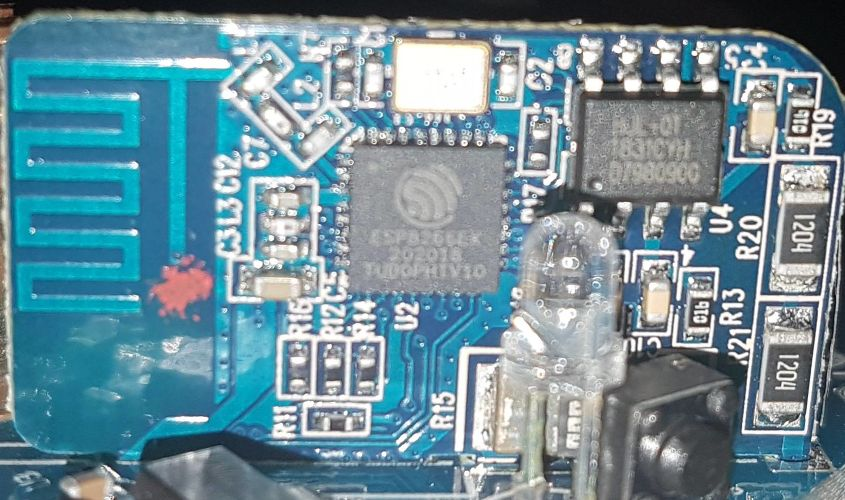

Getting Started with ESPHome
============================

.. seo::
    :description: Getting started guide for installing ESPHome targeted towards someone with no experience.
    :image: /guides/images/esphome-dummies-baked.svg

.. image:: /guides/images/esphome-dummies-short.svg
    :alt: Parody "For Dummies" book cover with "ESPHome Flashing For Dummies" written on it
    :align: center
    :width: 75.0%

This guide takes you through loading ESPHome on a device that you own. Not
ready for that yet? You can learn more about ESPHome first:

- `Why would I want local control of my devices? <https://example.com>`_
- `What is ESPHome? <https://example.com>`_
- `How does ESPHome work? <https://example.com>`_

This guide tries to cover a wide variety of situations, as well as go into
enough detail that someone with no prior experience can successfully load
ESPHome on any device.

Materials
---------

Because we're working with hardware, we might need some additional tools,
depending on your situation. Already have all this stuff? You're good to go!

But if you don't, don't go out and buy everything just yet. Read through the
guide first and make a list of everything you need. Different situations will
require different parts and tools.

.. list-table::
    :header-rows: 1
    :widths: 1 3 1 3

    * - Name
      - Purpose
      - Approx. cost
      - Picture
    * - USB to micro-USB/mini-USB/USB-C
      - If your target device has a USB port on it, you need the appropriate
        cable to connect to it.
      - $3 to $10
      - .. image:: /guides/images/usb-cable.jpg
          :alt: From https://www.stockvault.net/photo/271754/usb-cable
    * - USB to serial adaptor
      - Serial communication is a simple way of talking to other devices, like
        the ESP32/ESP8266 you're flashing. But your computer probably doesn't
        have this capability built-in. "Serial", "UART", "TTL", and "COM" are
        all more-or-less synonyms.

        There are many different types of these, so don't worry if yours doesn't
        look exactly like the picture. However, you do need one with a voltage
        regulator.

        The `Tasmota website provides a good set of suggestions on what to buy
        <https://tasmota.github.io/docs/Getting-Started/#needed-hardware>`_.
      - $3 to $10
      - .. image:: /guides/images/usb-serial-adaptor.jpg
    * - Jumper wires
      - Used to connect two things together electrically. The male end has metal
        protuding and is plugged into the the female end of a wire or board.
        They come in varying lengths too, but for our purposes, any length will
        do.
      - $3 to $8 for a pack
      - .. image:: /guides/images/jumper-wires.jpg
          :alt: From https://www.flickr.com/photos/snazzyguy/8096512976
    * - Breakable headers
      - Soldered to a PCB to provide a way to connect jumper wires. The distance
        between the metal pins is known as the pitch, and is usually 2.54mm for
        what we're doing.

        This sort of header can be cut to the correct length along the groves.
      - $3 to $8 for a pack
      - .. image:: /guides/images/breakable-header.jpg
          :alt: From https://www.flickr.com/photos/snazzyguy/27120004896/
    * - Wire snips, wire cutters, flush cutters
      - Used to cut wire. These can often be subsituted by a knife or scissors,
        but be careful not to hurt yourself.
      - $5 to $15
      - .. image:: /guides/images/wire-cutters.jpg
          :alt: From https://www.flickr.com/photos/snazzyguy/3932324106
    * - Wire strippers
      - Used to remove the insulation from wires, leaving the conductive metal
        interior exposed. These can often be subsituted by a knife, scissors, or
        fingernails, but be careful not to hurt yourself.

        There are many different styles, not just that in the picture. You'll
        want something that works with fairly thin wire, about 20 AWG to 26 AWG.
      - $5 to $15
      - .. image:: /guides/images/strippers.jpg
          :alt: From https://www.flickr.com/photos/snazzyguy/3931542659
    * - Soldering iron
      - Used to melt metal, called solder, to connect things together in an
        electrically conductive way.

        You'll want something with temperature control. Other than that, there
        are many varying opinions and options here.

        `The /r/AskElectronics wiki has some good suggestions
        <https://www.reddit.com/r/AskElectronics/wiki/soldering>`_. The
        following would serve you well, although be careful to buy from a
        reliable source:

        - Hakko FX-888D
        - KSGER T12
        - TS100/TS80
      - $60 to $120
      - .. image:: /guides/images/soldering-iron.jpg
          :alt: From https://commons.wikimedia.org/wiki/File:Soldering_Station_Weller_2.jpeg
    * - Electronics solder
      - Molten metal used to join things in an electrically conductive way.
        There are two types, leaded and lead-free. Leaded melts at a lower
        temperature and is a little easier to work with, but is hazardous to the
        environment (but not to humans in this form).

        Electronics solder also usually has a "rosin core", which helps clean
        the surfaces to allow the solder to stick.

        You absolutely do not want plumbing solder, also known as "acid core" or
        "silver solder". It needs much higher temperatures than we can safely
        use here.
      - $8 to $12
      - .. image:: /guides/images/solder.jpg
          :alt: From https://commons.wikimedia.org/wiki/File:Rosin_core_solder.JPG
    * - Electronics flux
      - Used to clean the metal surfaces before soldering them together.
        Sometimes the rosin core of the solder doesn't provide enough, so you'd
        want add some extra.

        This stuff is helpful, but probably not needed for this guide since we
        won't be doing any advanced soldering.

        If you do buy it, you absolutely do not want plumber's flux. It will
        destroy your circuit boards.
      - $8 to $12
      - .. image:: /guides/images/flux.jpg

Connecting to the ESP
---------------------

There's a wide variety of situations you might find yourself in, each of which
requires you do something different to connect your computer to the ESP in
order to flash it.

You only need to physically connect to it once. Once you've flashed your device
and connected it to your WiFi, you can use the `OTA (over-the-air) update
component </components/ota.html>`_ to install software remotely.

With the exception of the situation where you have a USB port, you need to make
five electrical connections to program an ESP-based board:

- +3.3V, or occasionally +5.0V
- GND, or ground
- TX
- RX
- IO0, used to place the board into programming mode. This is often a button
  that you need to hold down while connecting the power (+3.3V).

RX and TX are frequently swapped. If programming your board doesn't work the
first time, try flipping the wires connected to those pins before trying again.

.. warning::

    .. image:: /images/high-voltage-warning.svg
      :alt: High voltage warning symbol
      :height: 50

    **Do not connect your device to mains electricity while following this
    guide.** If your device is open and plugged into the wall, you'll be a
    single touch away from being electrocuted.

    You are solely responsible for your own safety. If you feel something is
    wrong or are uncomfortable with continuing, stop immediately.

USB port on device
******************

.. figure:: /images/nodemcu_esp8266.jpg
    :align: center
    :width: 75.0%

    A device with a USB port and a serial adaptor built-in

Development boards often come with a USB port built in. This USB port is
connected to a serial adaptor, so you don't need a separate serial adaptor. You
can use just a USB cable to connect it to your computer to program it.

This isn't likely to be very useful without connecting additional sensors to it
by either soldering or using a breadboard, but you do not need anything else to
*just* flash ESPHome on it.

Pre-soldered programming headers
********************************

.. figure:: images/programming-header-populated.jpg
    :align: center
    :width: 75.0%

    A device that comes with programming headers pre-installed

In this situation, you'll need just jumper wires and a USB to serial adaptor.
You don't need to solder anything, that's already been done by the factory.

Unpopulated programming header
******************************

.. figure:: images/programming-header-unpopulated.jpg
    :align: center
    :width: 75.0%

    A device that has a spot for programming headers on the circuit board

You can probably get away with jumper wires and a USB to serial adaptor. You
can place the male end of the wires directly into the circuit board and hold
them into place with your hand until you're done flashing the board.

These headers sometimes have writing on the circuit board indicating what each
pin is. If your header does not, either look it up on the internet, or use a
multimeter in continuity mode to figure it out (advanced topic).

Solder-filled programming header
********************************

.. figure:: images/programming-header-filled.jpg
    :align: center
    :width: 75.0%

    A set of programming headers that are filled with solder

You'll need a USB to serial adapter, jumper wires, a soldering iron, and
probably solder and some breakaway headers if your board looks like this.

You can try placing the jumper wires in the right place, but you'll have
trouble holding them without having them slide around. You'll want to solder a
header onto the programming port in this situation.

These headers sometimes have writing on the circuit board indicating what each
pin is. If your header does not, either look it up on the internet, or use a
multimeter in continuity mode to figure it out (advanced topic).

Module only
***********

.. figure:: images/module-only-programming.jpg
    :align: center
    :width: 75.0%
    :alt: From https://tasmota.github.io/docs/devices/SM-SO301/

    An ESP8266 module with programming wires soldered on

If the device has a module but no programming headers, things get a bit tricky.
You'll need a USB to serial adaptor, jumper wires, wire strippers, wire snips,
a soldering iron, solder, and a bit of flux would help.

Cut the jumper wires, strip a bit off the end, and then solder them onto the
module. You can find the correct places to solder the wires by looking the
module model number on the internet. You can find `one list of commonly used
modules here <https://tasmota.github.io/docs/Pinouts/>`_.

Bare chip
*********

    A bare ESP8266 IC with no programming header

This is an advanced topic and won't be covered in detail, but you have three options:

- You can hope that your device is supported by an OTA conversation tool. Most
  these tools have been broken by vendors, and the ESPHome community can't help
  you with using these tools.
- If the programming wires connect to a larger component like a resistor, you
  can solder or clip your jumper wires to that larger component.
- You can use your amazing microsoldering skills to connect directly to the IC.

ESPHome installation
---------------------

Windows
*******

Mac
***

Linux
*****

Your distribution probably already has Python installed. Confirm that it is at
least version 3.7:

.. code-block:: bash

    python3 --version

Looks good? You can go ahead and install ESPHome:

.. code-block:: bash

    pip3 install --user esphome

.. caution::

    Don't use ``sudo`` with pip. If you do, you'll run into trouble updating
    your OS down the road.

    For details see `DontBreakDebian
    <https://wiki.debian.org/DontBreakDebian#A.27make_install.27_can_conflict_with_packages>`_.
    `pip install` is essentially equvilant to `make install`, and that advice
    applies to all Linux distributions, not just Debian.

At this point, you should be able confirm that ESPHome has been successfully installed:

.. code-block:: console

    $ esphome version
    Version: 2021.12.3

If you get an error like "Command not found", you need to add the binary to
your ``PATH`` using ``export PATH=$PATH:$HOME/.local/bin``.

To set this permanently, you can run ``echo 'export
PATH=$PATH:$HOME/.local/bin' >> $HOME/.bashrc``, then log out and back in.

See Also
--------

- :doc:`cli`
- :doc:`ESPHome index </index>`
- :doc:`getting_started_hassio`
- :ghedit:`Edit`
