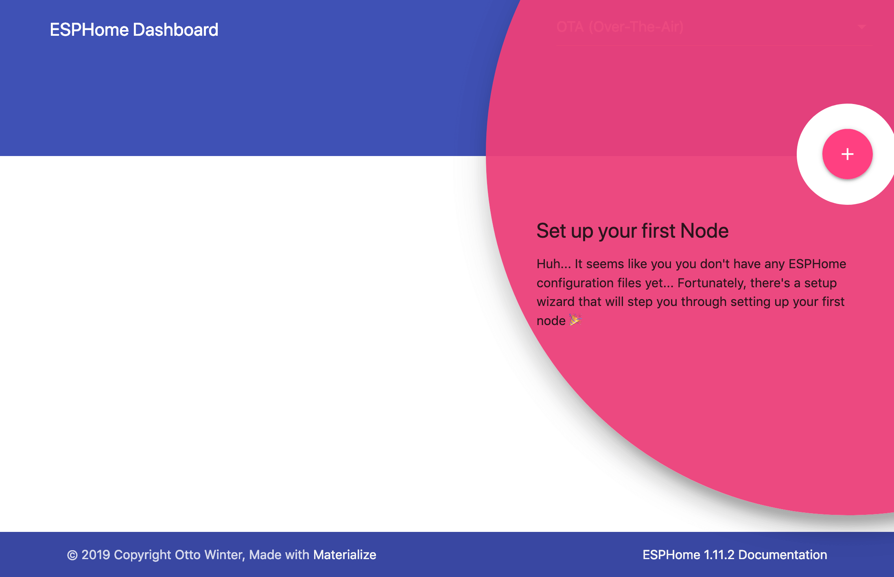
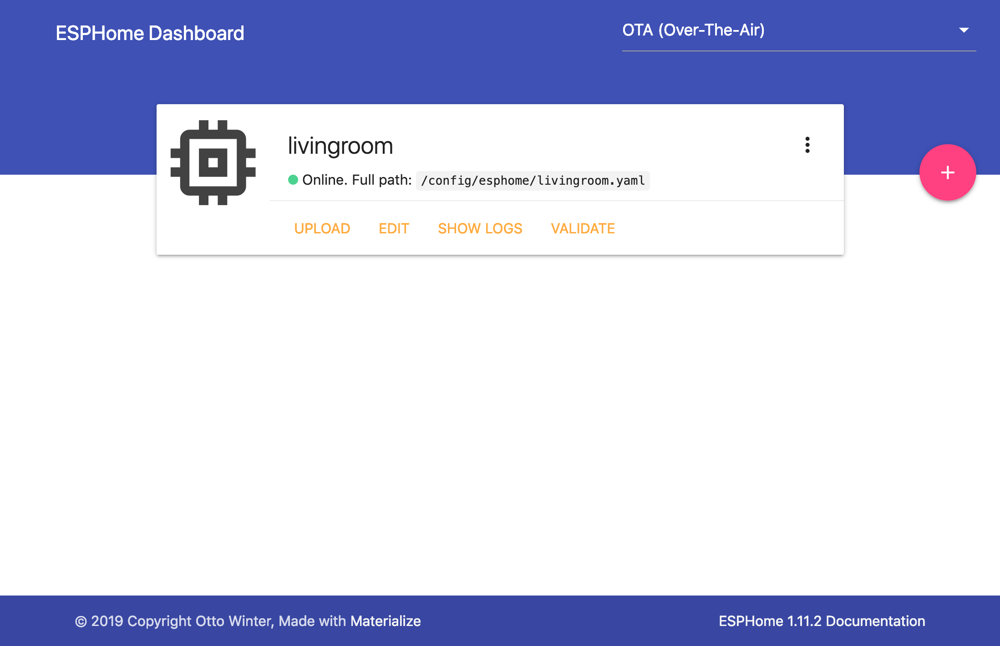

Getting Started with ESPHome and Home Assistant
===============================================

.. seo::
    :description: Getting Started guide for installing ESPHome Dashboard as a Home Assistant add-on and creating a basic configuration.
    :image: home-assistant.png

ESPHome is the perfect solution for creating custom firmware for
your ESP8266/ESP32 boards. In this guide we’ll go through how to setup a
basic "node" using the ESPHome Dashboard, installed as a Home Assistant add-on.

But first, here's a very quick introduction to how ESPHome works:
ESPHome is a *tool* which aims to make managing your ESP boards as simple as possible. It reads in a YAML configuration file (just like Home Assistant) and creates custom firmware which it installs on your ESP device. Devices or sensors added in ESPHome's configuration will automatically show up in Home Assistant's UI.

Installing ESPHome Dashboard
----------------------------

The ESPHome Dashboard can be installed as a Home Assistant add-on, which you can find in the add-on store in the Supervisor panel. Open it using the following button then click on INSTALL:

.. raw:: html

    

After that, wait a bit until it is installed (this can take a while). Click "Start" and then click "Open Web UI". If you see "502: Bad Gateway" it is currently starting, and you can refresh the page after a couple of seconds.

.. figure:: images/hassio_addon.png
    :align: center
    :width: 75.0%

You should now be greeted by a nice introduction wizard which will step you through
creating your first configuration.

The wizard will guide you through creating your first configuration and, depending on your browser, install it on your ESP device. You will need to name your configuration and enter your wireless network settings so that the ESP device can come online and can communicate with Home Assistant.

.. raw:: html

    

.. note::

    The most difficult part of setting up a new ESPHome device is the initial installation. Installation requires that your ESP device is connected with a cable to a computer. Later updates can be installed wirelessly.

    If you use `Microsoft Edge <https://www.microsoft.com/edge>`_ or `Google Chrome <https://www.google.com/chrome>`_, you will be able to install the initial configuration by connecting your ESP device to the computer that you're using to view the ESPHome Dashboard.
    *You need to access the ESPHome Dashboard over HTTPS for this to work. This is a requirement of browsers to access your ESP device to ensure that we write the correct data.*

    If you use another browser, you will have to connect the ESP devices to the machine running the ESPHome Dashboard and Home Assistant.

    If the serial port is not showing up, you might not have the required drivers installed. These drivers work for most ESP devices:

      * CP2102 (square chip): `driver <https://www.silabs.com/products/development-tools/software/usb-to-uart-bridge-vcp-drivers>`__
      * CH341: `driver <https://github.com/nodemcu/nodemcu-devkit/tree/master/Drivers>`__

Dashboard Interface
-------------------

Assuming you created your first configuration file with the wizard, let's take a quick
tour of the ESPHome Dashboard interface.

On the front page you will see all configurations for nodes you created. For each file,
there are three basic actions you can perform:

- **INSTALL**: This compiles the firmware for your node and installs it. Installation happens wirelessy if you have enabled the :doc:`/components/ota` in your configuration. Alternatively you can install it from your browser or via a device connected to the machine running the ESPHome Dashboard.

- **SHOW LOGS**: With this command you can view all the logs the node is outputting. If a USB device is
  connected, it will attempt to use the serial connection. Otherwise it will use the built-in OTA logs.

- **COMPILE**: This command compiles the firmware and gives you the option of downloading the generated
  binary so that you can install it yourself from your computer using :ref:`ESPHome-flasher <esphome-flasher>`.

The configuration files for ESPHome can be found and edited under ``<HOME_ASSISTANT_CONFIG>/esphome/``.
For example the configuration for the node in the picture above can be found
in ``/config/esphome/livingroom.yaml``.

Now go ahead and use one of the :ref:`devices guides <devices>` to extend your configuration.

Adding some (basic) features
----------------------------

So now you should have a file called ``/config/esphome/livingroom.yaml`` (or similar).
Go open that file (in any text editor) and add a :doc:`simple GPIO switch </components/switch/gpio>`
to the configuration like this:

.. code-block:: yaml

    switch:
      - platform: gpio
        name: "Living Room Dehumidifier"
        pin: 5

In above example, we're simply adding a switch that's called "Living Room Dehumidifier" (could control
anything really, for example lights) and is connected to the pin ``GPIO5``.

Connecting your device to Home Assistant
----------------------------------------

Once your configuration is installed on your ESP device and is online, it will be automatically discovered by Home Assistant and offered to set up on your integrations screen:

.. raw:: html

    

Alternatively, you can manually add the device by clicking "CONFIGURE" on the ESPHome integration
and entering "<NODE_NAME>.local" as the host.

.. figure:: /components/switch/images/gpio-ui.png
    :align: center
    :width: 75.0%

After the first installation, you will probably never need to use the USB
cable again, as all features of ESPHome are enabled remotely as well.

Adding A Binary Sensor
----------------------

Next, we’re going to add a very simple binary sensor that periodically
checks a GPIO pin to see whether it’s pulled high or low - the :doc:`GPIO Binary
Sensor </components/binary_sensor/gpio>`.

.. code-block:: yaml

    binary_sensor:
      - platform: gpio
        name: "Living Room Window"
        pin:
          number: 16
          inverted: True
          mode: INPUT_PULLUP

This time when installing, you don’t need to have the device plugged in
through USB again. The upload will happen wirelessly (:doc:`"over the air" </components/ota>`).

.. figure:: /components/binary_sensor/images/gpio-ui.png
    :align: center
    :width: 75.0%

Where To Go Next
----------------

Great 🎉! You’ve now successfully setup your first ESPHome project
and installed your first ESPHome custom firmware to your node. You’ve
also learned how to enable some basic components via the configuration
file.

So now is a great time to go take a look at the :doc:`Components Index </index>`.
Hopefully you’ll find all sensors/outputs/… you’ll need in there. If you’re having any problems or
want new features, please either create a new issue on the `GitHub issue
tracker <https://github.com/esphome/issues/issues>`__ or find us on the
`Discord chat <https://discord.gg/KhAMKrd>`__ (also make sure to read the :doc:`FAQ <faq>`).

See Also
--------

- :doc:`ESPHome index </index>`
- :doc:`getting_started_command_line`
- :ghedit:`Edit`
