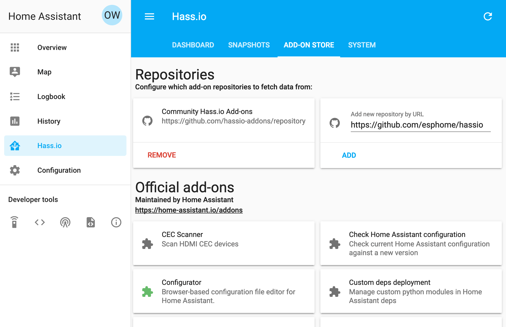
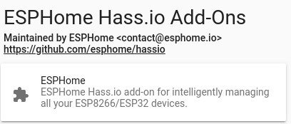

Getting Started with ESPHome and Home Assistant
===============================================

.. seo::
    :description: Getting Started guide for installing ESPHome as a Home Assistant add-on and creating a basic configuration.
    :image: home-assistant.png

ESPHome is the perfect solution for creating custom firmware for
your ESP8266/ESP32 boards. In this guide we’ll go through how to setup a
basic "node" by use of the Home Assistant add-on.

But first, here's a very quick introduction to how ESPHome works:
ESPHome is a *tool* which reads in a YAML configuration file (just like Home Assistant)
and creates a custom firmware binary. The tool also has many helpers that simplify flashing devices (uploading the new binary file)
and aim to make managing your ESP boards as simple as possible. Once you have added devices
or sensors in ESPHome's configuration, they will even automatically show up in Home
Assistant's UI.

Installation
------------

Installing the ESPHome Home Assistant add-on is easy. Navigate to the Supervisor
panel in your Home Assistant frontend, then enter ``ESPHome`` in the searchbar of the "Add-on Store"
tab.

Click on ESPHome, then INSTALL.

After that, wait a bit until the add-on is installed (this can take a while) and
go to the add-on page. Start the add-on and then click "Open Web UI". If you see "502: Bad Gateway" the
addon is currently starting, and you can refresh the page after a couple of seconds.

.. figure:: images/hassio_addon.png
    :align: center
    :width: 75.0%

You should now be greeted by a nice introduction wizard which will step you through
creating your first configuration.

.. figure:: images/hassio_start.png
    :align: center
    :width: 95.0%

Dashboard Interface
-------------------

Assuming you created your first configuration file with the wizard, let's take a quick
tour of the ESPHome dashboard interface.

.. figure:: images/dashboard.png
    :align: center
    :width: 95.0%

On the front page you will see all configurations for nodes you created. For each file,
there are three basic actions you can perform:

- **UPLOAD**: This compiles the firmware for your node and uploads it using any connected
  USB device or, if no USB devices are connected, over-the-air using the :doc:`/components/ota`.

  .. warning::

      The Home Assistant add-on is currently not capable of discovering new USB ports after the
      add-on has started due to some docker restrictions. Please go to the add-on details page
      and restart the add-on if a new USB device is not automatically found. If the USB device
      is still not found, try changing the USB cable and restarting the add-on.

- **SHOW LOGS**: With this command you can view all the logs the node is outputting. If a USB device is
  connected, it will attempt to use the serial connection. Otherwise it will use the built-in OTA logs.

- **COMPILE**: This command compiles the firmware and gives you the option of downloading the generated
  binary so that you can upload it yourself from your computer.

  .. note::

      If you're having problems with flashing over USB, you can always download the firmware using the
      ``COMPILE`` button and flash the firmware using :ref:`ESPHome-flasher <esphome-flasher>`.

The configuration files for ESPHome can be found and edited under ``<HOME_ASSISTANT_CONFIG>/esphome/``.
For example the configuration for the node in the picture above can be found
in ``/config/esphome/livingroom.yaml``.

Now go ahead and use one of the :ref:`devices guides <devices>` to extend your configuration for the device you
intend to flash an ESPHome firmware onto. Then proceed with uploading the first firmware using the
upload button.

Adding some (basic) features
----------------------------

So now you should have a file called ``/config/esphome/livingroom.yaml`` (or similar).
Go open that file (in any text editor) and add a :doc:`simple GPIO switch </components/switch/gpio>`
to the configuration like this:

.. code-block:: yaml

    switch:
      - platform: gpio
        name: "Living Room Dehumidifier"
        pin: 5

In above example, we're simply adding a switch that's called "Living Room Dehumidifier" (could control
anything really, for example lights) and is connected to the pin ``GPIO5``.

Connecting your device to Home Assistant
----------------------------------------

Now when you go to the Home Assistant "Integrations" screen (under "Configuration" panel), you
should see the ESPHome device show up in the discovered section (although this can take up to 5 minutes).
Alternatively, you can manually add the device by clicking "CONFIGURE" on the ESPHome integration
and entering "<NODE_NAME>.local" as the host.

.. figure:: /components/switch/images/gpio-ui.png
    :align: center
    :width: 75.0%

After the first upload, you will probably never need to use the USB
cable again, as all features of ESPHome are enabled remotely as well.
No more opening hidden boxes stowed in places hard to reach. Yay!

Adding A Binary Sensor
----------------------

Next, we’re going to add a very simple binary sensor that periodically
checks a GPIO pin to see whether it’s pulled high or low - the :doc:`GPIO Binary
Sensor </components/binary_sensor/gpio>`.

.. code-block:: yaml

    binary_sensor:
      - platform: gpio
        name: "Living Room Window"
        pin:
          number: 16
          inverted: True
          mode: INPUT_PULLUP

This is an advanced feature of ESPHome, almost all pins can
optionally have a more complicated configuration schema with options for
inversion and pinMode - the :ref:`Pin Schema <config-pin_schema>`.

This time when uploading, you don’t need to have the device plugged in
through USB again. The upload will magically happen :doc:`"over the air" </components/ota>`.

.. figure:: /components/binary_sensor/images/gpio-ui.png
    :align: center
    :width: 75.0%

Where To Go Next
----------------

Great 🎉! You’ve now successfully setup your first ESPHome project
and uploaded your first ESPHome custom firmware to your node. You’ve
also learned how to enable some basic components via the configuration
file.

So now is a great time to go take a look at the :doc:`Components Index </index>`.
Hopefully you’ll find all sensors/outputs/… you’ll need in there. If you’re having any problems or
want new features, please either create a new issue on the `GitHub issue
tracker <https://github.com/esphome/issues/issues>`__ or find us on the
`Discord chat <https://discord.gg/KhAMKrd>`__ (also make sure to read the :doc:`FAQ <faq>`).

See Also
--------

- :doc:`ESPHome index </index>`
- :doc:`getting_started_command_line`
- :ghedit:`Edit`
