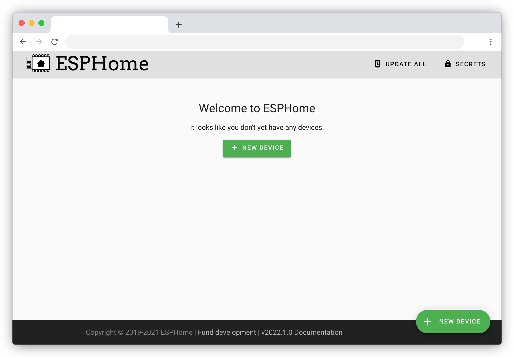
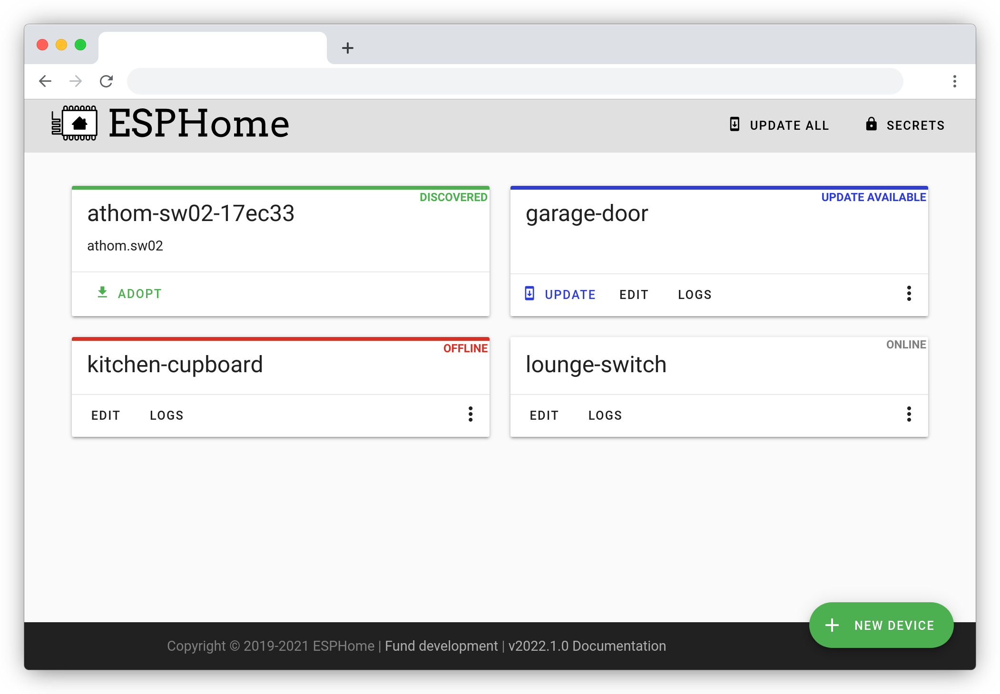

Getting Started with ESPHome and Home Assistant
===============================================

.. seo::
    :description: Getting Started guide for installing ESPHome Dashboard as a Home Assistant add-on and creating a basic configuration.
    :image: home-assistant.svg

In this guide we’ll go through how to install ESPHome on a device using the ESPHome Dashboard, installed as a Home Assistant add-on.

But first, here's a very quick introduction to how ESPHome works:
ESPHome is a *tool* which aims to make managing your ESP boards as simple as possible. It reads in a YAML configuration file and creates custom firmware which it installs on your ESP device. Devices or sensors added in ESPHome's configuration will automatically show up in Home Assistant's UI.

Installing ESPHome Dashboard
----------------------------

The ESPHome Dashboard can be installed as a Home Assistant add-on, which you can find in the add-on store in the Supervisor panel. Open it using the following button then click on INSTALL:

If you do not have the official ESPHome add-on repository added you can add with this button:

.. raw:: html

    

After that, wait a bit until it is installed (this can take a while). Click "Start" and then click "Open Web UI". If you see "502: Bad Gateway" it is currently starting, and you can refresh the page after a couple of seconds.

.. figure:: images/hassio_addon.png
    :align: center
    :width: 75.0%

You should now be greeted by a nice introduction wizard which will step you through
creating your first configuration.

The wizard will guide you through creating your first configuration and, depending on your browser, install it on your ESP device. You will need to name your configuration and enter your wireless network settings so that the ESP device can come online and can communicate with Home Assistant.

.. note::

    The most difficult part of setting up a new ESPHome device is the initial installation. Installation requires that your ESP device is connected with a cable to a computer. Later updates can be installed wirelessly.

    For guidance on making this first connection, see :doc:`physical_device_connection`

Dashboard Interface
-------------------

Assuming you created your first configuration file with the wizard, let's take a quick
tour of the ESPHome Dashboard interface.

On the front page you will see all configurations for nodes you created. For each file,
there are a few basic actions you can perform:

- **UPDATE**: This button will show up if the device has not been installed with the same ESPHome version currently running.

- **EDIT**: This will open the configuration editor.

- **LOGS**: With this command you can view all the logs the node is outputting. If a USB device is
  connected, you can choose to use the serial connection. Otherwise it will use the built-in OTA logs.

- **Overflow menu**: This is a dropdown menu which allows you to perform more actions.

  - **Validate**: This will validate the configuration file.
  - **Install**: Opens the Install dialog.
  - **Clean Build Files**: This will delete all of the generated build files and is a safe operation to perform. Sometimes old files are not removed and can cause compile issues later on.
  - **Delete**: This will delete the configuration file.

The configuration files for ESPHome can be found and edited under ``<HOME_ASSISTANT_CONFIG>/esphome/``.
For example the configuration for the ``garage-door`` node in the picture above can be found
in ``/config/esphome/garage-door.yaml``.

.. note::

    Since Home Assistant add-ons run as individual containers, accessing these through
    command line is not very straightforward, but it's possible. To do that,
    install Home Assistant's SSH addon, configure a username and a password,
    and disable `Protection Mode` (please assess the risks you take with that).
    Then, for example to access the logs from a device through an SSH client,
    log in, and you can use a command like
    `docker exec -it addon_15ef4d2f_esphome esphome logs /config/esphome/garage-door.yaml`.
    See :doc:`getting_started_command_line` for more.

Now go ahead and use one of the :ref:`devices guides <devices>` to extend your configuration.

Adding some (basic) features
----------------------------

So now you should have a file called ``/config/esphome/livingroom.yaml`` (or similar).
Go open that file (in any text editor) and add a :doc:`simple GPIO switch </components/switch/gpio>`
to the configuration like this:

.. code-block:: yaml

    switch:
      - platform: gpio
        name: "Living Room Dehumidifier"
        pin: GPIO5

In above example, we're simply adding a switch that's called "Living Room Dehumidifier" (could control
anything really, for example lights) and is connected to the pin ``GPIO5``.

Connecting your device to Home Assistant
----------------------------------------

Once your configuration is installed on your ESP device and is online, it will be automatically discovered by Home Assistant and offered to set up on your integrations screen:

.. raw:: html

    

Alternatively, you can manually add the device on the Home Assistant Integrations page.  Click on the "Add Integration" button (bottom right), search for esphome, and enter the host name, eg: "<NODE_NAME>.local" as the host.  Use the same process to add multiple esphome devices.

.. figure:: /components/switch/images/gpio-ui.png
    :align: center
    :width: 75.0%

After the first installation, you will probably never need to use the USB
cable again, as all features of ESPHome are enabled remotely as well.

Adding A Binary Sensor
----------------------

Next, we’re going to add a very simple binary sensor that periodically
checks a GPIO pin to see whether it’s pulled high or low - the :doc:`GPIO Binary
Sensor </components/binary_sensor/gpio>`.

.. code-block:: yaml

    binary_sensor:
      - platform: gpio
        name: "Living Room Window"
        pin:
          number: 16
          inverted: true
          mode:
            input: true
            pullup: true

This time when installing, you don’t need to have the device plugged in
through USB again. The upload will happen wirelessly (:doc:`"over the air" </components/ota>`).

.. figure:: /components/binary_sensor/images/gpio-ui.png
    :align: center
    :width: 75.0%

Where To Go Next
----------------

Great 🎉! You’ve now successfully setup your first ESPHome project
and installed your first ESPHome custom firmware to your node. You’ve
also learned how to enable some basic components via the configuration
file.

So now is a great time to go take a look at the :doc:`Components Index </index>`.
Hopefully you’ll find all sensors/outputs/… you’ll need in there. If you’re having any problems or
want new features, please either create a new issue on the `GitHub issue
tracker <https://github.com/esphome/issues/issues>`__ or find us on the
`Discord chat <https://discord.gg/KhAMKrd>`__ (also make sure to read the :doc:`FAQ <faq>`).

See Also
--------

- :doc:`ESPHome index </index>`
- :doc:`getting_started_command_line`
- :ghedit:`Edit`
