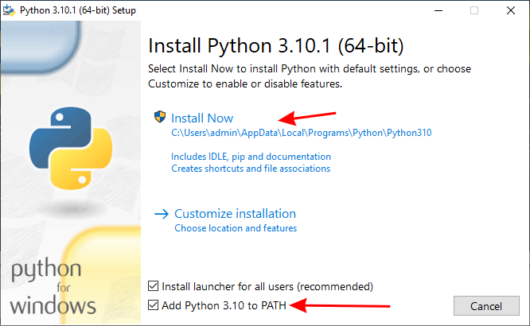

Installing ESPHome Manually
===========================

Windows
-------

Download Python from `the official site <https://www.python.org/downloads/>`_.

Make sure you check "Add Python to PATH", and go all the way through the
installer.

Log out and back in, or restart your computer. Whichever is easiest.

Open the start menu and type ``cmd``. Press the enter key.

In the terminal that comes up, check that Python is installed:

.. code-block:: console

    > python --version
    Python 3.10.1

.. note::

    Don't copy the ``>``. That's used to show that this is a command that goes
    in the console, and to let you see what the expected results are (shown on
    the next line without a ``>``)

Looks good? You can go ahead and install ESPHome:

.. code-block:: console

    > pip3 install wheel
    > pip3 install esphome

And you should be good to go! You can test that things are properly installed
with the following:

.. code-block:: console

    > esphome version
    Version: 2021.12.3

Mac
---

The simplest way to install ESPHome on a Mac is with `Homebrew <https://brew.sh/>`_:

.. code-block:: console

    $ brew install esphome

Or, if you have a working Python installation you can install it directly without Homebrew.
There are several ways to install Python on a Mac, including with Apple's Xcode command 
line tools or from `Python downloads <https://www.python.org/downloads/>`_.

Make sure you're running python 3.9 or above, then install using ``pip3``:

.. code-block:: console

    $ python3 --version
    Python 3.9.15

    $ pip3 install esphome

You can then test that things are properly installed with the following:

.. code-block:: console

    $ esphome version
    Version: 2021.12.3

Linux
-----

Your distribution probably already has Python installed. Confirm that it is at
least version 3.9:

.. code-block:: console

    $ python3 --version
    Python 3.9.15

Looks good? Now create a virtual environment to contain ESPHome and it's dependencies.

.. code-block:: console

    $ python3 -m venv venv
    $ source venv/bin/activate

You may or may not see ``(venv)`` at the beginning of your prompt depending on your shell configuration. This indicates that you are in the virtual environment.

You can go ahead and install ESPHome:

.. code-block:: bash

    pip3 install esphome

.. caution::

    Don't use ``sudo`` with pip. If you do, you'll run into trouble updating
    your OS down the road.

    For details, see `DontBreakDebian
    <https://wiki.debian.org/DontBreakDebian#A.27make_install.27_can_conflict_with_packages>`_.
    ``pip install`` is equivalent to ``make install`` in this context. The
    advice in the article applies to all Linux distributions, not just Debian.

    Some people install ESPHome without the virtual environment, which can lead to issues with PATHs etc.
    Non virtual environment installations are considered not "supported" as people end up having to know your exact system setup.

At this point, you should be able confirm that ESPHome has been successfully installed:

.. code-block:: console

    $ esphome version
    Version: 2022.11.4

If you get an error like "Command not found", you need to add the binary to
your ``PATH`` using ``export PATH=$PATH:$HOME/.local/bin``.

To set this permanently, you can run ``echo 'export
PATH=$PATH:$HOME/.local/bin' >> $HOME/.bashrc``, then log out and back in.

See Also
--------

- :doc:`ESPHome index </index>`
- :doc:`getting_started_command_line`
- :ghedit:`Edit`
