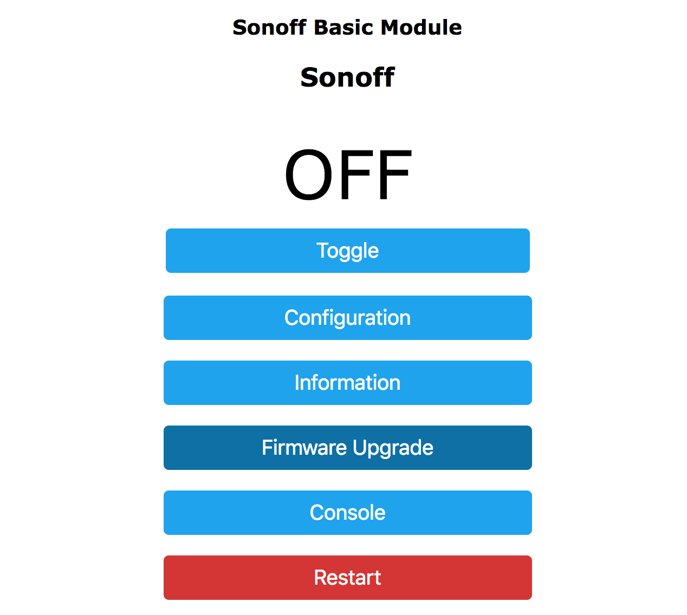
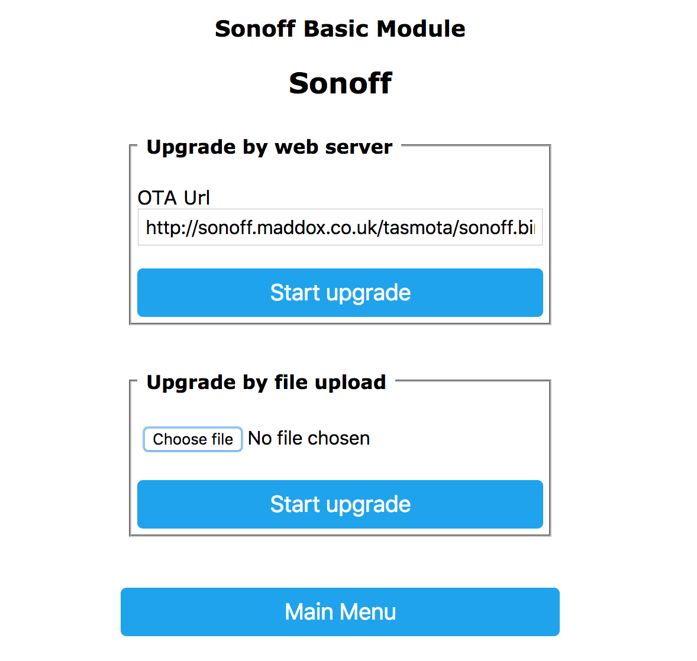

Migrating from Tasmota
======================

.. seo::
    :description: Migration guide for installing ESPHome on ESPs running Tasmota.
    :image: tasmota.svg

Migrating from previous Tasmota setups is very easy. You just need to have
ESPHome create a binary for you and then upload that in the Tasmota web interface.

Incompatible versions
---------------------
WARNING! Migrating via OTA on ESP32, from Tasmota v12 (with boot partition) and up is currently not possible! Trying it could soft-brick your device!


Getting the Binary
------------------

First create a configuration for your device. Then, generate and download the firmware image:

Using the Home Assistant add-on/dashboard
`````````````````````````````````````````

From the card of your device: open **the three dots menu** and select **Install** option.

  .. figure:: images/dashboard-install.png

A new dialog will open. Click on **Manual download** option.

  .. figure:: images/dashboard-install-manual.png

Finally, choose **modern format** in the last dialog.

  .. figure:: images/dashboard-install-manual-modern.png

The build process of the firmware will start and the image will be automatically downloaded after its completion.

Using the command line
``````````````````````

From your configuration files folder, run 

:: 

  esphome compile <MY_DEVICE>.yaml
  
replacing ``<MY_DEVICE>.yaml`` with your configuration file and navigate to the ``<MY_DEVICE>/.pioenvs/<MY_DEVICE>/`` folder. 

There you will find a ``firmware.bin`` file. This is the binary that you will upload.

Uploading the Binary
--------------------

To upload the binary, navigate to the Tasmota web interface and enter the
"Firmware Upgrade" section.



In the "Upgrade by file upload" section, choose the binary you previously downloaded



If everything succeeds, you will see an "Upload Successful" message and ESPHome
will connect to the WiFi network configured in your .yaml file. 🎉

.. figure:: images/tasmota_upload.png
    :align: center
    :width: 60.0%

Happy Hacking!

.. note::

    When using the :doc:`esp8266_pwm output </components/output/esp8266_pwm>` platform and
    switching from Tasmota, you need to power-cycle the device once. After that
    the dimming functionality will work as usual and no more power cycles are required.

About image size and ESP8266
----------------------------

    ESP8266 has very limited storage space. Trying to upload a large image will cause the
    upgrade process to fail.

    Tasmota 8.2 introduced upgrading using gzipped binaries which are smaller in size and
    make the upgrade process easier. 

    - If you are using Tasmota 8.2 or later (recommended) you probably will want to compress the firmware generated from ESPHome with ``gzip`` before uploading it.
    
    - If you are using any version older than 8.2: first upload ``tasmota-minimal.bin`` from Tasmota repository. Then upload the firmware generated from ESPHome. 
        - Alternatively, first upgrade Tasmota to the latest version. Then use the first (gzip, recommended) method.
    
    If you are using Tasmota 7.2+ it may be necessary to run the command ``SetOption78 1`` in the 
    Tasmota console and restart your device to be able to upgrade to esphome.


Automated migration from console
--------------------------------

You may also use Tasmota console to invoke the upgrade with just two commands:

:: 

  OtaUrl http://<MY-ESPHOME:6052>/download.bin?configuration=<MY_DEVICE>.yaml&type=firmware-factory.bin&compressed=1
  Upgrade 1

replacing ``http://<MY-ESPHOME:6052>/`` with the host and port of your ESPHome installation and ``<MY_DEVICE>.yaml``
with your device configuration file name.

If you need to use the uncompressed image for any reason, just remove ``&compressed=1`` from the above url.

See Also
--------

- :doc:`/components/esp8266`
- :doc:`/components/esp32`
- :doc:`migrate_espurna`
- :doc:`migrate_espeasy`
- :ghedit:`Edit`
