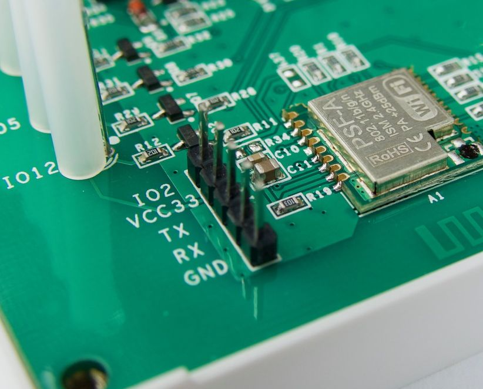
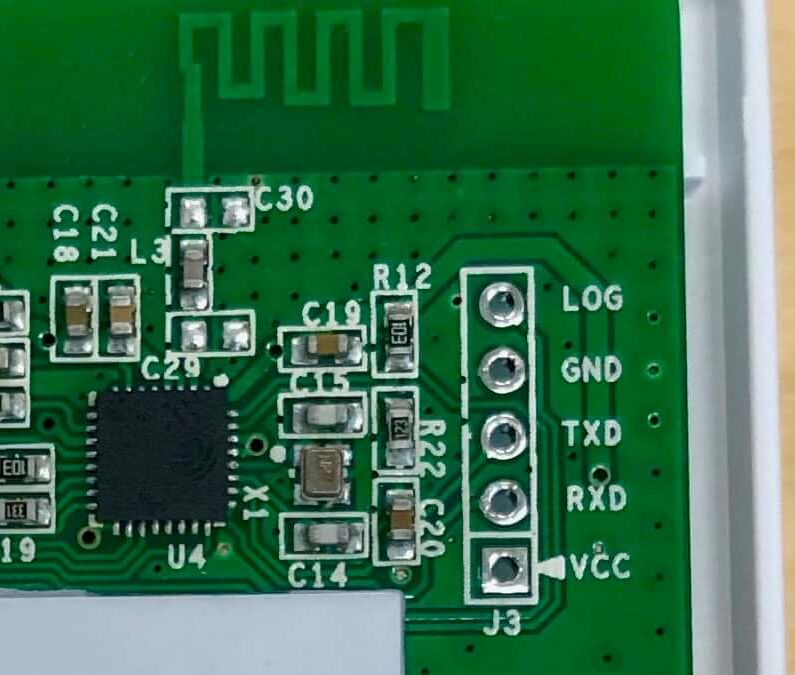
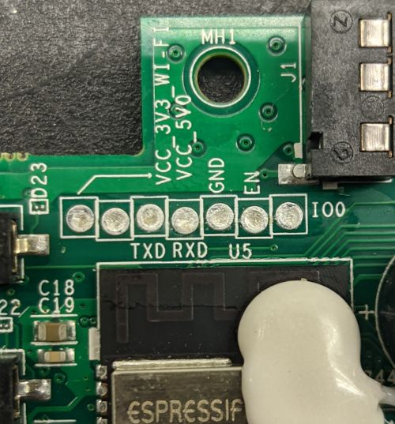
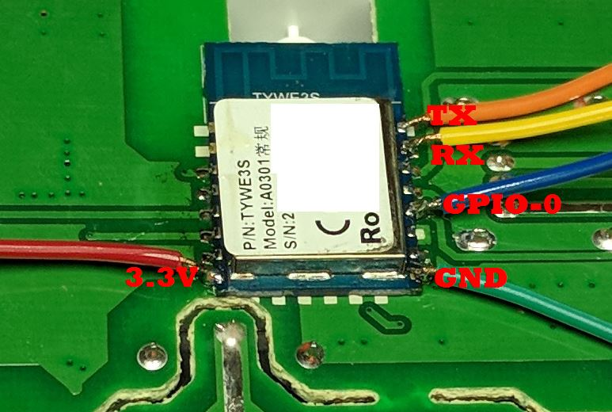
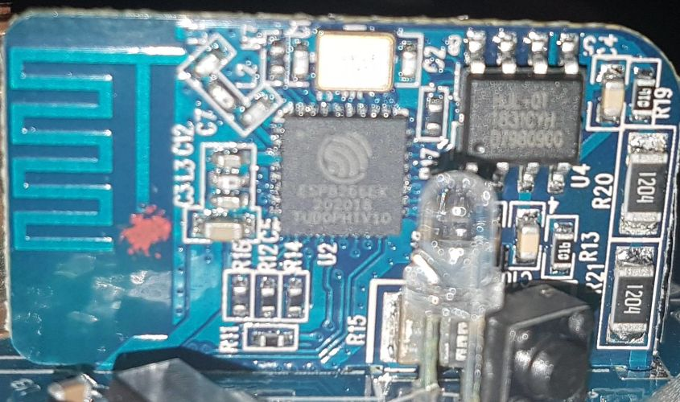

Physically Connecting to your Device
====================================

The most difficult part of setting up a new ESPHome device is the initial
installation, which requires connecting your ESP device to a computer using a
cable.

**You only need to do this once per device.** Once you've flashed ESPHome on a
device, you can use :doc:`the OTA updater </components/ota>` to upload new
versions or configuration changes wirelessly.

ESPHome runs on a wide variety of devices, so it's hard to list any specific
set of tools that you need or to give instructions on how to connect. This
guide tries to cover some of the more common flashing situations. If your
device doesn't fit any of these situations, try and find a guide for your
specific device in the :ref:`devices guides <devices>` or elsewhere on the
internet.

Connecting to the ESP
---------------------

There's a wide variety of situations you might find yourself in, each of which
requires you do something different to connect your computer to the ESP in
order to flash it.

You only need to physically connect to it once. Once you've flashed your device
and connected it to your WiFi, you can use the `OTA (over-the-air) update
component </components/ota.html>`_ to install software remotely.

Programming a ESP-based device is done by connecting the serial port on the
ESP8266/ESP32 to your computer through a USB to serial adapter. Some devices
have adapter built into the circuit board (and some even have the programmer
embedded in the MCU, in which case things are a bit easier.

In case you use an external serial programmer connected to RX and TX of the ESP, choose one based
on CH340 as it's the most reliable and the cheapest one to use for flashing. Programmers based on
CP2102 or PL2303 are compatible with many devices, but using an external 3.3V supply might be
necessary for them. 

.. _esphome-phy-con-drv:

Plug in the board or the serial programmer into a free USB port and check if it has been properly detected
by your computer. The firmware programming tools use a serial interface to communicate with your device. 
On Windows these interfaces are named ``COM1``, ``COM2``, etc. and on Linux they are named ``/dev/ttyUSB0``,
``/dev/ttyACM1``, etc. 

.. note::

    If it's not showing up as a serial port, you might not have the required drivers
    installed. The model number you need is engraved on the chip connected to the USB port.
    ESPs and programmers usually ship with one of these UART chips:

    * CH34x: `driver <https://github.com/nodemcu/nodemcu-devkit/tree/master/Drivers>`__
    * CP2102: `driver <https://www.silabs.com/products/development-tools/software/usb-to-uart-bridge-vcp-drivers>`__
    * PL2303: `driver <https://www.prolific.com.tw/US/ShowProduct.aspx?p_id=225&pcid=41>`__

With the exception of the situation where you have a USB port, you need to make
five electrical connections to program an ESP-based board:

- ``+3.3V``, or occasionally ``+5.0V``
- ``GND``, or ground
- ``TX`` of programmer to ``RX`` of the ``ESP``
- ``RX`` of programmer to ``TX`` of the ``ESP``
- ``IO0``, used to place the board into programming mode. This is often a button
  that you need to hold down while connecting the power (``+3.3V``).

The power supplied to the device is one of the most important elements for both flashing
the device and for stable operation. You must ensure that the device receives sufficient
power (current AND appropriate voltage level) to properly flash the firmware on the device.
When using an external ``3.3V`` supply, ensure the ground (``GND``) of both are connected together,
this ensures a common ground. A PC power supply can be a good source for ``3.3V`` DC power.

.. note::

    Some adapters can be switched between ``3.3V`` and ``5V`` for the data pins, but still provide 5V on the power pin which will irreparably destroy your device. You **MUST** make sure the data (``RX`` and ``TX``) and ``VCC`` pins are set for ``3.3V``.

ESP needs to be put into programming mode or flash mode before the firmware can be uploaded. This is
done by connecting ``GPIO0`` pin to ``GND`` while the chip is booting. 

.. _esphome-phy-con-prg:

To put the ESP into programming mode:

* Disconnect the USB connection of your board or serial programmer from the computer (to power off your ESP)
* Bridge ``GPIO0`` and ``GND`` (by pressing the on-board button or connection with a wire)
* Connect the board or serial programmer to your computer (ensuring ESP powers up)
* After a few seconds disconnect ``GPIO0`` from ``GND`` (release button or remove the wire connection). On devices that do not provide the ``GPIO0`` connected button, it may be easier to leave the wired bridge in place throughout the entire flashing process (erase & upload). Doing so will not create any problems. After the firmware is uploaded successfully, remove the bridge. This allows the device to boot normally.

You may need to power-cycle the ESP between erasing and uploading the firmware, this can be done by disconnecting and reconnecting, of course with ``GPIO0`` and ``GND`` still connected to each other.

``RX`` and ``TX`` can be sometimes swapped. If programming your board doesn't work the
first time, try flipping the wires connected to those pins before trying again.

.. warning::

    .. image:: /images/high-voltage-warning.svg
      :alt: High voltage warning symbol
      :height: 50

    **Do not connect your device to mains electricity while following this
    guide.** If your device is open and plugged directly into the wall, you'll
    be a single touch away from being electrocuted.

    Note that this does not apply if your device uses a separate "wall wart" or
    a power brick. Using an external power supply while flashing is an advanced
    topic not covered here, but does not pose any safety risk.

    **You are solely responsible for your own safety.** If you feel something
    is wrong or are uncomfortable with continuing, stop immediately.

USB Port on Device
******************

.. figure:: /images/nodemcu_esp8266.jpg
    :align: center
    :width: 75.0%

    A device with a USB port and a serial adapter built-in

Development boards often come with a USB port built in. This USB port is
connected to a serial adapter, so you don't need a separate serial adapter. You
can use just a :ref:`USB cable <usb-cable>` to connect it to your computer to
program it.

This isn't likely to be very useful without connecting additional sensors to it
by either soldering or using a breadboard, but you do not need anything else to
*just* flash ESPHome on it.

Pre-soldered Programming Header
*******************************

    A device that comes with programming headers pre-installed

In this situation, you'll need just :ref:`jumper wires <jumper-wires>` and a
:ref:`USB to serial adapter <usb-serial-adapter>`. You don't need to solder
anything, that's already been done by the factory.

Unpopulated Programming Header
******************************

    A device that has a spot for programming headers on the circuit board

You can probably get away with :ref:`jumper wires <jumper-wires>` and a
:ref:`USB to serial adapter <usb-serial-adapter>`. You can place the male end
of the wires directly into the circuit board and hold them into place with your
hand until you're done flashing the board.

These headers sometimes have writing on the circuit board indicating what each
pin is. If your header does not, either look it up on the internet, or use a
multimeter in continuity mode to figure it out (advanced topic).

Solder-filled Programming Header
********************************

    A set of programming headers that are filled with solder

You'll need a USB to serial adapter, :ref:`jumper wires <jumper-wires>`, a
:ref:`soldering iron <soldering-iron>`, and probably :ref:`solder <solder>` and
some :ref:`breakaway headers <pcb-headers>` if your board looks like this.

You can try placing the jumper wires in the right place, but you'll have
trouble holding them without having them slide around. You'll want to solder a
header onto the programming port in this situation.

These headers sometimes have writing on the circuit board indicating what each
pin is. If your header does not, either look it up on the internet, or use a
multimeter in continuity mode to figure it out (advanced topic).

Module Only
***********

    An ESP8266 module with programming wires soldered on

If the device has a module but no programming headers, things get a bit tricky.
You'll need a :ref:`USB to serial adapter <usb-serial-adapter>`, :ref:`jumper
wires <jumper-wires>`, :ref:`wire strippers <wire-strippers>`, :ref:`wire snips
<wire-snips>`, a :ref:`soldering iron <soldering-iron>`, :ref:`solder
<solder>`, and a bit of :ref:`flux <soldering-flux>` would help.

Cut the jumper wires, strip a bit off the end, and then solder them onto the
module. You can find the correct places to solder the wires by looking up the
module model number on the internet. You can find `one list of commonly used
modules here <https://tasmota.github.io/docs/Pinouts/>`_.

Bare Chip
*********

    A bare ESP8266 IC with no programming header

This is an advanced topic and won't be covered in detail, but you have three options:

- You can hope that your device is supported by an OTA conversation tool. Most
  these tools have been broken by vendors, and the ESPHome community can't help
  you with using these tools.
- If the programming wires connect to a larger component like a resistor, you
  can solder or clip your :ref:`jumper wires <jumper-wires>` to that larger
  component.
- You can use your amazing microsoldering skills to connect directly to the IC.

Materials
---------

Because we're working with hardware, we might need some additional tools,
depending on the situation. Already have all this stuff? You're good to go!

But if you don't, don't go out and buy everything just yet. Read through the
guide first and make a list of everything you need. Different situations will
require different parts and tools.

.. list-table::
    :header-rows: 1
    :widths: 1 3 1 3

    * - Name
      - Purpose
      - Approx. cost
      - Picture

        .. _usb-cable:
    * - :ref:`USB to micro-USB/mini-USB/USB-C <usb-cable>`
      - If your target device has a USB port on it, you need the appropriate
        cable to connect to it.
      - $3 to $10
      - .. image:: /guides/images/usb-cable.jpg
            :alt: From https://www.stockvault.net/photo/271754/usb-cable

        .. _usb-serial-adapter:
    * - :ref:`USB to serial adapter <usb-serial-adapter>`
      - Serial communication is a simple way of talking to other devices, like
        the ESP32/ESP8266 you're flashing. But your computer probably doesn't
        have this capability built-in. "Serial", "UART", "TTL", and "COM" are
        all more-or-less synonyms.

        There are many different types of these, so don't worry if yours doesn't
        look exactly like the picture. However, you do need one with a voltage
        regulator.

        The `Tasmota website provides a good set of suggestions on what to buy
        <https://tasmota.github.io/docs/Getting-Started/#needed-hardware>`_.
      - $3 to $10
      - .. image:: /guides/images/usb-serial-adapter.jpg
            :alt: From https://tasmota.github.io/docs/Getting-Started/

        .. _jumper-wires:
    * - :ref:`Jumper wires <jumper-wires>`
      - Used to connect two things together electrically. The male end has metal
        protuding and is plugged into the female end of a wire or board.
        They come in varying lengths too, but for our purposes, any length will
        do.
      - $3 to $8 for a pack
      - .. image:: /guides/images/jumper-wires.jpg
            :alt: From https://www.flickr.com/photos/snazzyguy/8096512976

        .. _pcb-headers:
    * - :ref:`Breakable headers <pcb-headers>`
      - Soldered to a PCB to provide a way to connect jumper wires. The distance
        between the metal pins is known as the pitch, and is usually 2.54mm for
        what we're doing.

        This sort of header can be cut to the correct length along the groves.
      - $3 to $8 for a pack
      - .. image:: /guides/images/breakable-header.jpg
            :alt: From https://www.flickr.com/photos/snazzyguy/27120004896/

        .. _wire-snips:
    * - :ref:`Wire snips, wire cutters, flush cutters <wire-snips>`
      - Used to cut wire. These can often be subsituted by a knife or scissors,
        but be careful not to hurt yourself.
      - $5 to $15
      - .. image:: /guides/images/wire-cutters.jpg
            :alt: From https://www.flickr.com/photos/snazzyguy/3932324106

        .. _wire-strippers:
    * - :ref:`Wire strippers <wire-strippers>`
      - Used to remove the insulation from wires, leaving the conductive metal
        interior exposed. These can often be subsituted by a knife, scissors, or
        fingernails, but be careful not to hurt yourself.

        There are many different styles, not just that in the picture. You'll
        want something that works with fairly thin wire, about 20 AWG to 26 AWG.
      - $5 to $15
      - .. image:: /guides/images/strippers.jpg
            :alt: From https://www.flickr.com/photos/snazzyguy/3931542659

        .. _soldering-iron:
    * - :ref:`Soldering iron <soldering-iron>`
      - Used to melt metal, called solder, to connect things together in an
        electrically conductive way.

        You'll want something with temperature control. Other than that, there
        are many varying opinions and options here.

        `The /r/AskElectronics wiki has some good suggestions
        <https://www.reddit.com/r/AskElectronics/wiki/soldering>`_. The
        following would serve you well, although be careful to buy from a
        reliable source:

        - Hakko FX-888D
        - KSGER T12
        - TS100/TS80
      - $60 to $120
      - .. image:: /guides/images/soldering-iron.jpg
            :alt: From https://commons.wikimedia.org/wiki/File:Soldering_Station_Weller_2.jpeg

        .. _solder:
    * - :ref:`Electronics solder <solder>`
      - Molten metal used to join things in an electrically conductive way.
        There are two types, leaded and lead-free. Leaded melts at a lower
        temperature and is a little easier to work with, but is hazardous to the
        environment (but not to humans in this form).

        Electronics solder also usually has a "rosin core", which helps clean
        the surfaces to allow the solder to stick.

        You absolutely do not want plumbing solder, also known as "acid core" or
        "silver solder". It needs much higher temperatures than we can safely
        use here.
      - $8 to $12
      - .. image:: /guides/images/solder.jpg
            :alt: From https://commons.wikimedia.org/wiki/File:Rosin_core_solder.JPG

        .. _soldering-flux:
    * - :ref:`Electronics flux <soldering-flux>`
      - Used to clean the metal surfaces before soldering them together.
        Sometimes the rosin core of the solder doesn't provide enough, so you'd
        want add some extra.

        This stuff is helpful, but probably not needed for this guide since we
        won't be doing any advanced soldering.

        If you do buy it, you absolutely do not want plumber's flux. It will
        destroy your circuit boards.
      - $8 to $12
      - .. image:: /guides/images/flux.jpg

See Also
--------

- :doc:`ESPHome index </index>`
- :doc:`getting_started_command_line`
- :doc:`getting_started_hassio`
- :ghedit:`Edit`
